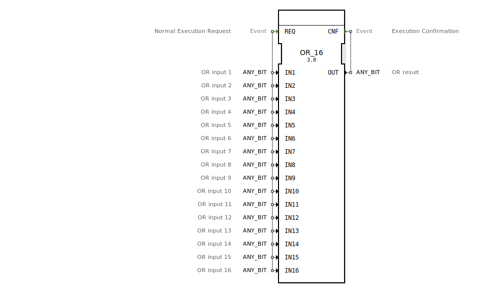

# OR_16

```{index} single: OR_16
```


* * * * * * * * * *
## Einleitung
Der Funktionsblock `OR_16` führt eine bitweise logische ODER-Operation auf bis zu 16 Eingangsvariablen durch. Es handelt sich um einen generischen Funktionsblock, der mit verschiedenen Bit-Datentypen (ANY_BIT) arbeiten kann. Der Block ist Teil des Pakets `iec61131::bitwiseOperators` und entspricht dem Standard IEC 61131-3.



## Schnittstellenstruktur

### **Ereignis-Eingänge**
- `REQ` (Normal Execution Request): Löst die Berechnung aus. Wird mit allen 16 Eingangsvariablen verknüpft.

### **Ereignis-Ausgänge**
- `CNF` (Execution Confirmation): Bestätigt die Ausführung der Operation. Wird mit dem Ergebnis `OUT` verknüpft.

### **Daten-Eingänge**
16 Eingänge vom Typ `ANY_BIT`:
- `IN1` bis `IN16`: Die Eingangswerte für die ODER-Operation. Jeder Eingang ist kommentiert als "OR input X" (wobei X die Nummer des Eingangs ist).

### **Daten-Ausgänge**
- `OUT` (ANY_BIT): Das Ergebnis der bitweisen ODER-Operation aller Eingangswerte.

### **Adapter**
Der Funktionsblock verwendet keine Adapter.

## Funktionsweise
Bei Empfang des `REQ`-Ereignisses führt der Block eine bitweise ODER-Verknüpfung aller aktiven Eingangswerte (`IN1` bis `IN16`) durch. Das Ergebnis wird an `OUT` ausgegeben und das `CNF`-Ereignis wird ausgelöst.

## Technische Besonderheiten
- Generische Implementierung: Arbeitet mit allen `ANY_BIT`-Datentypen (z.B. BOOL, BYTE, WORD, DWORD, LWORD)
- Unterstützt bis zu 16 Eingangsvariablen
- Kompatibel mit IEC 61131-3 Standard

## Zustandsübersicht
1. Wartezustand: Auf `REQ`-Ereignis warten
2. Ausführungszustand: Bei `REQ` werden Eingänge verarbeitet und Ergebnis berechnet
3. Bestätigungszustand: Ausgabe des Ergebnisses und Trigger von `CNF`

## Anwendungsszenarien
- Bitweise Logikoperationen in Steuerungsanwendungen
- Signalverarbeitung mit Mehrfachbedingungen
- Generische Logikbausteine in Bibliotheken

## Vergleich mit ähnlichen Bausteinen
- Im Vergleich zu einfacheren ODER-Blöcken (z.B. OR_2) bietet OR_16 deutlich mehr Eingänge
- Ähnlich zu AND_16 oder XOR_16, aber mit anderer logischer Operation
- Generische Implementierung ermöglicht flexiblere Nutzung als typspezifische Blöcke

## Fazit
Der OR_16 Funktionsblock bietet eine flexible und standardkonforme Lösung für bitweise ODER-Operationen mit bis zu 16 Eingängen. Seine generische Natur macht ihn vielseitig einsetzbar, während die klare Schnittstellenstruktur die Integration in verschiedene Steuerungsanwendungen erleichtert.