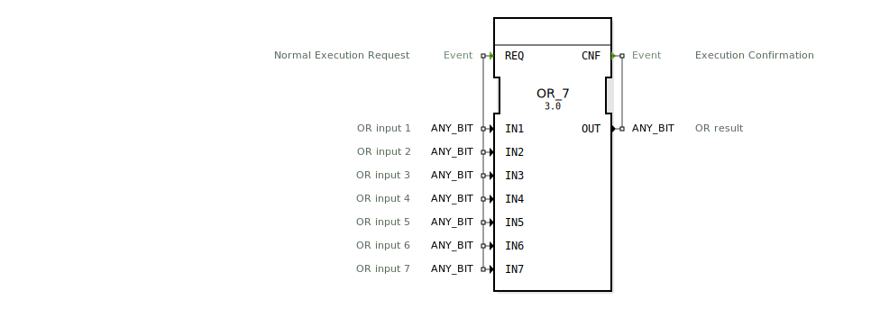

# OR_7

```{index} single: OR_7
```


* * * * * * * * * *
## Einleitung
Der Funktionsblock `OR_7` führt eine bitweise logische ODER-Operation auf bis zu sieben Eingangsvariablen durch. Es handelt sich um einen generischen Funktionsblock, der mit verschiedenen Bit-Datentypen (`ANY_BIT`) arbeiten kann. Der Block ist Teil der `iec61131::bitwiseOperators`-Bibliothek und implementiert eine Standard-Bitoperation gemäß IEC 61131-3.



## Schnittstellenstruktur

### **Ereignis-Eingänge**
- **REQ**: Startet die Ausführung des Funktionsblocks. Mit diesem Ereignis werden alle Eingangsvariablen (`IN1` bis `IN7`) übergeben.

### **Ereignis-Ausgänge**
- **CNF**: Signalisiert die erfolgreiche Ausführung der ODER-Operation und liefert das Ergebnis über die Variable `OUT`.

### **Daten-Eingänge**
- **IN1** bis **IN7** (`ANY_BIT`): Bis zu sieben Eingangsvariablen, auf denen die bitweise ODER-Operation durchgeführt wird. Jeder Eingang kann einen beliebigen Bit-Datentyp (z.B. `BOOL`, `BYTE`, `WORD`, `DWORD`, `LWORD`) haben.

### **Daten-Ausgänge**
- **OUT** (`ANY_BIT`): Das Ergebnis der bitweisen ODER-Operation. Der Datentyp entspricht dem der Eingangsvariablen.

### **Adapter**
Der Funktionsblock verwendet keine Adapter.

## Funktionsweise
Bei Auslösung des `REQ`-Ereignisses führt der Funktionsblock eine bitweise ODER-Operation auf den Werten der Eingangsvariablen `IN1` bis `IN7` durch. Das Ergebnis wird in der Variable `OUT` gespeichert und das `CNF`-Ereignis ausgelöst, um die erfolgreiche Berechnung zu signalisieren.

## Technische Besonderheiten
- **Generische Implementierung**: Der Funktionsblock kann mit verschiedenen Bit-Datentypen (`ANY_BIT`) umgehen, was ihn flexibel einsetzbar macht.
- **Skalierbarkeit**: Unterstützt bis zu sieben Eingangsvariablen, was komplexere logische Verknüpfungen ermöglicht.

## Zustandsübersicht
1. **Idle-Zustand**: Wartet auf das `REQ`-Ereignis.
2. **Ausführungszustand**: Führt die ODER-Operation durch und berechnet das Ergebnis.
3. **Bestätigungszustand**: Löst das `CNF`-Ereignis aus und gibt das Ergebnis über `OUT` aus.

## Anwendungsszenarien
- **Logische Verknüpfungen**: Kombination mehrerer binärer Signale zu einem gemeinsamen Ergebnis.
- **Steuerungstechnik**: Verwendung in Steuerungsalgorithmen, wo mehrere Bedingungen gleichzeitig erfüllt sein müssen (ODER-Verknüpfung).
- **Datenverarbeitung**: Bitweise Operationen auf Byte-, Word- oder DWord-Ebene.

## Vergleich mit ähnlichen Bausteinen
- **OR (Standard)**: Standard-ODER-Bausteine in IEC 61131-3 unterstützen typischerweise nur zwei Eingänge. `OR_7` erweitert diese Funktionalität auf bis zu sieben Eingänge.
- **GEN_OR**: Der generische ODER-Baustein, auf dem `OR_7` basiert, kann theoretisch beliebig viele Eingänge verarbeiten, ist aber weniger spezifisch in der Implementierung.

## Fazit
Der `OR_7`-Funktionsblock bietet eine flexible und leistungsfähige Lösung für bitweise ODER-Operationen mit bis zu sieben Eingangsvariablen. Seine generische Natur ermöglicht den Einsatz mit verschiedenen Bit-Datentypen, was ihn zu einem vielseitigen Werkzeug in der Steuerungs- und Automatisierungstechnik macht.