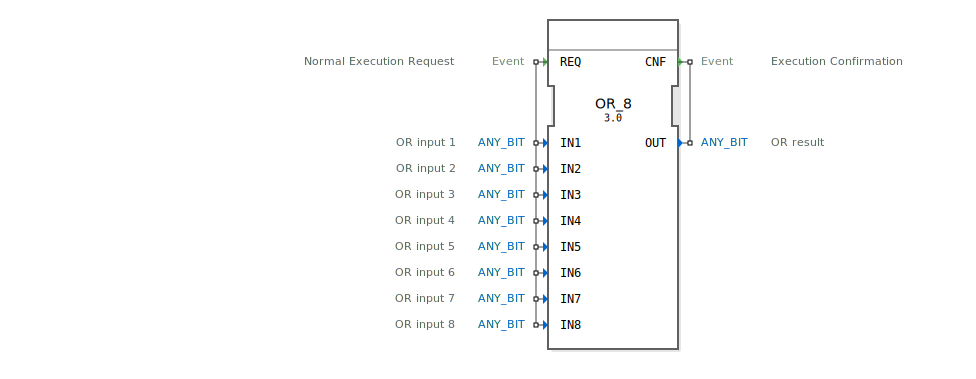

# OR_8

```{index} single: OR_8
```


* * * * * * * * * *
## Einleitung
Der OR_8 Funktionsblock ist ein generischer Baustein zur Berechnung einer bitweisen ODER-Verknüpfung. Er unterstützt bis zu 8 Eingänge und ist gemäß der Norm IEC 61131-3 klassifiziert. Der Baustein ist besonders für Anwendungen geeignet, in denen mehrere binäre Signale logisch verknüpft werden müssen.



## Schnittstellenstruktur
### **Ereignis-Eingänge**
- **REQ**: Startet die Ausführung des Funktionsblocks. Wird mit allen Daten-Eingängen verknüpft.

### **Ereignis-Ausgänge**
- **CNF**: Signalisiert die erfolgreiche Ausführung des Funktionsblocks. Wird mit dem Daten-Ausgang `OUT` verknüpft.

### **Daten-Eingänge**
- **IN1** bis **IN8**: Jeder dieser Eingänge nimmt einen beliebigen Bit-Typ (`ANY_BIT`) entgegen. Diese stellen die Operanden für die ODER-Verknüpfung dar.

### **Daten-Ausgänge**
- **OUT**: Gibt das Ergebnis der bitweisen ODER-Verknüpfung der Eingänge `IN1` bis `IN8` zurück. Der Datentyp entspricht dem der Eingänge (`ANY_BIT`).

### **Adapter**
Der Funktionsblock verfügt über keine Adapter.

## Funktionsweise
Der OR_8 Funktionsblock führt eine bitweise ODER-Verknüpfung der Werte an den Eingängen `IN1` bis `IN8` durch. Das Ergebnis wird am Ausgang `OUT` ausgegeben, sobald das Ereignis `REQ` empfangen wird. Die Ausführung wird durch das Ereignis `CNF` bestätigt.

## Technische Besonderheiten
- **Generische Implementierung**: Der Baustein ist generisch und kann mit verschiedenen Bit-Typen (`ANY_BIT`) arbeiten.
- **Flexible Eingangsanzahl**: Unterstützt bis zu 8 Eingänge, was ihn für komplexe Verknüpfungen geeignet macht.

## Zustandsübersicht
1. **Idle-Zustand**: Wartet auf das Ereignis `REQ`.
2. **Ausführungszustand**: Führt die ODER-Verknüpfung durch und setzt den Ausgang `OUT`.
3. **Bestätigungszustand**: Sendet das Ereignis `CNF` zur Bestätigung der Ausführung.

## Anwendungsszenarien
- Logische Verknüpfung mehrerer Sensordaten.
- Steuerungslogik in industriellen Automatisierungssystemen.
- Kombination von binären Steuersignalen.

## ⚖️ Vergleich mit ähnlichen Bausteinen
- **OR_2/OR_4**: Ähnliche Funktionsblöcke mit weniger Eingängen (2 bzw. 4). OR_8 bietet mehr Flexibilität bei komplexeren Anwendungen.
- **GEN_OR**: Generische Basisimplementierung, die durch OR_8 spezialisiert wird.

## Fazit
Der OR_8 Funktionsblock ist ein leistungsstarkes Werkzeug für bitweise ODER-Verknüpfungen in der industriellen Automatisierung. Seine generische Natur und die Unterstützung für bis zu 8 Eingänge machen ihn besonders vielseitig einsetzbar.