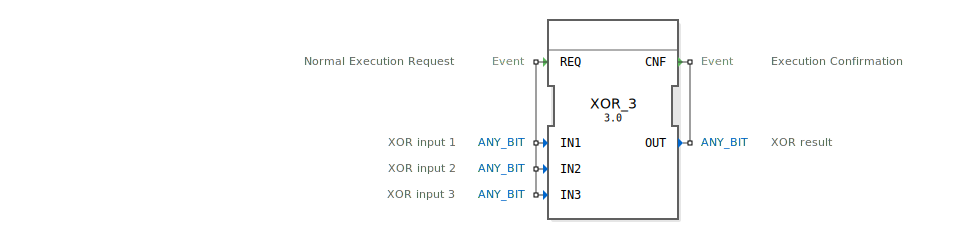

# XOR_3

```{index} single: XOR_3
```


* * * * * * * * * *
## Einleitung
Der XOR_3 Funktionsblock ist ein generischer Baustein zur Berechnung der bitweisen XOR-Verknüpfung mit drei Eingängen. Er implementiert die logische Exklusiv-ODER-Operation auf Bitebene gemäß dem IEC 61131-3 Standard und kann mit verschiedenen Bit-Datentypen verwendet werden.



## Schnittstellenstruktur

### **Ereignis-Eingänge**
- **REQ**: Normaler Ausführungsanforderung - löst die Berechnung der XOR-Operation aus

### **Ereignis-Ausgänge**
- **CNF**: Ausführungsbestätigung - signalisiert den Abschluss der Berechnung

### **Daten-Eingänge**
- **IN1**: XOR-Eingang 1 (ANY_BIT Datentyp)
- **IN2**: XOR-Eingang 2 (ANY_BIT Datentyp)
- **IN3**: XOR-Eingang 3 (ANY_BIT Datentyp)

### **Daten-Ausgänge**
- **OUT**: XOR-Ergebnis (ANY_BIT Datentyp)

### **Adapter**
Der Funktionsblock verwendet keine Adapter.

## Funktionsweise
Bei Eintreffen des REQ-Ereignisses führt der Baustein eine bitweise XOR-Operation auf den drei Eingangswerten IN1, IN2 und IN3 durch. Die Operation wird für jedes Bitposition separat ausgeführt und entspricht der logischen Funktion: OUT = IN1 XOR IN2 XOR IN3. Nach Abschluss der Berechnung wird das CNF-Ereignis zusammen mit dem Ergebniswert ausgegeben.

## Technische Besonderheiten
- Verwendet den generischen Datentyp ANY_BIT, der mit verschiedenen Bit-Datentypen (BOOL, BYTE, WORD, DWORD, LWORD) kompatibel ist
- Implementiert als generischer Funktionsblock mit der Klasse 'GEN_XOR'
- Unterstützt genau drei Eingänge für die XOR-Operation
- Entspricht der IEC 61131-3 Klassifikation für standardisierte bitweise boolesche Funktionen

## Zustandsübersicht
Der Baustein arbeitet zustandslos:
1. Wartezustand: Keine aktive Berechnung
2. Berechnungszustand: Bei REQ-Ereignis wird die XOR-Operation ausgeführt
3. Ausgabezustand: CNF-Ereignis mit Ergebnis wird ausgegeben

## Anwendungsszenarien
- Bitweise Verschlüsselungsoperationen
- Paritätsprüfungen in Kommunikationsprotokollen
- Fehlererkennung in digitalen Systemen
- Steuerungslogik mit mehreren Bedingungen
- Datenverarbeitung in industriellen Automatisierungssystemen

## Vergleich mit ähnlichen Bausteinen
Im Vergleich zu Standard-XOR-Bausteinen mit zwei Eingängen bietet XOR_3 die Möglichkeit, drei Eingänge gleichzeitig zu verarbeiten. Gegenüber AND/OR-Operationen liefert XOR ein exklusives Ergebnis, bei dem das Ausgangsbit nur dann 1 ist, wenn eine ungerade Anzahl der Eingangsbits 1 ist.


## Zugehörige Übungen

* [Uebung_002a7_AX](../../../../training1/Ventilsteuerung/4diacIDE-workspace/test_AX/Uebungen_doc/Uebung_002a7_AX.md)

## Fazit
Der XOR_3 Funktionsblock stellt eine effiziente und flexible Lösung für bitweise XOR-Operationen mit drei Eingängen in 4diac-Systemen dar. Seine generische Natur ermöglicht den Einsatz mit verschiedenen Bit-Datentypen, was ihn vielseitig in industriellen Automatisierungsanwendungen einsetzbar macht.