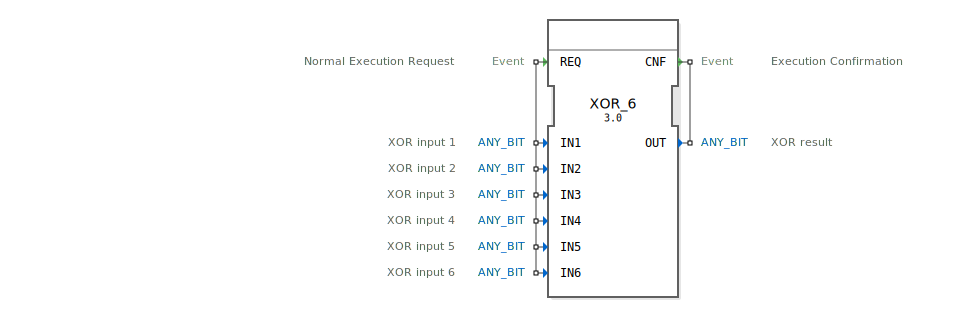

# XOR_6

```{index} single: XOR_6
```


* * * * * * * * * *

## Einleitung
Der XOR_6 Funktionsblock ist ein generischer Baustein zur Berechnung der bitweisen XOR-Verknüpfung mit sechs Eingängen. Er implementiert die boolesche Exklusiv-ODER-Operation auf Bitebene gemäß dem IEC 61131-3 Standard und kann mit verschiedenen Bit-Datentypen arbeiten.



## Schnittstellenstruktur

### **Ereignis-Eingänge**
- **REQ**: Normaler Ausführungsanforderung - löst die Berechnung der XOR-Operation aus

### **Ereignis-Ausgänge**
- **CNF**: Ausführungsbestätigung - signalisiert den Abschluss der Berechnung

### **Daten-Eingänge**
- **IN1**: XOR-Eingang 1 (ANY_BIT Datentyp)
- **IN2**: XOR-Eingang 2 (ANY_BIT Datentyp)
- **IN3**: XOR-Eingang 3 (ANY_BIT Datentyp)
- **IN4**: XOR-Eingang 4 (ANY_BIT Datentyp)
- **IN5**: XOR-Eingang 5 (ANY_BIT Datentyp)
- **IN6**: XOR-Eingang 6 (ANY_BIT Datentyp)

### **Daten-Ausgänge**
- **OUT**: XOR-Ergebnis (ANY_BIT Datentyp)

### **Adapter**
Keine Adapter-Schnittstellen vorhanden.

## Funktionsweise
Der XOR_6 Block führt eine bitweise XOR-Operation auf allen sechs Eingängen durch. Bei Aktivierung des REQ-Ereignisses werden die Werte an IN1 bis IN6 verarbeitet und das Ergebnis an OUT ausgegeben. Die Operation folgt der mathematischen Definition der XOR-Funktion, wobei das Ergebnis für jedes Bit wahr ist, wenn eine ungerade Anzahl der entsprechenden Eingangsbits wahr ist.

Die Berechnung erfolgt nach der Formel: OUT = IN1 ⊕ IN2 ⊕ IN3 ⊕ IN4 ⊕ IN5 ⊕ IN6

## Technische Besonderheiten
- **Generischer Datentyp**: Verwendet ANY_BIT, was Kompatibilität mit verschiedenen Bit-Datentypen (BOOL, BYTE, WORD, DWORD, LWORD) ermöglicht
- **Sechs Eingänge**: Bietet erweiterte Funktionalität gegenüber Standard-XOR-Blöcken mit weniger Eingängen
- **Ereignisgesteuerte Ausführung**: Folgt dem 4diac-Execution Model mit REQ/CNF Ereignispaar

## Zustandsübersicht
Der Funktionsblock besitzt einen einfachen Zustandsautomaten:
1. **Wartezustand**: Block wartet auf REQ-Ereignis
2. **Berechnungszustand**: Verarbeitet die Eingänge bei REQ-Aktivierung
3. **Ausgabezustand**: Sendet CNF-Ereignis mit berechnetem Ergebnis

## Anwendungsszenarien
- **Paritätsprüfung**: Überprüfung der Datenintegrität durch XOR-Verknüpfung mehrerer Datenworte
- **Datenverschlüsselung**: Einfache kryptographische Operationen
- **Fehlererkennung**: Generierung von Prüfsummen in Kommunikationsprotokollen
- **Steuerungstechnik**: Logische Verknüpfungen in Automatisierungsanwendungen

## Vergleich mit ähnlichen Bausteinen
Im Vergleich zu Standard-XOR-Blöcken mit zwei Eingängen bietet XOR_6:
- Erweiterte Funktionalität mit sechs direkten Eingängen
- Vermeidung von Kaskadierung mehrerer XOR-Blöcke
- Kompaktere Implementierung für komplexe XOR-Operationen

## Fazit
Der XOR_6 Funktionsblock stellt eine leistungsstarke und flexible Lösung für bitweise XOR-Operationen mit mehreren Eingängen dar. Seine generische Natur ermöglicht breite Anwendbarkeit in verschiedenen Automatisierungsprojekten, während die sechsfache Eingangsfunktionalität effiziente Implementierungen komplexer logischer Verknüpfungen unterstützt.