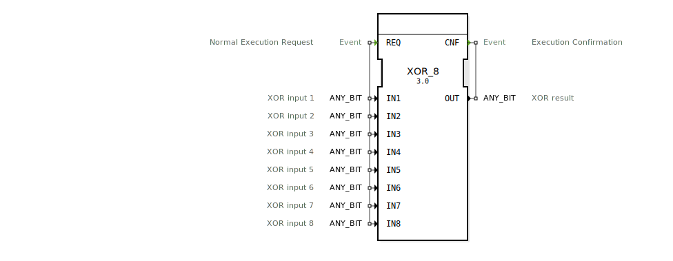

# XOR_8

```{index} single: XOR_8
```


* * * * * * * * * *
## Einleitung
Der XOR_8 Funktionsblock führt eine bitweise XOR-Operation auf bis zu 8 Eingangsvariablen durch. Es handelt sich um einen generischen Funktionsblock, der mit verschiedenen Bit-Datentypen (ANY_BIT) arbeiten kann. Der Block ist gemäß dem IEC 61131-3 Standard klassifiziert und bietet eine einfache Möglichkeit, XOR-Operationen in Steuerungsanwendungen durchzuführen.



## Schnittstellenstruktur

### **Ereignis-Eingänge**
- **REQ** (Normal Execution Request): Startet die Berechnung der XOR-Operation. Wird mit allen Daten-Eingängen verknüpft.

### **Ereignis-Ausgänge**
- **CNF** (Execution Confirmation): Signalisiert den Abschluss der Berechnung. Wird mit dem Daten-Ausgang OUT verknüpft.

### **Daten-Eingänge**
- **IN1** (ANY_BIT): XOR-Eingang 1
- **IN2** (ANY_BIT): XOR-Eingang 2
- **IN3** (ANY_BIT): XOR-Eingang 3
- **IN4** (ANY_BIT): XOR-Eingang 4
- **IN5** (ANY_BIT): XOR-Eingang 5
- **IN6** (ANY_BIT): XOR-Eingang 6
- **IN7** (ANY_BIT): XOR-Eingang 7
- **IN8** (ANY_BIT): XOR-Eingang 8

### **Daten-Ausgänge**
- **OUT** (ANY_BIT): Ergebnis der XOR-Operation

### **Adapter**
Der Funktionsblock verfügt über keine Adapter-Schnittstellen.

## Funktionsweise
Bei Empfang des REQ-Ereignisses führt der Funktionsblock eine bitweise XOR-Operation auf allen aktiven Eingangsvariablen (IN1 bis IN8) durch. Das Ergebnis wird am Ausgang OUT ausgegeben und das CNF-Ereignis wird ausgelöst, um den Abschluss der Operation zu signalisieren.

## Technische Besonderheiten
- Unterstützt den generischen Datentyp ANY_BIT, was bedeutet, dass verschiedene Bit-Datentypen (z.B. BOOL, BYTE, WORD, DWORD, LWORD) verwendet werden können.
- Die Operation wird streng bitweise durchgeführt.
- Der Funktionsblock ist Teil des Pakets "iec61131::bitwiseOperators".

## Zustandsübersicht
Der Funktionsblock hat keine komplexen Zustände. Er reagiert auf das REQ-Ereignis mit einer sofortigen Berechnung und Ausgabe des Ergebnisses.

## Anwendungsszenarien
- Bitweise Prüfsummenberechnung
- Datenverschlüsselungsoperationen
- Fehlererkennung in Datenübertragungen
- Steuerungslogik mit bitweisen Operationen

## ⚖️ Vergleich mit ähnlichen Bausteinen
Im Vergleich zu einfacheren XOR-Blöcken (z.B. mit nur 2 Eingängen) bietet XOR_8 die Möglichkeit, bis zu 8 Eingänge gleichzeitig zu verarbeiten. Andere bitweise Operatoren (wie AND_8 oder OR_8) führen ähnliche Operationen mit unterschiedlichen logischen Verknüpfungen durch.

## Fazit
Der XOR_8 Funktionsblock bietet eine flexible und standardkonforme Lösung für bitweise XOR-Operationen in Steuerungssystemen. Seine generische Natur ermöglicht den Einsatz mit verschiedenen Bit-Datentypen, während die Unterstützung für bis zu 8 Eingänge komplexere logische Operationen ermöglicht. Die einfache Schnittstelle und deterministische Ausführung machen ihn zu einem zuverlässigen Baustein für Steuerungsanwendungen.