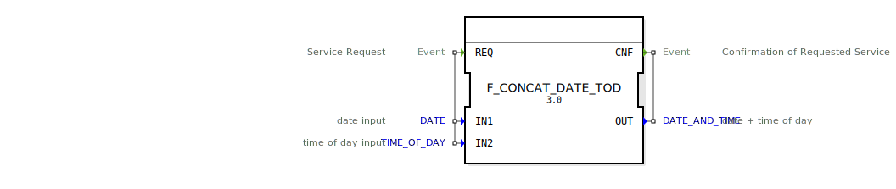

# F_CONCAT_DATE_TOD

```{index} single: F_CONCAT_DATE_TOD
```


* * * * * * * * * *
## Einleitung
Der Funktionsblock `F_CONCAT_DATE_TOD` dient zur Verkettung eines Datums (`DATE`) und einer Tageszeit (`TIME_OF_DAY`) zu einem kombinierten Datums- und Zeitstempel (`DATE_AND_TIME`). Dieser Baustein ist besonders nützlich in Szenarien, wo separate Datums- und Zeitinformationen zu einem einzigen Zeitstempel zusammengeführt werden müssen.



## Schnittstellenstruktur

### **Ereignis-Eingänge**
- **REQ**: Startet die Verarbeitung des Funktionsblocks. Bei Auslösung dieses Ereignisses werden die Eingabedaten `IN1` (Datum) und `IN2` (Tageszeit) verarbeitet.

### **Ereignis-Ausgänge**
- **CNF**: Signalisiert die erfolgreiche Verarbeitung und gibt den kombinierten Zeitstempel `OUT` aus.

### **Daten-Eingänge**
- **IN1** (`DATE`): Eingabe für das Datum.
- **IN2** (`TIME_OF_DAY`): Eingabe für die Tageszeit.

### **Daten-Ausgänge**
- **OUT** (`DATE_AND_TIME`): Der kombinierte Datums- und Zeitstempel, der aus den Eingaben `IN1` und `IN2` erzeugt wird.

### **Adapter**
Dieser Funktionsblock verfügt über keine Adapter.

## Funktionsweise
Bei Auslösung des Ereignisses `REQ` werden die Eingabedaten `IN1` (Datum) und `IN2` (Tageszeit) gelesen und zu einem `DATE_AND_TIME`-Wert kombiniert. Das Ergebnis wird über die Variable `OUT` ausgegeben und das Ereignis `CNF` signalisiert die erfolgreiche Verarbeitung.

## Technische Besonderheiten
- Der Funktionsblock unterstützt die standardisierten Datentypen `DATE`, `TIME_OF_DAY` und `DATE_AND_TIME` gemäß IEC 61131-3.
- Die Verarbeitung erfolgt synchron mit dem Auslösen des `REQ`-Ereignisses.

## Zustandsübersicht
1. **Idle**: Wartet auf das `REQ`-Ereignis.
2. **Processing**: Verarbeitet die Eingabedaten und kombiniert sie zu einem `DATE_AND_TIME`-Wert.
3. **Output**: Gibt das Ergebnis über `OUT` aus und signalisiert `CNF`.

## Anwendungsszenarien
- Kombination von separat erfassten Datums- und Zeitinformationen in Steuerungssystemen.
- Erzeugung von Zeitstempeln für Protokollierungs- und Überwachungszwecke.

## ⚖️ Vergleich mit ähnlichen Bausteinen
Im Vergleich zu anderen Bausteinen, die ähnliche Funktionen bieten, zeichnet sich `F_CONCAT_DATE_TOD` durch seine Einfachheit und direkte Verarbeitung aus. Es gibt keine zusätzlichen Parameter oder komplexen Konfigurationsmöglichkeiten, was ihn besonders für einfache Anwendungsfälle geeignet macht.

## Fazit
Der Funktionsblock `F_CONCAT_DATE_TOD` ist ein effizientes Werkzeug zur Kombination von Datums- und Zeitinformationen in Steuerungssystemen. Seine einfache Handhabung und klare Schnittstellenstruktur machen ihn zu einer zuverlässigen Lösung für grundlegende Zeitstempel-Operationen.