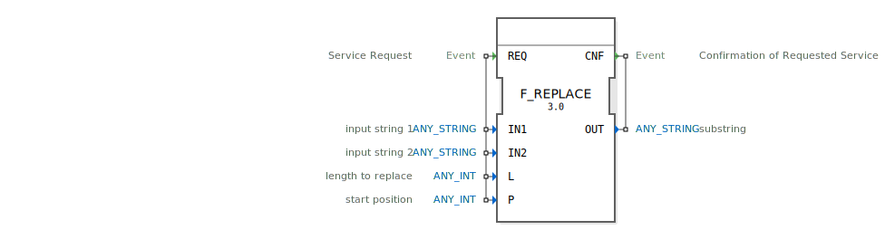

# F_REPLACE

```{index} single: F_REPLACE
```


* * * * * * * * * *
## Einleitung
Der Funktionsblock F_REPLACE dient zur Manipulation von Zeichenketten. Er ersetzt eine bestimmte Anzahl von Zeichen (L) in der ersten Eingabezeichenkette (IN1) durch die zweite Eingabezeichenkette (IN2), beginnend an einer spezifizierten Position (P).



## Schnittstellenstruktur

### **Ereignis-Eingänge**
- **REQ**: Dienst-Anforderung. Löst die Ersetzungsoperation aus. Verknüpft mit den Daten-Eingängen IN1, IN2, L und P.

### **Ereignis-Ausgänge**
- **CNF**: Bestätigung der angeforderten Dienstleistung. Wird ausgelöst, wenn die Ersetzung abgeschlossen ist. Verknüpft mit dem Daten-Ausgang OUT.

### **Daten-Eingänge**
- **IN1** (ANY_STRING): Die erste Eingabezeichenkette, in der die Ersetzung vorgenommen wird.
- **IN2** (ANY_STRING): Die zweite Eingabezeichenkette, die als Ersatz verwendet wird.
- **L** (ANY_INT): Die Anzahl der zu ersetzenden Zeichen.
- **P** (ANY_INT): Die Startposition für die Ersetzung in IN1.

### **Daten-Ausgänge**
- **OUT** (ANY_STRING): Die resultierende Zeichenkette nach der Ersetzung.

### **Adapter**
Keine Adapter vorhanden.

## Funktionsweise
Der Funktionsblock führt die folgende Operation durch:
1. Beim Empfang des REQ-Ereignisses werden die Eingabewerte IN1, IN2, L und P gelesen.
2. In der Zeichenkette IN1 werden ab Position P genau L Zeichen durch die Zeichenkette IN2 ersetzt.
3. Das Ergebnis wird in OUT gespeichert und das CNF-Ereignis ausgelöst.

## Technische Besonderheiten
- Unterstützt beliebige Zeichenketten-Typen (ANY_STRING).
- Die Position P und die Länge L müssen gültige Indizes innerhalb der Zeichenkette IN1 sein, um korrekte Ergebnisse zu gewährleisten.

## Zustandsübersicht
Der Funktionsblock hat keine internen Zustände. Die Operation wird bei jedem REQ-Ereignis neu ausgeführt.

## Anwendungsszenarien
- Textverarbeitung in Automatisierungsanwendungen.
- Manipulation von Zeichenketten in Protokollnachrichten.
- Dynamische Anpassung von Konfigurationsstrings.

## ⚖️ Vergleich mit ähnlichen Bausteinen
- Ähnlich zu F_INSERT, jedoch ersetzt F_REPLACE bestehende Zeichen statt neue einzufügen.
- Im Vergleich zu F_DELETE wird hier nicht nur gelöscht, sondern durch andere Zeichen ersetzt.

## Fazit
F_REPLACE ist ein nützlicher Funktionsblock für die Zeichenkettenmanipulation in IEC 61131-3 basierten Steuerungen. Seine einfache und klare Funktionsweise macht ihn ideal für verschiedene Anwendungen in der Automatisierungstechnik.