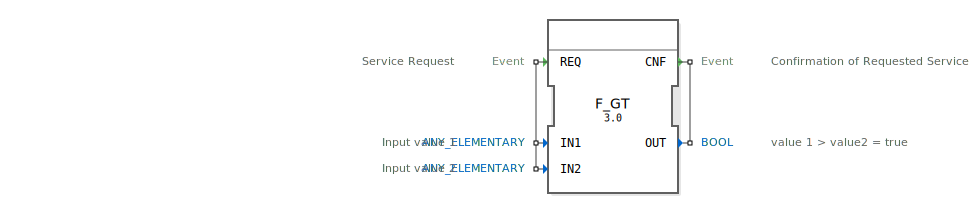

# F_GT

```{index} single: F_GT
```


<https://content.helpme-codesys.com/en/CODESYS%20Development%20System/_cds_operator_gt.html>

* * * * * * * * * *




Folgender Text wurde erzeugt von <https://chat.deepseek.com/> am 05.02.2025 und noch nicht korrekturgelesen (HF)

**Der GT-Operator in IEC 61499: Eine Einführung**

Die IEC 61499 ist eine internationale Norm, die sich mit der Modellierung von Funktionsbausteinen für industrielle Automatisierungssysteme beschäftigt. Sie bietet ein standardisiertes Framework für die Entwicklung von verteilten Steuerungssystemen, wobei logische und arithmetische Operatoren eine zentrale Rolle spielen. Einer dieser Operatoren ist der **GT-Operator** (Greater Than, „größer als“), der in diesem Aufsatz näher beleuchtet werden soll.

### Was ist der GT-Operator?

Der GT-Operator ist ein Vergleichsoperator, der verwendet wird, um festzustellen, ob ein Wert größer als ein anderer Wert ist. In der IEC 61499 wird dieser Operator häufig in Funktionsbausteinen eingesetzt, um Bedingungen zu evaluieren und Entscheidungen basierend auf numerischen Vergleichen zu treffen. Der GT-Operator vergleicht zwei Eingangswerte und gibt einen booleschen Wert (`TRUE` oder `FALSE`) zurück, je nachdem, ob der erste Wert größer als der zweite Wert ist.

### Syntax und Verwendung

In der IEC 61499 wird der GT-Operator in Ausdrücken von Funktionsbausteinen verwendet. Die Syntax des GT-Operators ist wie folgt:

```
GT(Eingang1, Eingang2)
```

Hierbei sind `Eingang1` und `Eingang2` die beiden Werte, die verglichen werden sollen. Der Rückgabewert des Operators ist `TRUE`, wenn `Eingang1` größer als `Eingang2` ist, andernfalls ist der Rückgabewert `FALSE`.

### Anwendungsbeispiele

1. **Überwachung von Grenzwerten:**
   In industriellen Prozessen ist es oft notwendig, Grenzwerte zu überwachen. Der GT-Operator kann verwendet werden, um zu überprüfen, ob ein Messwert einen bestimmten Schwellenwert überschreitet:

   ```
   IF GT(Messwert, Schwellenwert) THEN
       // Alarm auslösen oder Korrekturmaßnahmen einleiten
   END_IF
   ```

2. **Steuerung von Produktionsprozessen:**
   In einem Produktionsprozess kann der GT-Operator verwendet werden, um zu bestimmen, ob eine bestimmte Menge an Material produziert wurde. Wenn die produzierte Menge größer als die Zielmenge ist, kann der Prozess gestoppt werden:

   ```
   IF GT(ProduzierteMenge, ZielMenge) THEN
       // Produktionsprozess stoppen
   END_IF
   ```

3. **Temperaturregelung:**
   In einem Heizsystem kann der GT-Operator verwendet werden, um zu überprüfen, ob die aktuelle Temperatur den Sollwert überschreitet. Wenn dies der Fall ist, kann die Heizung abgeschaltet werden:

   ```
   IF GT(AktuelleTemperatur, SollTemperatur) THEN
       // Heizung abschalten
   END_IF
   ```

4. **Energieverbrauchsüberwachung:**
   Der GT-Operator kann auch zur Überwachung des Energieverbrauchs eingesetzt werden. Wenn der Verbrauch einen bestimmten Wert überschreitet, können Maßnahmen zur Energieeinsparung eingeleitet werden:

   ```
   IF GT(EnergieVerbrauch, Grenzwert) THEN
       // Energieeinsparmaßnahmen aktivieren
   END_IF
   ```

### Vorteile des GT-Operators

- **Einfache Logik:** Der GT-Operator ermöglicht es, komplexe Bedingungen in einfachen, leicht verständlichen Ausdrücken zu formulieren.
- **Flexibilität:** Der Operator kann auf verschiedene numerische Datentypen angewendet werden, einschließlich Ganzzahlen und Gleitkommazahlen.
- **Effizienz:** Durch die direkte Integration in Funktionsbausteine reduziert der GT-Operator den Bedarf an zusätzlicher Programmierung und macht den Code effizienter.
- **Robustheit:** Der GT-Operator trägt dazu bei, robuste Steuerungsalgorithmen zu entwickeln, die auf präzisen numerischen Vergleichen basieren.

#


## 🛠️ Zugehörige Übungen

* [Uebung_060](../../../../training1/Ventilsteuerung/4diacIDE-workspace/test_B/Uebungen_doc/Uebung_060.md)
* [Uebung_071](../../../../training1/Ventilsteuerung/4diacIDE-workspace/test_B/Uebungen_doc/Uebung_071.md)
* [Uebung_071a](../../../../training1/Ventilsteuerung/4diacIDE-workspace/test_B/Uebungen_doc/Uebung_071a.md)
* [Uebung_110](../../../../training1/Ventilsteuerung/4diacIDE-workspace/test_B/Uebungen_doc/Uebung_110.md)
* [Uebung_111](../../../../training1/Ventilsteuerung/4diacIDE-workspace/test_B/Uebungen_doc/Uebung_111.md)

## Fazit

Der GT-Operator ist ein wichtiges Werkzeug in der IEC 61499, das die Implementierung von numerischen Vergleichen in industriellen Steuerungssystemen vereinfacht. Seine Fähigkeit, festzustellen, ob ein Wert größer als ein anderer Wert ist, macht ihn zu einem unverzichtbaren Bestandteil in der Prozessüberwachung, Regelung und Entscheidungsfindung. Ob in der Produktionssteuerung, Temperaturregelung oder Energieverbrauchsüberwachung – der GT-Operator ist ein leistungsstarkes und vielseitiges Element in der Welt der industriellen Automatisierung. Durch seine Einfachheit und Effizienz trägt er dazu bei, die Entwicklung von zuverlässigen und effektiven Steuerungssystemen zu unterstützen.