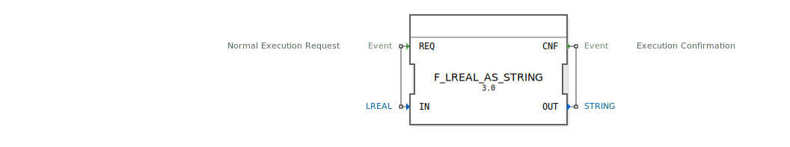

# F_LREAL_AS_STRING

```{index} single: F_LREAL_AS_STRING
```


* * * * * * * * * *
## Einleitung
Der Funktionsblock `F_LREAL_AS_STRING` dient zur Konvertierung eines LREAL-Wertes (64-Bit Gleitkommazahl) in einen STRING. Diese Funktionalität ist besonders nützlich, wenn numerische Werte für die Anzeige, Protokollierung oder Kommunikation als Zeichenketten benötigt werden.



## Schnittstellenstruktur

### **Ereignis-Eingänge**
- `REQ`: Startet die Konvertierung. Der Eingang ist mit dem Daten-Eingang `IN` verbunden.

### **Ereignis-Ausgänge**
- `CNF`: Signalisiert den Abschluss der Konvertierung. Der Ausgang ist mit dem Daten-Ausgang `OUT` verbunden.

### **Daten-Eingänge**
- `IN` (LREAL): Der Eingangswert, der in einen STRING konvertiert werden soll.

### **Daten-Ausgänge**
- `OUT` (STRING): Der Ergebnis-STRING nach der Konvertierung.

### **Adapter**
Dieser Funktionsblock verwendet keine Adapter.

## Funktionsweise
Bei Auslösung des `REQ`-Ereignisses wird der Algorithmus ausgeführt, der den LREAL-Wert `IN` in einen STRING konvertiert und das Ergebnis über `OUT` ausgibt. Das `CNF`-Ereignis signalisiert die erfolgreiche Beendigung der Konvertierung.

## Technische Besonderheiten
- Die Konvertierung erfolgt mittels der Funktion `LREAL_AS_STRING`.
- Der Funktionsblock ist einfach und hat keine internen Zustände oder komplexe Logik.

## Zustandsübersicht
Da es sich um einen einfachen Funktionsblock handelt, gibt es keine Zustandsübergänge oder -maschinen.

## Anwendungsszenarien
- Anzeige von Gleitkommazahlen in Benutzeroberflächen.
- Protokollierung von Messwerten in Textdateien oder Datenbanken.
- Vorbereitung von Daten für die Kommunikation über Textprotokolle.

## ⚖️ Vergleich mit ähnlichen Bausteinen
- Im Gegensatz zu `F_STRING_TO_LREAL` führt dieser Baustein die umgekehrte Konvertierung durch.
- Im Vergleich zu generischen Konvertierungsbausteinen ist dieser spezialisiert auf LREAL-zu-STRING-Konvertierungen.

## Fazit
Der `F_LREAL_AS_STRING` Funktionsblock bietet eine einfache und effiziente Möglichkeit, Gleitkommazahlen in Zeichenketten umzuwandeln. Seine klare Schnittstelle und einfache Funktionsweise machen ihn zu einem nützlichen Baustein in vielen Automatisierungsanwendungen.