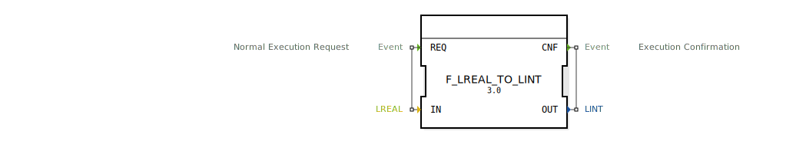

# F_LREAL_TO_LINT

```{index} single: F_LREAL_TO_LINT
```


* * * * * * * * * *
## Einleitung
Der Funktionsblock `F_LREAL_TO_LINT` dient der Konvertierung eines LREAL-Wertes (64-Bit Gleitkommazahl) in einen LINT-Wert (64-Bit Ganzzahl). Diese Konvertierung ist insbesondere in Szenarien erforderlich, in denen Gleitkommazahlen in Ganzzahlen umgewandelt werden müssen, beispielsweise bei der Verarbeitung von Sensorwerten oder bei der Steuerung von Aktoren.



## Schnittstellenstruktur

### **Ereignis-Eingänge**
- **REQ**: Normaler Ausführungsanforderung. Dieser Eingang löst die Konvertierung aus.

### **Ereignis-Ausgänge**
- **CNF**: Ausführungsbestätigung. Dieser Ausgang signalisiert den Abschluss der Konvertierung.

### **Daten-Eingänge**
- **IN**: LREAL (64-Bit Gleitkommazahl). Der Eingabewert, der konvertiert werden soll.

### **Daten-Ausgänge**
- **OUT**: LINT (64-Bit Ganzzahl). Der konvertierte Ausgabewert.

### **Adapter**
Keine Adapter vorhanden.

## Funktionsweise
Der Funktionsblock führt die Konvertierung von LREAL zu LINT durch, sobald das Ereignis `REQ` empfangen wird. Die Konvertierung erfolgt mithilfe der Funktion `LREAL_TO_LINT`, die den Eingabewert `IN` in den Ausgabewert `OUT` umwandelt. Nach Abschluss der Konvertierung wird das Ereignis `CNF` ausgelöst.

## Technische Besonderheiten
- Die Konvertierung schneidet den Nachkommateil der Gleitkommazahl ab (Trunkierung).
- Es erfolgt keine Rundung des Wertes.
- Bei Werten außerhalb des darstellbaren Bereichs von LINT kann es zu Überlaufproblemen kommen.

## Zustandsübersicht
Der Funktionsblock besitzt keine internen Zustände. Die Konvertierung erfolgt unmittelbar bei Empfang des `REQ`-Ereignisses.

## Anwendungsszenarien
- Umwandlung von Sensorwerten (z.B. Temperaturmessungen) in Ganzzahlen für weitere Verarbeitung.
- Steuerung von Aktoren, die Ganzzahlwerte erwarten.
- Datenvorverarbeitung in Steuerungssystemen.

## Vergleich mit ähnlichen Bausteinen
- `F_REAL_TO_INT`: Konvertiert REAL (32-Bit Gleitkommazahl) zu INT (16-Bit Ganzzahl).
- `F_LREAL_TO_DINT`: Konvertiert LREAL (64-Bit Gleitkommazahl) zu DINT (32-Bit Ganzzahl).
- `F_LREAL_TO_LINT` bietet eine höhere Genauigkeit durch die Verwendung von 64-Bit Ganzahlen.

## Fazit
Der Funktionsblock `F_LREAL_TO_LINT` ist ein einfacher und effizienter Baustein zur Konvertierung von 64-Bit Gleitkommazahlen in 64-Bit Ganzahlen. Er eignet sich besonders für Anwendungen, die eine hohe Genauigkeit und einen großen Wertebereich erfordern. Durch seine einfache Schnittstelle und direkte Funktionsweise ist er leicht in bestehende Steuerungssysteme integrierbar.