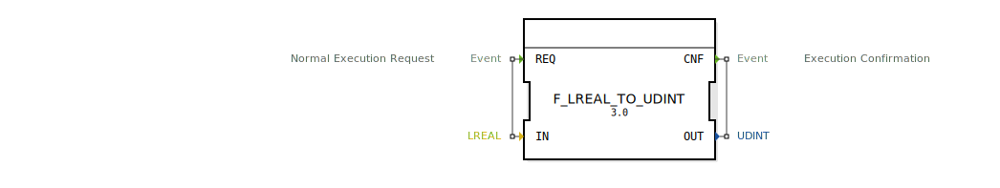

# F_LREAL_TO_UDINT

```{index} single: F_LREAL_TO_UDINT
```


* * * * * * * * * *
## Einleitung
Der Funktionsblock `F_LREAL_TO_UDINT` dient zur Konvertierung eines 64-Bit Gleitkommawerts (LREAL) in einen 32-Bit vorzeichenlosen Integerwert (UDINT). Diese Konvertierung ist nützlich, wenn Gleitkommazahlen in vorzeichenlose Integerwerte umgewandelt werden müssen, z.B. für spezifische Steuerungs- oder Kommunikationsanwendungen.



## Schnittstellenstruktur

### **Ereignis-Eingänge**
- **REQ**: Startet die Konvertierung. Dieser Ereigniseingang ist mit dem Daten-Eingang `IN` verknüpft.

### **Ereignis-Ausgänge**
- **CNF**: Signalisiert den Abschluss der Konvertierung. Dieser Ereignisausgang ist mit dem Daten-Ausgang `OUT` verknüpft.

### **Daten-Eingänge**
- **IN** (LREAL): Der Eingangswert, der konvertiert werden soll.

### **Daten-Ausgänge**
- **OUT** (UDINT): Der konvertierte Ausgangswert.

### **Adapter**
Dieser Funktionsblock verwendet keine Adapter.

## Funktionsweise
Der Funktionsblock führt die Konvertierung von einem LREAL- zu einem UDINT-Wert durch, sobald das `REQ`-Ereignis empfangen wird. Die Konvertierung erfolgt mittels der eingebauten Funktion `LREAL_TO_UDINT`. Nach Abschluss der Konvertierung wird das `CNF`-Ereignis ausgelöst, und der konvertierte Wert steht am Ausgang `OUT` zur Verfügung.

## Technische Besonderheiten
- Die Konvertierung schneidet den Gleitkommawert auf den nächsten ganzzahligen Wert ab.
- Es gibt keine Überprüfung auf Überlauf oder Unterlauf. Werte außerhalb des UDINT-Bereichs (0 bis 4.294.967.295) führen zu undefiniertem Verhalten.

## Zustandsübersicht
Der Funktionsblock besitzt keine internen Zustände. Die Konvertierung erfolgt unmittelbar bei Empfang des `REQ`-Ereignisses.

## Anwendungsszenarien
- Konvertierung von Sensordaten (z.B. Temperaturmessungen) in vorzeichenlose Integerwerte für die weitere Verarbeitung.
- Vorbereitung von Gleitkommawerten für die Kommunikation mit Systemen, die nur vorzeichenlose Integerwerte unterstützen.

## Vergleich mit ähnlichen Bausteinen
- **F_REAL_TO_UINT**: Konvertiert 32-Bit Gleitkommawerte (REAL) in 16-Bit vorzeichenlose Integerwerte (UINT).
- **F_LREAL_TO_DINT**: Konvertiert 64-Bit Gleitkommawerte (LREAL) in 32-Bit vorzeichenbehaftete Integerwerte (DINT).
- **F_LREAL_TO_UDINT** ist spezifisch für die Konvertierung zu vorzeichenlosen 32-Bit Integern.

## Fazit
Der Funktionsblock `F_LREAL_TO_UDINT` bietet eine einfache und effiziente Möglichkeit, Gleitkommawerte in vorzeichenlose Integerwerte umzuwandeln. Aufgrund der fehlenden Überlaufprüfung sollte er jedoch nur in Szenarien eingesetzt werden, in denen die Eingabewerte bekannt und innerhalb des zulässigen Bereichs liegen.