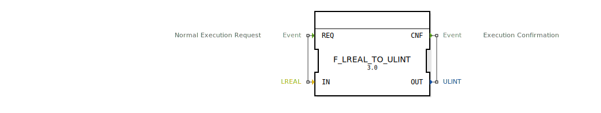

# F_LREAL_TO_ULINT

```{index} single: F_LREAL_TO_ULINT
```


* * * * * * * * * *
## Einleitung
Der Funktionsblock `F_LREAL_TO_ULINT` dient der Konvertierung eines LREAL-Wertes (64-Bit Gleitkommazahl) in einen ULINT-Wert (64-Bit vorzeichenlose Ganzzahl). Diese Konvertierung ist insbesondere in Szenarien erforderlich, in denen Gleitkommazahlen in vorzeichenlose Ganzzahlen umgewandelt werden müssen, z.B. für bestimmte Berechnungen oder zur Speicherung in spezifischen Datenformaten.



## Schnittstellenstruktur
### **Ereignis-Eingänge**
- `REQ` (Normal Execution Request): Startet die Konvertierung des Eingabewertes. Wird mit dem Daten-Eingang `IN` verknüpft.

### **Ereignis-Ausgänge**
- `CNF` (Execution Confirmation): Signalisiert den Abschluss der Konvertierung. Wird mit dem Daten-Ausgang `OUT` verknüpft.

### **Daten-Eingänge**
- `IN` (LREAL): Der Eingabewert, der konvertiert werden soll.

### **Daten-Ausgänge**
- `OUT` (ULINT): Der konvertierte Ausgabewert.

### **Adapter**
Keine Adapter vorhanden.

## Funktionsweise
Der Funktionsblock führt die Konvertierung durch, sobald das Ereignis `REQ` empfangen wird. Der Algorithmus `REQ` wandelt den LREAL-Wert `IN` mithilfe der Funktion `LREAL_TO_ULINT` in einen ULINT-Wert um und speichert das Ergebnis in `OUT`. Anschließend wird das Ereignis `CNF` ausgelöst, um den Abschluss der Konvertierung zu signalisieren.

## Technische Besonderheiten
- Die Konvertierung erfolgt ohne Rundung, d.h. der Nachkommaanteil wird abgeschnitten.
- Bei Werten außerhalb des darstellbaren Bereichs von ULINT (0 bis 2^64-1) kann es zu Überlauf oder unerwarteten Ergebnissen kommen.

## Zustandsübersicht
Der Funktionsblock besitzt keine internen Zustände. Die Konvertierung erfolgt unmittelbar bei Empfang des `REQ`-Ereignisses.

## Anwendungsszenarien
- Konvertierung von Sensorwerten (z.B. Temperaturmessungen) in vorzeichenlose Ganzzahlen für weitere Verarbeitung.
- Umwandlung von Gleitkommazahlen für die Speicherung in Datenbanken oder Protokollen, die nur Ganzzahlen unterstützen.
- Verwendung in Steuerungsalgorithmen, die vorzeichenlose Ganzzahlen erfordern.

## ⚖️ Vergleich mit ähnlichen Bausteinen
- `F_REAL_TO_UINT`: Konvertiert REAL (32-Bit Gleitkommazahl) in UINT (16-Bit vorzeichenlose Ganzzahl).
- `F_LREAL_TO_LINT`: Konvertiert LREAL in LINT (64-Bit vorzeichenbehaftete Ganzzahl).
- `F_LREAL_TO_ULINT` ist spezifisch für 64-Bit vorzeichenlose Konvertierungen und bietet somit eine höhere Genauigkeit und einen größeren Wertebereich im Vergleich zu 16- oder 32-Bit Varianten.

## Fazit
Der Funktionsblock `F_LREAL_TO_ULINT` bietet eine einfache und effiziente Möglichkeit, Gleitkommazahlen in vorzeichenlose Ganzzahlen umzuwandeln. Durch seine klare Schnittstelle und direkte Funktionsweise eignet er sich ideal für Anwendungen, die eine präzise Konvertierung ohne Rundung erfordern.