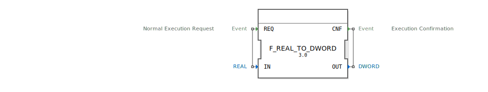

# F_REAL_TO_DWORD

```{index} single: F_REAL_TO_DWORD
```


* * * * * * * * * *
## Einleitung
Der Funktionsblock `F_REAL_TO_DWORD` dient der Konvertierung eines REAL-Wertes (Fließkommazahl) in einen DWORD-Wert (32-Bit vorzeichenlose Ganzzahl). Diese Konvertierung ist besonders nützlich, wenn Fließkommawerte in Systemen verarbeitet werden müssen, die nur Ganzzahloperationen unterstützen.



## Schnittstellenstruktur
### **Ereignis-Eingänge**
- **REQ**: Startet die Konvertierung. Der zu konvertierende Wert wird über den Daten-Eingang `IN` bereitgestellt.

### **Ereignis-Ausgänge**
- **CNF**: Signalisiert den Abschluss der Konvertierung. Der konvertierte Wert wird über den Daten-Ausgang `OUT` ausgegeben.

### **Daten-Eingänge**
- **IN**: REAL-Wert, der in einen DWORD-Wert konvertiert werden soll.

### **Daten-Ausgänge**
- **OUT**: Der resultierende DWORD-Wert nach der Konvertierung.

### **Adapter**
Dieser Funktionsblock verwendet keine Adapter.

## Funktionsweise
Bei Empfang eines Ereignisses am Eingang `REQ` wird der Algorithmus ausgeführt, der den REAL-Wert von `IN` in einen DWORD-Wert konvertiert und das Ergebnis an `OUT` ausgibt. Anschließend wird das Ereignis `CNF` ausgelöst, um den Abschluss der Operation zu signalisieren.

## Technische Besonderheiten
- Die Konvertierung erfolgt durch die Funktion `REAL_TO_DWORD`, die den REAL-Wert direkt in einen DWORD-Wert umwandelt. Dabei wird der Fließkommawert auf die nächstliegende Ganzzahl gerundet.
- Es ist zu beachten, dass bei sehr großen oder kleinen Werten Datenverlust auftreten kann, da der DWORD-Typ nur eine begrenzte Genauigkeit bietet.

## Zustandsübersicht
Der Funktionsblock besitzt keine internen Zustände. Die Konvertierung erfolgt unmittelbar bei Empfang des `REQ`-Ereignisses.

## Anwendungsszenarien
- Verarbeitung von Sensordaten, die als Fließkommawerte vorliegen, aber in Ganzzahlform weiterverarbeitet werden müssen.
- Integration in Steuerungssysteme, die nur Ganzzahloperationen unterstützen.
- Datenkonvertierung für Kommunikationsprotokolle, die DWORD-Werte erfordern.

## ⚖️ Vergleich mit ähnlichen Bausteinen
- **F_REAL_TO_INT**: Konvertiert REAL in INT (vorzeichenbehaftete Ganzzahl). Im Gegensatz dazu liefert `F_REAL_TO_DWORD` einen vorzeichenlosen Wert.
- **F_REAL_TO_LREAL**: Konvertiert REAL in LREAL (höhere Genauigkeit), während `F_REAL_TO_DWORD` den Wert in einen Ganzzahltyp umwandelt.


## 🛠️ Zugehörige Übungen

* [Uebung_126b2_sub](../../../../../training1/Ventilsteuerung/4diacIDE-workspace/test_B/Uebungen_doc/Uebung_126b2_sub.md)

## Fazit
Der Funktionsblock `F_REAL_TO_DWORD` bietet eine einfache und effiziente Möglichkeit, Fließkommawerte in vorzeichenlose Ganzzahlen umzuwandeln. Er ist besonders nützlich in Umgebungen, die nur Ganzzahloperationen unterstützen oder wenn Daten in einem bestimmten Format weiterverarbeitet werden müssen. Bei der Verwendung ist jedoch auf mögliche Datenverluste durch die Konvertierung zu achten.