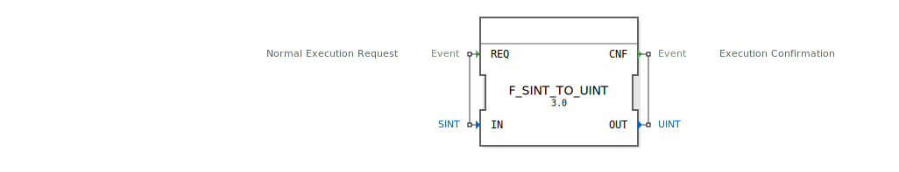

# F_SINT_TO_UINT

```{index} single: F_SINT_TO_UINT
```


* * * * * * * * * *
## Einleitung
Der Funktionsblock `F_SINT_TO_UINT` dient der Konvertierung eines vorzeichenbehafteten 8-Bit-Integer-Werts (`SINT`) in einen vorzeichenlosen 16-Bit-Integer-Wert (`UINT`). Diese Konvertierung ist insbesondere dann notwendig, wenn Daten zwischen Systemen ausgetauscht werden, die unterschiedliche Datentypen verwenden.



## Schnittstellenstruktur

### **Ereignis-Eingänge**
- **REQ**: Startet die Konvertierung. Der Eingang ist mit dem Daten-Eingang `IN` verbunden.

### **Ereignis-Ausgänge**
- **CNF**: Signalisiert den Abschluss der Konvertierung. Der Ausgang ist mit dem Daten-Ausgang `OUT` verbunden.

### **Daten-Eingänge**
- **IN**: Der Eingang erwartet einen Wert vom Typ `SINT` (vorzeichenbehafteter 8-Bit-Integer).

### **Daten-Ausgänge**
- **OUT**: Der Ausgang liefert den konvertierten Wert als `UINT` (vorzeichenloser 16-Bit-Integer).

### **Adapter**
- Es sind keine Adapter vorhanden.

## Funktionsweise
Der Funktionsblock führt die Konvertierung durch, sobald das Ereignis `REQ` empfangen wird. Dabei wird der Wert am Eingang `IN` vom Typ `SINT` in einen `UINT`-Wert umgewandelt und am Ausgang `OUT` ausgegeben. Die erfolgreiche Konvertierung wird durch das Ereignis `CNF` signalisiert.

## Technische Besonderheiten
- Die Konvertierung erfolgt mittels der Funktion `SINT_TO_UINT`, die im Algorithmus des Funktionsblocks implementiert ist.
- Der Funktionsblock ist einfach und benötigt keine zusätzliche Zustandsverwaltung.

## Zustandsübersicht
Da es sich um einen einfachen Funktionsblock handelt, gibt es keine komplexen Zustände. Der Block reagiert direkt auf das `REQ`-Ereignis mit der Ausführung der Konvertierung und der Ausgabe des Ergebnisses.

## Anwendungsszenarien
- Konvertierung von Sensorwerten, die als `SINT` vorliegen, für Systeme, die `UINT` erwarten.
- Datenaufbereitung für Kommunikationsprotokolle, die vorzeichenlose Werte benötigen.

## Vergleich mit ähnlichen Bausteinen
- Im Vergleich zu generischen Konvertierungsblöcken ist `F_SINT_TO_UINT` spezialisiert und optimiert für die Konvertierung von `SINT` zu `UINT`.
- Andere Blöcke wie `F_INT_TO_UINT` oder `F_DINT_TO_UDINT` bieten ähnliche Funktionalität, jedoch für andere Datentypen.


## Zugehörige Übungen

* [Uebung_035](../../../../../training1/Ventilsteuerung/4diacIDE-workspace/test_B/Uebungen_doc/Uebung_035.md)
* [Uebung_035b](../../../../../training1/Ventilsteuerung/4diacIDE-workspace/test_B/Uebungen_doc/Uebung_035b.md)
* [Uebung_035c](../../../../../training1/Ventilsteuerung/4diacIDE-workspace/test_B/Uebungen_doc/Uebung_035c.md)
* [Uebung_036](../../../../../training1/Ventilsteuerung/4diacIDE-workspace/test_B/Uebungen_doc/Uebung_036.md)
* [Uebung_037](../../../../../training1/Ventilsteuerung/4diacIDE-workspace/test_B/Uebungen_doc/Uebung_037.md)
* [Uebung_038](../../../../../training1/Ventilsteuerung/4diacIDE-workspace/test_B/Uebungen_doc/Uebung_038.md)
* [Uebung_038_AX](../../../../../training1/Ventilsteuerung/4diacIDE-workspace/test_AX/Uebungen_doc/Uebung_038_AX.md)
* [Uebung_039_sub_NumbAnzeig](../../../../../training1/Ventilsteuerung/4diacIDE-workspace/test_B/Uebungen_doc/Uebung_039_sub_NumbAnzeig.md)
* [Uebung_040](../../../../../training1/Ventilsteuerung/4diacIDE-workspace/test_B/Uebungen_doc/Uebung_040.md)
* [Uebung_040_2](../../../../../training1/Ventilsteuerung/4diacIDE-workspace/test_B/Uebungen_doc/Uebung_040_2.md)
* [Uebung_040_AX](../../../../../training1/Ventilsteuerung/4diacIDE-workspace/test_AX/Uebungen_doc/Uebung_040_AX.md)
* [Uebung_041](../../../../../training1/Ventilsteuerung/4diacIDE-workspace/test_B/Uebungen_doc/Uebung_041.md)

## Fazit
Der `F_SINT_TO_UINT` Funktionsblock ist ein effizientes Werkzeug für die spezifische Konvertierung von vorzeichenbehafteten zu vorzeichenlosen Integer-Werten. Seine Einfachheit und direkte Funktionsweise machen ihn zu einer zuverlässigen Lösung in Steuerungs- und Automatisierungssystemen.