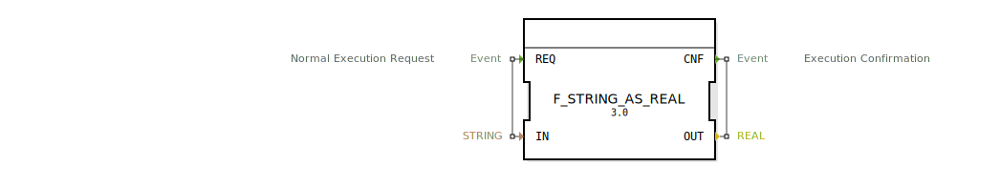

# F_STRING_AS_REAL

```{index} single: F_STRING_AS_REAL
```


* * * * * * * * * *
## Einleitung
Der Funktionsblock `F_STRING_AS_REAL` dient der Konvertierung eines `STRING`-Wertes in einen `REAL`-Wert. Er ist besonders nützlich, wenn Daten aus einer Zeichenkette in eine numerische Darstellung umgewandelt werden müssen, beispielsweise bei der Verarbeitung von Benutzereingaben oder der Interpretation von Textdateien.



## Schnittstellenstruktur

### **Ereignis-Eingänge**
- **REQ**: Startet die Konvertierung. Bei Auslösung dieses Ereignisses wird der Algorithmus zur Umwandlung des `STRING`-Wertes in einen `REAL`-Wert ausgeführt.

### **Ereignis-Ausgänge**
- **CNF**: Signalisiert den erfolgreichen Abschluss der Konvertierung. Dieses Ereignis wird zusammen mit dem konvertierten `REAL`-Wert ausgegeben.

### **Daten-Eingänge**
- **IN** (`STRING`): Der Eingabewert, der in einen `REAL`-Wert umgewandelt werden soll.

### **Daten-Ausgänge**
- **OUT** (`REAL`): Der Ergebniswert der Konvertierung.

### **Adapter**
Dieser Funktionsblock verwendet keine Adapter.

## Funktionsweise
Der Funktionsblock führt bei Auslösung des `REQ`-Ereignisses die Konvertierung des `STRING`-Wertes `IN` in einen `REAL`-Wert durch. Die Umwandlung erfolgt mittels der eingebauten Funktion `STRING_AS_REAL`. Nach erfolgreicher Konvertierung wird das `CNF`-Ereignis ausgelöst und der Ergebniswert über `OUT` ausgegeben.

## Technische Besonderheiten
- Die Konvertierung kann fehlschlagen, wenn der Eingabe-`STRING` keine gültige `REAL`-Zahl darstellt. In diesem Fall kann es zu einem Laufzeitfehler kommen.
- Der Funktionsblock ist einfach gehalten und enthält keine zusätzliche Fehlerbehandlung.

## Zustandsübersicht
1. **Idle**: Wartet auf das `REQ`-Ereignis.
2. **Processing**: Führt die Konvertierung durch.
3. **Completed**: Sendet das `CNF`-Ereignis mit dem Ergebnis.

## Anwendungsszenarien
- Verarbeitung von Benutzereingaben, die als Zeichenketten vorliegen.
- Interpretation von Daten aus Textdateien oder Netzwerkkommunikation.
- Umwandlung von Konfigurationswerten, die als Zeichenketten gespeichert sind.

## ⚖️ Vergleich mit ähnlichen Bausteinen
- Im Vergleich zu generischen Konvertierungsblöcken ist `F_STRING_AS_REAL` spezialisiert auf die Umwandlung von `STRING` zu `REAL`.
- Andere Blöcke könnten zusätzliche Funktionen wie Fehlerbehandlung oder Formatierung bieten, sind dafür aber komplexer.

## Fazit
Der `F_STRING_AS_REAL`-Funktionsblock ist ein einfaches und effizientes Werkzeug zur Konvertierung von Zeichenketten in Gleitkommazahlen. Seine Stärke liegt in der Einfachheit und direkten Anwendbarkeit, allerdings ohne integrierte Fehlerbehandlung. Für robuste Anwendungen sollten zusätzliche Sicherheitsmaßnahmen implementiert werden.