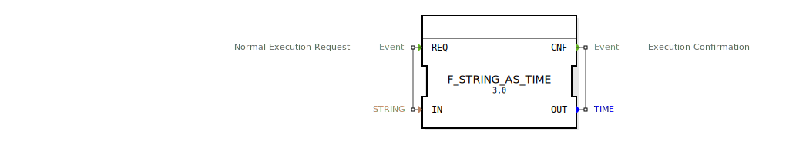

# F_STRING_AS_TIME

```{index} single: F_STRING_AS_TIME
```


* * * * * * * * * *
## Einleitung
Der Funktionsblock `F_STRING_AS_TIME` dient der Konvertierung eines Zeitwertes im STRING-Format in das TIME-Format. Dies ist besonders nützlich, wenn Zeitwerte als Text vorliegen und für weitere Verarbeitung in ein maschinenlesbares Format umgewandelt werden müssen.



## Schnittstellenstruktur
### **Ereignis-Eingänge**
- `REQ`: Startet die Konvertierung des Zeitwertes. Wird dieser Ereigniseingang ausgelöst, beginnt der Funktionsblock mit der Umwandlung des an `IN` übergebenen Strings.

### **Ereignis-Ausgänge**
- `CNF`: Signalisiert die erfolgreiche Beendigung der Konvertierung. Dieses Ereignis wird zusammen mit dem konvertierten Zeitwert am Datenausgang `OUT` ausgegeben.

### **Daten-Eingänge**
- `IN` (STRING): Der Eingang für den Zeitwert im STRING-Format, der in das TIME-Format umgewandelt werden soll.

### **Daten-Ausgänge**
- `OUT` (TIME): Der Ausgang, an dem der konvertierte Zeitwert im TIME-Format ausgegeben wird.

### **Adapter**
Es sind keine Adapter vorhanden.

## Funktionsweise
Der Funktionsblock nutzt die eingebaute Funktion `STRING_AS_TIME`, um den über den Eingang `IN` empfangenen String in einen TIME-Wert umzuwandeln. Die Konvertierung wird durch das Ereignis `REQ` ausgelöst und bei erfolgreicher Umwandlung durch das Ereignis `CNF` bestätigt.

## Technische Besonderheiten
- Die Konvertierung erfolgt direkt und ohne Zwischenschritte.
- Der Funktionsblock ist Teil des Pakets `iec61131::conversion`.

## Zustandsübersicht
1. **Idle**: Der Funktionsblock wartet auf das Ereignis `REQ`.
2. **Processing**: Bei Empfang von `REQ` wird die Konvertierung durchgeführt.
3. **Completion**: Nach erfolgreicher Konvertierung wird das Ereignis `CNF` ausgelöst und der Zustand wechselt zurück zu Idle.

## Anwendungsszenarien
- Verarbeitung von Zeitwerten, die als Text in Benutzereingaben oder externen Datenquellen vorliegen.
- Integration in Systeme, die Zeitwerte im TIME-Format für Steuerungs- oder Regelungsaufgaben benötigen.

## Vergleich mit ähnlichen Bausteinen
- Im Vergleich zu anderen Konvertierungsbausteinen ist `F_STRING_AS_TIME` spezialisiert auf die Umwandlung von Zeitwerten und bietet daher eine direkte und effiziente Lösung für diesen spezifischen Anwendungsfall.

## Fazit
Der `F_STRING_AS_TIME` Funktionsblock ist ein effizientes Werkzeug zur Konvertierung von Zeitwerten im STRING-Format in das TIME-Format. Durch seine einfache und direkte Funktionsweise eignet er sich ideal für Anwendungen, die eine schnelle und zuverlässige Umwandlung benötigen.