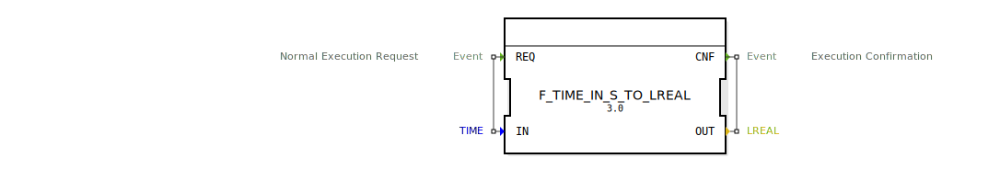

# F_TIME_IN_S_TO_LREAL

```{index} single: F_TIME_IN_S_TO_LREAL
```


* * * * * * * * * *
## Einleitung
Der Funktionsblock `F_TIME_IN_S_TO_LREAL` dient zur Konvertierung eines Zeitwerts in Sekunden (`TIME`) in einen Fließkommawert (`LREAL`). Diese Konvertierung ist nützlich, wenn Zeitwerte in mathematischen Berechnungen oder für weitere Verarbeitungsschritte benötigt werden.



## Schnittstellenstruktur
### **Ereignis-Eingänge**
- **REQ**: Startet die Konvertierung. Der Eingang ist mit dem Daten-Eingang `IN` verknüpft.

### **Ereignis-Ausgänge**
- **CNF**: Signalisiert den Abschluss der Konvertierung. Der Ausgang ist mit dem Daten-Ausgang `OUT` verknüpft.

### **Daten-Eingänge**
- **IN**: Der Eingang erwartet einen Zeitwert vom Typ `TIME` in Sekunden, der konvertiert werden soll.

### **Daten-Ausgänge**
- **OUT**: Gibt den konvertierten Wert als Fließkommazahl (`LREAL`) aus.

### **Adapter**
- Keine Adapter vorhanden.

## Funktionsweise
Der Funktionsblock führt die Konvertierung von `TIME` zu `LREAL` durch, sobald das Ereignis `REQ` ausgelöst wird. Die Konvertierung erfolgt mithilfe der Funktion `TIME_IN_S_TO_LREAL`, die den Zeitwert in Sekunden in einen entsprechenden Fließkommawert umwandelt. Nach Abschluss der Konvertierung wird das Ereignis `CNF` ausgelöst.

## Technische Besonderheiten
- Der Funktionsblock ist ein einfacher Algorithmus (`SimpleFB`) und führt keine komplexen Zustandsübergänge durch.
- Die Konvertierung ist direkt und ohne zusätzliche Verzögerung.

## Zustandsübersicht
Da es sich um einen einfachen Funktionsblock handelt, gibt es keine Zustandsübergänge. Die Konvertierung erfolgt sofort bei Auslösung von `REQ`.

## Anwendungsszenarien
- Umrechnung von Zeitwerten für mathematische Operationen.
- Integration in Steuerungslogik, wo Zeitwerte als Fließkommazahlen benötigt werden.
- Verwendung in Regelungstechnik oder Datenverarbeitung, wo präzise Zeitmessungen erforderlich sind.

## Umgekehrte Konvertierung (Numerisch zu TIME)
Oft wird nach einer Funktion wie `DINT_TO_TIME` gesucht, um einen numerischen Wert (z.B. 500) wieder in einen Zeitwert (z.B. 500ms) zurückzuwandeln. Einen solchen expliziten Konvertierungsbaustein gibt es in der Regel nicht, da dies elegant über eine Multiplikation gelöst wird.

Verwenden Sie hierfür den Baustein **`F_MULTIME`** (aus der Kategorie `arithmetic`):
*   Multiplizieren Sie Ihren numerischen Wert mit der gewünschten Zeitbasis.
*   **Beispiel:** `500 * T#1ms = T#500ms`
*   Dies ermöglicht eine flexible Skalierung (z.B. * T#1s für Sekunden, * T#100ms für Zehntelsekunden).

## ⚖️ Vergleich mit ähnlichen Bausteinen
- Im Gegensatz zu anderen Konvertierungsbausteinen, die möglicherweise zusätzliche Parameter oder Zustände benötigen, ist `F_TIME_IN_S_TO_LREAL` auf eine spezifische und direkte Konvertierung ausgelegt.
- Ähnliche Bausteine könnten z.B. `TIME_TO_STRING` oder `TIME_TO_INT` sein, die jedoch andere Ausgabetypen liefern.

## Fazit
Der Funktionsblock `F_TIME_IN_S_TO_LREAL` bietet eine effiziente und direkte Möglichkeit, Zeitwerte in Sekunden in Fließkommazahlen umzuwandeln. Durch seine einfache Struktur und schnelle Ausführung eignet er sich ideal für Anwendungen, die eine präzise und unkomplizierte Konvertierung erfordern.