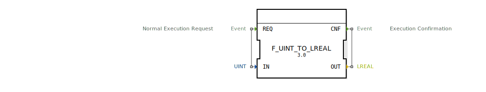

# F_UINT_TO_LREAL

```{index} single: F_UINT_TO_LREAL
```


* * * * * * * * * *
## Einleitung
Der Funktionsblock `F_UINT_TO_LREAL` dient der Konvertierung eines vorzeichenlosen 16-Bit-Integer-Werts (UINT) in einen 64-Bit-Gleitkommawert (LREAL). Diese Konvertierung ist insbesondere in Steuerungsanwendungen nützlich, wo unterschiedliche Datentypen verarbeitet werden müssen.



## Schnittstellenstruktur

### **Ereignis-Eingänge**
- **REQ**: Startet die Konvertierung. Bei diesem Ereignis wird der Wert am Eingang `IN` gelesen und konvertiert.

### **Ereignis-Ausgänge**
- **CNF**: Signalisiert den Abschluss der Konvertierung. Der konvertierte Wert steht am Ausgang `OUT` zur Verfügung.

### **Daten-Eingänge**
- **IN** (UINT): Der vorzeichenlose 16-Bit-Integer-Wert, der in einen LREAL-Wert konvertiert werden soll.

### **Daten-Ausgänge**
- **OUT** (LREAL): Der resultierende 64-Bit-Gleitkommawert nach der Konvertierung.

### **Adapter**
Es sind keine Adapter vorhanden.

## Funktionsweise
Der Funktionsblock führt die Konvertierung durch, indem der UINT-Wert von `IN` direkt in einen LREAL-Wert umgewandelt und an `OUT` ausgegeben wird. Die Konvertierung erfolgt bei Auftreten des Ereignisses `REQ`, und das Ereignis `CNF` signalisiert die Fertigstellung.

## Technische Besonderheiten
- **Algorithmus**: Der Algorithmus ist in Structured Text (ST) implementiert und besteht aus einer einfachen Zuweisung (`OUT := IN`).
- **Datentypen**: Unterstützt die Konvertierung von UINT (0 bis 65535) zu LREAL (64-Bit-Gleitkomma).

## Zustandsübersicht
1. **Idle**: Wartet auf das Ereignis `REQ`.
2. **Konvertierung**: Bei `REQ` wird der Wert von `IN` gelesen und konvertiert.
3. **Abschluss**: Das Ereignis `CNF` wird ausgelöst, und der konvertierte Wert steht an `OUT` zur Verfügung.

## Anwendungsszenarien
- **Messwertverarbeitung**: Umwandlung von diskreten Sensorwerten (z.B. ADC-Rohdaten) in Gleitkommawerte für weitere Berechnungen.
- **Datenkommunikation**: Konvertierung von ganzzahligen Werten für die Verwendung in Gleitkommaoperationen.

## Vergleich mit ähnlichen Bausteinen
- **F_INT_TO_LREAL**: Konvertiert einen vorzeichenbehafteten Integer (INT) zu LREAL.
- **F_DINT_TO_LREAL**: Konvertiert einen 32-Bit-Integer (DINT) zu LREAL.
- **F_ULINT_TO_LREAL**: Konvertiert einen 64-Bit-unsigned Integer (ULINT) zu LREAL.

## Fazit
Der `F_UINT_TO_LREAL` Funktionsblock bietet eine einfache und effiziente Möglichkeit, vorzeichenlose 16-Bit-Integer-Werte in 64-Bit-Gleitkommawerte umzuwandeln. Seine klare Schnittstelle und direkte Funktionsweise machen ihn ideal für Anwendungen, die eine schnelle und zuverlässige Typkonvertierung erfordern.