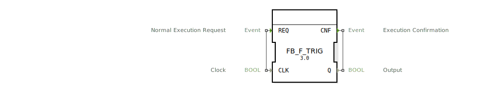

# FB_F_TRIG

```{index} single: FB_F_TRIG
```


* * * * * * * * * *

## Einleitung
Der Funktionsblock `FB_F_TRIG` dient zur Erkennung einer fallenden Flanke eines booleschen Signals. Er wird häufig in Steuerungsanwendungen eingesetzt, um Zustandsänderungen von `TRUE` nach `FALSE` zu detektieren und entsprechende Aktionen auszulösen.



## Schnittstellenstruktur

### **Ereignis-Eingänge**
- `REQ` (Normal Execution Request): Startet die Ausführung des Funktionsblocks. Wird mit dem Daten-Eingang `CLK` verknüpft.

### **Ereignis-Ausgänge**
- `CNF` (Execution Confirmation): Bestätigt die Ausführung des Funktionsblocks. Wird mit dem Daten-Ausgang `Q` verknüpft.

### **Daten-Eingänge**
- `CLK` (BOOL): Das zu überwachende Signal, dessen fallende Flanke erkannt werden soll.

### **Daten-Ausgänge**
- `Q` (BOOL): Gibt `TRUE` aus, wenn eine fallende Flanke erkannt wurde, ansonsten `FALSE`.

### **Adapter**
- Keine Adapter vorhanden.

## Funktionsweise
Der Funktionsblock speichert den vorherigen Zustand des `CLK`-Signals in einer internen Variable `MEM`. Bei jedem Aufruf über das `REQ`-Ereignis wird geprüft, ob das aktuelle `CLK`-Signal `FALSE` ist und der vorherige Zustand (`MEM`) `TRUE` war. In diesem Fall wird `Q` auf `TRUE` gesetzt, ansonsten auf `FALSE`. Der aktuelle Zustand von `CLK` wird dann in `MEM` gespeichert.

## Technische Besonderheiten
- Der Funktionsblock verwendet eine interne Speichervariable (`MEM`), um den vorherigen Zustand des `CLK`-Signals zu speichern.
- Die Logik zur Erkennung der fallenden Flanke wird in einem ST-Algorithmus implementiert.

## Zustandsübersicht
1. **Initialisierung**: `MEM` wird mit `TRUE` initialisiert.
2. **Erkennung einer fallenden Flanke**:
   - Wenn `CLK` von `TRUE` auf `FALSE` wechselt, wird `Q` auf `TRUE` gesetzt.
   - In allen anderen Fällen wird `Q` auf `FALSE` gesetzt.
3. **Speichern des aktuellen Zustands**: Der aktuelle Zustand von `CLK` wird in `MEM` gespeichert.

## Anwendungsszenarien
- Erkennung von Taster- oder Schalterbetätigungen in Steuerungssystemen.
- Synchronisation von Prozessen bei Signaländerungen.
- Triggerung von Aktionen bei fallenden Flanken in zeitkritischen Anwendungen.

## ⚖️ Vergleich mit ähnlichen Bausteinen
- **FB_R_TRIG**: Erkennung einer steigenden Flanke (von `FALSE` nach `TRUE`).
- **FB_R_F_TRIG**: Kombinierte Erkennung von steigenden und fallenden Flanken.
- **FB_F_TRIG** ist spezialisiert auf die Erkennung von fallenden Flanken und daher effizienter in dieser spezifischen Anwendung.


## 🛠️ Zugehörige Übungen

* [Uebung_178](../../../../training1/Ventilsteuerung/4diacIDE-workspace/test_B/Uebungen_doc/Uebung_178.md)
* [Uebung_178_AX](../../../../training1/Ventilsteuerung/4diacIDE-workspace/test_AX/Uebungen_doc/Uebung_178_AX.md)

## Fazit
Der `FB_F_TRIG` ist ein einfacher und effizienter Funktionsblock zur Erkennung von fallenden Flanken in booleschen Signalen. Durch seine klare Schnittstelle und einfache Funktionsweise eignet er sich ideal für Steuerungsanwendungen, bei denen Zustandsänderungen detektiert werden müssen.