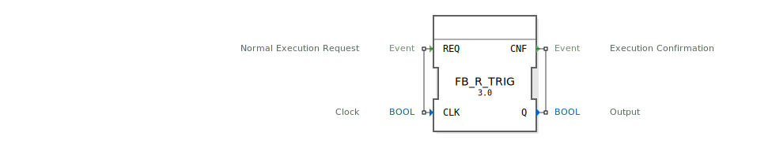

# FB_R_TRIG

```{index} single: FB_R_TRIG
```


* * * * * * * * * *
## Einleitung
Der Funktionsblock `FB_R_TRIG` dient der Erkennung einer steigenden Flanke eines booleschen Signals. Er wird typischerweise verwendet, um Zustandsänderungen von `FALSE` nach `TRUE` zu detektieren und darauf zu reagieren.



## Schnittstellenstruktur

### **Ereignis-Eingänge**
- **REQ**: Normaler Ausführungsanforderung. Wird verwendet, um die Flankenerkennung auszulösen. Ist mit dem Daten-Eingang `CLK` verknüpft.

### **Ereignis-Ausgänge**
- **CNF**: Ausführungsbestätigung. Wird ausgelöst, nachdem die Flankenerkennung abgeschlossen ist. Ist mit dem Daten-Ausgang `Q` verknüpft.

### **Daten-Eingänge**
- **CLK** (BOOL): Das Eingangssignal, dessen steigende Flanke erkannt werden soll.

### **Daten-Ausgänge**
- **Q** (BOOL): Das Ausgangssignal, das `TRUE` wird, wenn eine steigende Flanke am Eingang `CLK` erkannt wird.

### **Adapter**
Der Funktionsblock verwendet keine Adapter.

## Funktionsweise
Der `FB_R_TRIG` speichert den vorherigen Zustand des Eingangssignals `CLK` in einer internen Variable `MEM`. Bei jedem Aufruf des Algorithmus über das Ereignis `REQ` wird geprüft, ob der aktuelle Zustand von `CLK` `TRUE` und der vorherige Zustand `FALSE` war. Ist dies der Fall, wird der Ausgang `Q` auf `TRUE` gesetzt, andernfalls auf `FALSE`. Der aktuelle Zustand von `CLK` wird dann in `MEM` gespeichert für den nächsten Durchlauf.

## Technische Besonderheiten
- Der Funktionsblock ist gemäß dem Standard IEC 61499-1 implementiert.
- Er verwendet einen einfachen Algorithmus zur Flankenerkennung, der effizient und schnell ausgeführt werden kann.

## Zustandsübersicht
Der Funktionsblock hat keinen komplexen Zustandsautomaten. Der Zustand wird lediglich durch den Wert der internen Variable `MEM` repräsentiert, die den vorherigen Zustand von `CLK` speichert.

## Anwendungsszenarien
- Erkennung von Tastendrücken oder Schalterbetätigungen.
- Synchronisation von Prozessen auf steigende Flanken von Steuersignalen.
- Triggerung von Aktionen bei bestimmten Ereignissen.

## ⚖️ Vergleich mit ähnlichen Bausteinen
- **FB_F_TRIG**: Erkennung einer fallenden Flanke (von `TRUE` nach `FALSE`).
- **FB_R_TRIG** ist spezifisch für steigende Flanken und daher komplementär zu `FB_F_TRIG`.


## 🛠️ Zugehörige Übungen

* [Uebung_177](../../../../training1/Ventilsteuerung/4diacIDE-workspace/test_B/Uebungen_doc/Uebung_177.md)
* [Uebung_177_AX](../../../../training1/Ventilsteuerung/4diacIDE-workspace/test_AX/Uebungen_doc/Uebung_177_AX.md)

## Fazit
Der `FB_R_TRIG` ist ein einfacher und effektiver Funktionsblock zur Erkennung steigender Flanken. Seine klare Schnittstellenstruktur und einfache Funktionsweise machen ihn zu einem nützlichen Baustein in vielen Steuerungsanwendungen.