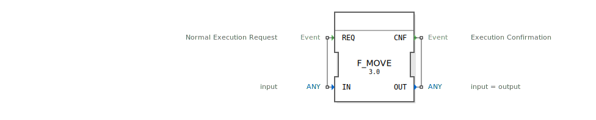

# F_MOVE

```{index} single: F_MOVE
```


* * * * * * * * * *




## Einführung
Der **F_MOVE** ist ein universeller Funktionsbaustein zur typsicheren Datenübertragung, entwickelt unter EPL-2.0 Lizenz. Version 1.0 ermöglicht die Übertragung beliebiger Datentypen (ANY) zwischen Variablen in Steuerungsanwendungen.

## Schnittstellenstruktur

### **Ereignis-Eingänge**
- `REQ`: Übertragungsanforderung (mit Eingabewert)

### **Ereignis-Ausgänge**
- `CNF`: Übertragungsbestätigung (mit Ausgabewert)

### **Daten-Eingänge**
- `IN` (ANY): Quelldaten (beliebiger Typ)

### **Daten-Ausgänge**
- `OUT` (ANY): Zieldaten (identischer Typ wie IN)

## Funktionsweise

1. **Aktivierung**:
   - Durch `REQ`-Ereignis ausgelöst
   - Verarbeitet beliebige Datentypen (ANY)

2. **Datenübertragung**:
   - 1:1 Kopie des Eingabewerts
   - Typerhaltende Übertragung
   - Unterstützt alle IEC 61131-3 Datentypen

3. **Bestätigung**:
   - `CNF`-Ereignis nach erfolgreicher Übertragung
   - OUT erhält exakte Kopie von IN

## Technische Spezifikationen

✔ **Generische Typunterstützung** (ANY)
✔ **Bitgenaue Datenkopie**
✔ **Einzyklus-Latenzzeit**
✔ **IEC 61131-3 konform**

## Anwendungsbeispiele

- **Datenkonvertierung**: Typumwandlungen
- **Signalweiterleitung**: Prozessdatenverteilung
- **Pufferoperationen**: Zwischenspeicherung
- **Schnittstellen**: Datenkapselung

## Besondere Hinweise

- **Typkompatibilität**:
  - Eingangs- und Ausgangstyp müssen identisch sein
  - Keine automatische Typkonvertierung

- **Performance**:
  - Konstant schnelle Ausführung
  - Unabhängig vom Datentyp

## ⚖️ Vergleich mit ähnlichen Bausteinen

| Merkmal        | F_MOVE  | F_BLOCK_MOVE | F_CAST |
|----------------|---------|--------------|--------|
| Funktionsumfang| Einzelwert | Speicherblock | Typkonvertierung |
| Typunterstützung | ANY    | BYTE-Array   | ANY    |
| Latenz         | 1 Zyklus | Variabel     | 1 Zyklus |


## 🛠️ Zugehörige Übungen

* [Uebung_002b2](../../../../training1/Ventilsteuerung/4diacIDE-workspace/test_B/Uebungen_doc/Uebung_002b2.md)
* [Uebung_103c](../../../../training1/Ventilsteuerung/4diacIDE-workspace/test_B/Uebungen_doc/Uebung_103c.md)
* [Uebung_110](../../../../training1/Ventilsteuerung/4diacIDE-workspace/test_B/Uebungen_doc/Uebung_110.md)
* [Uebung_111](../../../../training1/Ventilsteuerung/4diacIDE-workspace/test_B/Uebungen_doc/Uebung_111.md)
* [Uebung_171](../../../../training1/Ventilsteuerung/4diacIDE-workspace/test_B/Uebungen_doc/Uebung_171.md)

## Fazit

Der F_MOVE-Baustein bietet essentielle Datenübertragungsfunktionen:

- Universelle Typunterstützung
- Zuverlässige 1:1-Datenkopie
- Minimaler Ressourcenverbrauch

Unverzichtbar für Steuerungsanwendungen mit komplexen Datenstrukturen oder typsensiblen Operationen. Die generische Implementierung als GEN_FORTE_F_MOVE ermöglicht maximale Flexibilität in heterogenen Automatisierungsumgebungen.