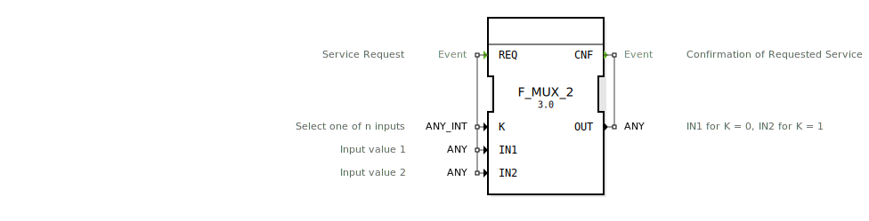

# F_MUX_2

```{index} single: F_MUX_2
```


* * * * * * * * * *

## Einleitung
Der F_MUX_2 ist ein Multiplexer-Funktionsblock nach IEC 61131-3, der als Standard-Selektionsfunktion klassifiziert ist. Der Baustein ermöglicht die Auswahl zwischen zwei Eingangssignalen basierend auf einem Steuersignal.



## Schnittstellenstruktur

### **Ereignis-Eingänge**
- **REQ**: Service-Anfrage - löst die Verarbeitung des Multiplexers aus

### **Ereignis-Ausgänge**
- **CNF**: Bestätigung der angeforderten Serviceleistung - signalisiert die Beendigung der Verarbeitung

### **Daten-Eingänge**
- **K**: Steuereingang zur Auswahl eines von n Eingängen (ANY_INT Typ)
- **IN1**: Eingangswert 1 (ANY Typ)
- **IN2**: Eingangswert 2 (ANY Typ)

### **Daten-Ausgänge**
- **OUT**: Ausgangswert - liefert IN1 für K = 0, IN2 für K = 1 (ANY Typ)

### **Adapter**
Keine Adapter-Schnittstellen vorhanden.

## Funktionsweise
Der F_MUX_2 arbeitet als 2:1 Multiplexer. Bei Eintreffen eines REQ-Ereignisses wertet der Baustein den Steuereingang K aus:
- Bei K = 0 wird der Wert von IN1 an OUT weitergegeben
- Bei K = 1 wird der Wert von IN2 an OUT weitergegeben

Nach erfolgreicher Verarbeitung wird das CNF-Ereignis ausgelöst, um den Abschluss der Operation zu signalisieren.

## Technische Besonderheiten
- Verwendung von generischen Datentypen (ANY und ANY_INT) für maximale Flexibilität
- Unterstützung verschiedener Datentypen für die Eingangswerte
- Einfache und deterministische Verarbeitung
- EPL-2.0 Lizenz

## Zustandsübergänge
1. **Wartezeit**: Keine aktive Verarbeitung
2. **Verarbeitung**: Bei REQ-Ereignis - Auswertung von K und Auswahl des entsprechenden Eingangs
3. **Abschluss**: Auslösung von CNF nach erfolgreicher Datenweitergabe

## Anwendungsszenarien
- Signalweiche in Steuerungsanwendungen
- Auswahl zwischen verschiedenen Betriebsmodi
- Umschaltung zwischen redundanten Signalquellen
- Verarbeitungspfad-Auswahl in komplexen Steuerungen

## ⚖️ Vergleich mit ähnlichen Bausteinen
Im Vergleich zu anderen Multiplexern bietet F_MUX_2:
- Spezifisch für 2 Eingänge optimiert
- Einfacherer Aufbau als Multiplexer mit mehr Eingängen
- Direkte und klare Steuerlogik
- Geringerer Ressourcenverbrauch bei 2-Wege-Auswahl


## 🛠️ Zugehörige Übungen

* [Uebung_090a1](../../../../training1/Ventilsteuerung/4diacIDE-workspace/test_B/Uebungen_doc/Uebung_090a1.md)

## Fazit
Der F_MUX_2 ist ein effizienter und zuverlässiger Multiplexer für Anwendungen, die eine Auswahl zwischen zwei Eingangssignalen erfordern. Seine einfache Struktur und die Verwendung generischer Datentypen machen ihn zu einer vielseitigen Lösung für verschiedene Steuerungsaufgaben.