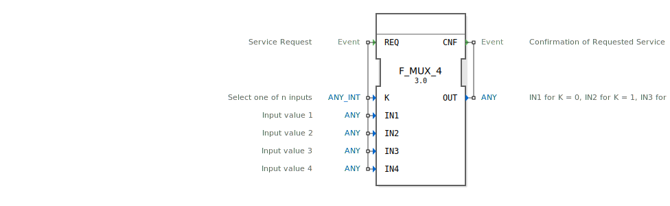

# F_MUX_4

* * * * * * * * * *
## Einleitung
Der Funktionsblock `F_MUX_4` ist ein Multiplexer mit vier Eingängen, der einen von vier Eingangswerten basierend auf einem Steuersignal auswählt und am Ausgang ausgibt. Er ist Teil der IEC 61131-3 Standardbibliothek und wird für Auswahloperationen in Steuerungsanwendungen verwendet.

## Schnittstellenstruktur

### **Ereignis-Eingänge**
- `REQ`: Dienst-Anforderung. Löst die Auswahl und Ausgabe des entsprechenden Eingangswerts aus. Wird mit den Daten-Eingängen `IN1`, `IN2`, `IN3`, `IN4` und `K` verknüpft.

### **Ereignis-Ausgänge**
- `CNF`: Bestätigung der angeforderten Dienstleistung. Wird ausgelöst, nachdem der Ausgangswert gesetzt wurde. Wird mit dem Daten-Ausgang `OUT` verknüpft.

### **Daten-Eingänge**
- `K` (`ANY_INT`): Steuersignal, das den auszuwählenden Eingang bestimmt.
  - `K = 0`: Wählt `IN1`
  - `K = 1`: Wählt `IN2`
  - `K = 2`: Wählt `IN3`
  - `K = 3`: Wählt `IN4`
- `IN1` (`ANY`): Eingangswert 1.
- `IN2` (`ANY`): Eingangswert 2.
- `IN3` (`ANY`): Eingangswert 3.
- `IN4` (`ANY`): Eingangswert 4.

### **Daten-Ausgänge**
- `OUT` (`ANY`): Ausgangswert, der dem durch `K` ausgewählten Eingang entspricht.

### **Adapter**
Keine Adapter vorhanden.

## Funktionsweise
Bei Empfang des Ereignisses `REQ` wertet der Funktionsblock den Wert von `K` aus und gibt den entsprechenden Eingangswert (`IN1` bis `IN4`) am Ausgang `OUT` aus. Anschließend wird das Ereignis `CNF` ausgelöst, um die erfolgreiche Auswahl und Ausgabe zu bestätigen.

## Technische Besonderheiten
- Unterstützt beliebige Datentypen (`ANY`) für die Eingänge und den Ausgang.
- Der Steuereingang `K` muss ein ganzzahliger Wert sein (`ANY_INT`).
- Die Initialwerte der Eingänge sind leer, es werden keine Standardwerte vorgegeben.

## Zustandsübersicht
1. **Idle-Zustand**: Wartet auf das Ereignis `REQ`.
2. **Auswahlzustand**: Wertet `K` aus und wählt den entsprechenden Eingang aus.
3. **Ausgabezustand**: Setzt `OUT` auf den ausgewählten Wert und löst `CNF` aus.

## Anwendungsszenarien
- Auswahl zwischen verschiedenen Sensordaten basierend auf einer Steuerlogik.
- Umschaltung zwischen verschiedenen Betriebsmodi in einer Steuerung.
- Dynamische Auswahl von Datenquellen in Abhängigkeit von externen Bedingungen.

## ⚖️ Vergleich mit ähnlichen Bausteinen
- `F_MUX_2`: Einfacher Multiplexer mit nur zwei Eingängen.
- `F_MUX_3`: Multiplexer mit drei Eingängen.
- `F_MUX_4` bietet eine Erweiterung auf vier Eingänge, was mehr Flexibilität bei der Auswahl ermöglicht.

## Fazit
Der `F_MUX_4` ist ein vielseitiger und einfach zu verwendender Multiplexer, der sich ideal für Anwendungen eignet, bei denen zwischen vier verschiedenen Eingangswerten ausgewählt werden muss. Seine Unterstützung beliebiger Datentypen und die klare Ereignissteuerung machen ihn zu einem wertvollen Baustein in der IEC 61131-3 Standardbibliothek.