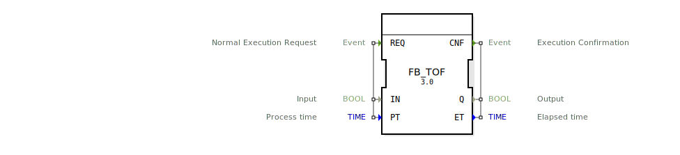

# FB_TOF

## 🎧 Podcast

* [E_TOF vs. FB_TOF: Der Event-Timer, der nicht zyklisch tickt – Revolution für Automatisierungssysteme?](https://podcasters.spotify.com/pod/show/iec-61499-grundkurs-de/episodes/E_TOF-vs--FB_TOF-Der-Event-Timer--der-nicht-zyklisch-tickt--Revolution-fr-Automatisierungssysteme-e3673qk)
* [FB_TOF und E_TOF: Verzögerungstimer in IEC 61131-3 und 61499](https://podcasters.spotify.com/pod/show/iec-61499-grundkurs-de/episodes/FB_TOF-und-E_TOF-Verzgerungstimer-in-IEC-61131-3-und-61499-e368e2d)

---- 
```{index} single: FB_TOF
```


* * * * * * * * * *

Folgender Text wurde erzeugt von <https://chat.deepseek.com/> am 05.02.2025 und noch nicht korrekturgelesen (HF)

## Einleitung
**Wichtiger Hinweis: Dieser Baustein funktioniert nur korrekt, wenn er zyklisch aufgerufen wird.**

### Der Baustein FB_TOF in der IEC 61131-3: Ein Überblick

#### Einleitung

Die IEC 61131-3 ist ein internationaler Standard, der die Programmierung von speicherprogrammierbaren Steuerungen (SPS) regelt. Ein zentrales Konzept in diesem Standard ist der Funktionsbaustein (FB), der als wiederverwendbare Komponente für die Steuerungslogik dient. Der Baustein **FB_TOF** (Off-Delay Timer) ist ein Beispiel für einen solchen Funktionsbaustein, der in der IEC 61131-3 verwendet wird, um eine verzögerte Abschaltfunktion zu modellieren. Dieser Aufsatz beschreibt die Struktur, das Verhalten und die Anwendung des FB_TOF-Bausteins anhand des bereitgestellten Quelltextes. Ein wichtiger Aspekt, der besonders hervorgehoben werden soll, ist, dass dieser Baustein nur dann korrekt funktioniert, wenn er **zyklisch aufgerufen** wird.

#### Struktur des FB_TOF-Bausteins

Der FB_TOF-Baustein ist ein standardisierter Funktionsbaustein gemäß der IEC 61131-3. Er besteht aus einer Schnittstelle (Interface), die Eingangs- und Ausgangsvariablen sowie Ereignisse definiert.

##### Schnittstelle (Interface)

Die Schnittstelle des FB_TOF-Bausteins besteht aus:

- **Eingangsereignis (Event Input)**:
  - **REQ (Request)**: Dieses Ereignis löst die Ausführung des Bausteins aus. Es ist mit den Eingangsvariablen **IN** und **PT** verknüpft.

- **Ausgangsereignis (Event Output)**:
  - **CNF (Confirmation)**: Dieses Ereignis wird ausgelöst, wenn die Ausführung des Bausteins abgeschlossen ist. Es ist mit den Ausgangsvariablen **Q** und **ET** verknüpft.

- **Eingangsvariablen (Input Variables)**:
  - **IN (Input)**: Dies ist eine boolesche Variable, die den Zustand des Timers steuert. Wenn **IN** auf **TRUE** gesetzt ist, startet der Timer. Wenn **IN** auf **FALSE** gesetzt wird, beginnt die Verzögerungszeit.
  - **PT (Process Time)**: Dies ist eine Zeitvariable (TIME), die die Verzögerungszeit definiert, nach der der Ausgang **Q** auf **FALSE** gesetzt wird.

- **Ausgangsvariablen (Output Variables)**:
  - **Q (Output)**: Dies ist eine boolesche Variable, die den Zustand des Timers anzeigt. Sie bleibt solange **TRUE**, bis die Verzögerungszeit **PT** abgelaufen ist.
  - **ET (Elapsed Time)**: Dies ist eine Zeitvariable (TIME), die die verstrichene Zeit seit dem Start der Verzögerung anzeigt.

#### Verhalten des FB_TOF-Bausteins

Der FB_TOF-Baustein verhält sich wie ein Off-Delay-Timer, der eine verzögerte Abschaltfunktion realisiert. Das Verhalten des Bausteins kann wie folgt beschrieben werden:

1. **Start des Timers**: Wenn das **REQ**-Ereignis eintritt und die Eingangsvariable **IN** auf **TRUE** gesetzt ist, startet der Timer. Der Ausgang **Q** wird auf **TRUE** gesetzt, und die verstrichene Zeit **ET** beginnt zu zählen.
2. **Verzögerungszeit**: Wenn die Eingangsvariable **IN** auf **FALSE** gesetzt wird, beginnt die Verzögerungszeit **PT**. Der Ausgang **Q** bleibt solange **TRUE**, bis die Verzögerungszeit abgelaufen ist.
3. **Ablauf der Verzögerungszeit**: Sobald die Verzögerungszeit **PT** abgelaufen ist, wird der Ausgang **Q** auf **FALSE** gesetzt, und das **CNF**-Ereignis wird ausgelöst, um den Abschluss der Verzögerung zu signalisieren.

#### Zyklischer Aufruf des FB_TOF-Bausteins

Ein kritischer Aspekt des FB_TOF-Bausteins ist, dass er **zyklisch aufgerufen** werden muss, um korrekt zu funktionieren. Das bedeutet, dass der Baustein in jedem Zyklus des SPS-Programms ausgeführt werden muss, um den Timer korrekt zu aktualisieren. Wenn der Baustein nicht zyklisch aufgerufen wird, kann die verstrichene Zeit **ET** nicht korrekt berechnet werden, und der Ausgang **Q** wird möglicherweise nicht rechtzeitig auf **FALSE** gesetzt.

Der zyklische Aufruf ist notwendig, weil der Baustein den Zustand des Timers (d.h. die verstrichene Zeit **ET**) in jedem Zyklus aktualisieren muss. Wenn der Baustein nicht regelmäßig aufgerufen wird, kann der Timer nicht korrekt arbeiten, und die Verzögerungszeit **PT** wird möglicherweise nicht eingehalten.

#### Anwendungsbeispiele

Der FB_TOF-Baustein kann in verschiedenen industriellen Steuerungsanwendungen eingesetzt werden, insbesondere in Szenarien, in denen eine verzögerte Abschaltfunktion erforderlich ist. Einige Beispiele sind:

- **Maschinensteuerung**: Der Baustein kann verwendet werden, um sicherzustellen, dass eine Maschine nach dem Ausschalten noch für eine bestimmte Zeit weiterläuft, z.B. um Prozesse abzuschließen oder Sicherheitsvorkehrungen zu treffen.
- **Beleuchtungssteuerung**: Der Baustein kann in Beleuchtungssystemen eingesetzt werden, um das Licht nach dem Ausschalten des Schalters noch für eine bestimmte Zeit brennen zu lassen.
- **Ventilsteuerung**: Der Baustein kann verwendet werden, um ein Ventil nach dem Schließen noch für eine bestimmte Zeit offen zu halten, um z.B. Druck abzulassen.

#### Fazit

Der FB_TOF-Baustein ist ein einfacher, aber leistungsfähiger Funktionsbaustein in der IEC 61131-3, der eine verzögerte Abschaltfunktion realisiert. Durch seine klare Struktur und einfache Bedienung eignet er sich ideal für Anwendungen, in denen eine zeitverzögerte Steuerung erforderlich ist. Ein wichtiger Aspekt, der beachtet werden muss, ist, dass der Baustein **zyklisch aufgerufen** werden muss, um korrekt zu funktionieren. Nur durch den regelmäßigen Aufruf in jedem SPS-Zyklus kann der Timer die verstrichene Zeit korrekt berechnen und die Verzögerungszeit einhalten.

Der bereitgestellte Quelltext zeigt, wie der FB_TOF-Baustein in der Praxis implementiert werden kann, und bietet eine solide Grundlage für die Entwicklung ähnlicher Bausteine in industriellen Steuerungssystemen. Der zyklische Aufruf ist dabei ein entscheidender Faktor für die korrekte Funktionsweise des Bausteins.



## Vergleich E_TOF zu FB_TOF

### Kapitel 1: Der FB_TOF-Baustein

Der **FB_TOF** (Off-Delay Timer) ist ein standardisierter Funktionsbaustein gemäß der IEC 61131-3, der eine verzögerte Abschaltfunktion realisiert. Ein wesentliches Merkmal dieses Bausteins ist der Ausgang **ET** (Elapsed Time), der die verstrichene Zeit seit dem Start der Verzögerung anzeigt. Dieser Ausgang ist besonders nützlich, um den Fortschritt der Verzögerungszeit zu überwachen und in Steuerungslogiken zu verwenden.

Ein kritischer Aspekt des FB_TOF-Bausteins ist jedoch, dass er **zyklisch aufgerufen werden muss**, um korrekt zu funktionieren. Das bedeutet, dass der Baustein in jedem Zyklus des SPS-Programms ausgeführt werden muss, um die verstrichene Zeit **ET** korrekt zu berechnen und die Verzögerungszeit **PT** einzuhalten. Wenn der Baustein nicht regelmäßig aufgerufen wird, kann der Timer nicht korrekt arbeiten, und die Verzögerungszeit wird möglicherweise nicht eingehalten. Diese Abhängigkeit vom zyklischen Aufruf macht den FB_TOF-Baustein ideal für traditionelle SPS-Systeme, die in festen Zyklen arbeiten.

### Kapitel 2: Der E_TOF-Baustein

Der **E_TOF** (Event-driven Off-Delay Timer) ist ein Funktionsbaustein gemäß der IEC 61499, der ebenfalls eine verzögerte Abschaltfunktion realisiert. Im Gegensatz zum FB_TOF besitzt der E_TOF **keinen Ausgang ET**, der die verstrichene Zeit anzeigt. Stattdessen basiert der E_TOF intern auf dem **E_DELAY**-Baustein, der in der IEC 61499 spezifiziert ist und eine ereignisgesteuerte Verzögerungsfunktion bietet.

Ein entscheidender Vorteil des E_TOF-Bausteins ist, dass er **nicht zyklisch aufgerufen werden muss**, um korrekt zu funktionieren. Da der interne **E_DELAY**-Baustein unabhängig vom zyklischen Aufruf des übergeordneten Bausteins arbeitet, kann der E_TOF auch in Systemen eingesetzt werden, die nicht zyklisch arbeiten, z.B. in ereignisgesteuerten oder verteilten Steuerungssystemen. Dies macht den E_TOF-Baustein besonders flexibel und geeignet für moderne, verteilte Steuerungsarchitekturen, bei denen zyklische Aufrufe nicht immer gewährleistet sind.

Zusammenfassend lässt sich sagen, dass der FB_TOF durch seinen Ausgang **ET** eine detaillierte Überwachung der verstrichenen Zeit ermöglicht, jedoch einen zyklischen Aufruf erfordert. Der E_TOF hingegen verzichtet auf den Ausgang **ET**, bietet dafür aber die Flexibilität, unabhängig von zyklischen Aufrufen zu arbeiten, was ihn ideal für ereignisgesteuerte Systeme macht.