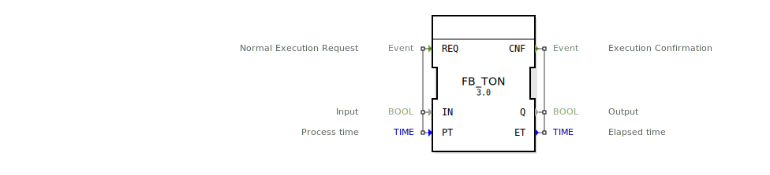

# FB_TON

```{index} single: FB_TON
```


* * * * * * * * * *
## Einleitung
**Wichtiger Hinweis: Dieser Baustein funktioniert nur korrekt, wenn er zyklisch aufgerufen wird.**

Der FB_TON ist ein standardisierter Timer-Funktionsblock gemäß IEC 61131-3, der eine Einschaltverzögerung (On-Delay) realisiert. Dieser Baustein wird verwendet, um zeitgesteuerte Verzögerungen in Steuerungsprogrammen zu implementieren.



## Schnittstellenstruktur

### **Ereignis-Eingänge**
- **REQ**: Normal Execution Request - Startet die Zeitüberwachung bei aktivem IN-Signal

### **Ereignis-Ausgänge**
- **CNF**: Execution Confirmation - Bestätigt den Abschluss der Zeitüberwachung

### **Daten-Eingänge**
- **IN**: Input - Boolescher Eingang, der den Timer startet (TRUE = Timer läuft)
- **PT**: Process Time - Zeitwert, der die Verzögerungsdauer definiert

### **Daten-Ausgänge**
- **Q**: Output - Boolescher Ausgang, der nach Ablauf der Verzögerungszeit TRUE wird
- **ET**: Elapsed Time - Zeigt die bereits verstrichene Zeit an

### **Adapter**
Keine Adapter-Schnittstellen vorhanden.

## Funktionsweise
Der FB_TON startet die Zeitmessung, wenn der Eingang IN von FALSE auf TRUE wechselt. Sobald die vorgegebene Zeit PT verstrichen ist, wird der Ausgang Q auf TRUE gesetzt. Der Ausgang ET zeigt kontinuierlich die bereits verstrichene Zeit an. Wird IN während der Zeitmessung auf FALSE gesetzt, wird der Timer zurückgesetzt und Q bleibt FALSE.

## Technische Besonderheiten
- Zeitwerte werden im TIME-Datentyp verarbeitet
- Der Timer wird bei IN=FALSE sofort zurückgesetzt
- ET zeigt immer die aktuelle verstrichene Zeit an, auch wenn der Timer noch läuft
- Konforme Implementierung nach IEC 61131-3 Standard

## Zustandsübergänge
1. **Inaktiv**: IN = FALSE, Q = FALSE, ET = 0
2. **Aktiv (Timer läuft)**: IN = TRUE, Q = FALSE, ET zählt hoch
3. **Zeit abgelaufen**: IN = TRUE, Q = TRUE, ET = PT

## Anwendungsszenarien
- Verzögerte Schaltvorgänge in Maschinensteuerungen
- Sicherheitszeitüberwachungen
- Prozesssteuerungen mit definierten Wartezeiten
- Verzögerte Alarmauslösungen

## ⚖️ Vergleich mit ähnlichen Bausteinen
- **FB_TOF**: Ausschaltverzögerung (Off-Delay) statt Einschaltverzögerung
- **FB_TP**: Impulstimer mit fester Pulsdauer
- **FB_TON_EXT**: Erweiterte Timer-Varianten mit zusätzlichen Funktionen


## 🛠️ Zugehörige Übungen

* [Uebung_020c3](../../../../training1/Ventilsteuerung/4diacIDE-workspace/test_B/Uebungen_doc/Uebung_020c3.md)
* [Uebung_020c3_AX](../../../../training1/Ventilsteuerung/4diacIDE-workspace/test_AX/Uebungen_doc/Uebung_020c3_AX.md)

## Fazit
Der FB_TON ist ein grundlegender und robuster Timer-Baustein für Standard-Einschaltverzögerungen in industriellen Steuerungssystemen. Seine einfache und intuitive Bedienung sowie die Konformität zum IEC 61131-3 Standard machen ihn zu einer zuverlässigen Wahl für zeitgesteuerte Anwendungen.