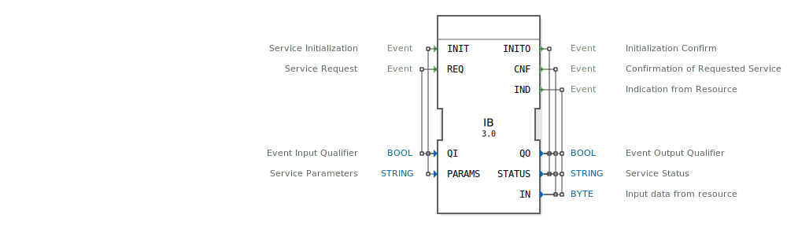

# IB

```{index} single: IB
```
## 🎧 Podcast

* [Eclipse 4diac: Innovationsmotor Forschung vs. Nutzerbedürfnisse – Was treibt die Entwicklung wirklich voran?](https://podcasters.spotify.com/pod/show/eclipse-4diac-de/episodes/Eclipse-4diac-Innovationsmotor-Forschung-vs--Nutzerbedrfnisse--Was-treibt-die-Entwicklung-wirklich-voran-e38cke4)
* [DIN EN 61499-1: Der digitale Lego-Baukasten für flexible Automatisierung und smarte Zukunft](https://podcasters.spotify.com/pod/show/iec-61499-grundkurs-de/episodes/DIN-EN-61499-1-Der-digitale-Lego-Baukasten-fr-flexible-Automatisierung-und-smarte-Zukunft-e3681pb)
* [DIN EN 61499-1: Die Lego-Steine für flexible und ereignisgesteuerte Industriesteuerungen](https://podcasters.spotify.com/pod/show/iec-61499-grundkurs-de/episodes/DIN-EN-61499-1-Die-Lego-Steine-fr-flexible-und-ereignisgesteuerte-Industriesteuerungen-e3681o1)
* [IEC 61499: The DNA of Flexible Automation – Powering Industry 4.0 from Factories to the High Seas](https://podcasters.spotify.com/pod/show/iec-61499-grundkurs-de/episodes/IEC-61499-The-DNA-of-Flexible-Automation--Powering-Industry-4-0-from-Factories-to-the-High-Seas-e376pi8)
* [IEC 61499 vs. 61131: Unpacking the Architectural Revolution of Distributed Control and Industry 4.0](https://podcasters.spotify.com/pod/show/iec-61499-prime-course-en/episodes/IEC-61499-vs--61131-Unpacking-the-Architectural-Revolution-of-Distributed-Control-and-Industry-4-0-e3ahbv5)

## 📺 Video

* [LogiBUS  Projekt Update](https://www.youtube.com/watch?v=kVNTJ9ZejFM)

## Einleitung
Der IB-Funktionsblock (Input Byte) ist ein Dienstschnittstellen-Funktionsblock für die Verarbeitung von Byte-Eingabedaten. Er dient als Schnittstelle zwischen einem IEC 61499-Steuerungssystem und externen Eingabegeräten oder Ressourcen, die Byte-Daten liefern.



## Schnittstellenstruktur

### **Ereignis-Eingänge**
- **INIT**: Dienstinitialisierung - Initialisiert den Funktionsblock und konfiguriert die Schnittstellenparameter
- **REQ**: Dienstanforderung - Fordert eine aktuelle Dateneingabe an

### **Ereignis-Ausgänge**
- **INITO**: Initialisierungsbestätigung - Bestätigt die erfolgreiche Initialisierung
- **CNF**: Dienstbestätigung - Bestätigt die angeforderten Dienstoperationen
- **IND**: Indikation von der Ressource - Signalisiert eingehende Daten von der externen Ressource

### **Daten-Eingänge**
- **QI**: Ereigniseingangsqualifizierer (BOOL) - Steuert die Ausführung der Ereignisse
- **PARAMS**: Dienstparameter (STRING) - Konfigurationsparameter für die Schnittstelle

### **Daten-Ausgänge**
- **QO**: Ereignisausgangsqualifizierer (BOOL) - Statusindikator für die Ausgangsereignisse
- **STATUS**: Dienststatus (STRING) - Statusinformationen über die aktuelle Operation
- **IN**: Eingabedaten von der Ressource (BYTE) - Die empfangenen Byte-Daten

### **Adapter**
Keine Adapter-Schnittstellen vorhanden.

## Funktionsweise
Der IB-Funktionsblock arbeitet als bidirektionale Schnittstelle für Byte-Eingabedaten. Bei Initialisierung (INIT) werden die Schnittstellenparameter konfiguriert. Über REQ-Ereignisse können Daten explizit angefordert werden, während IND-Ereignisse asynchrone Dateneingänge signalisieren. Die empfangenen Byte-Daten werden über den IN-Ausgang bereitgestellt.

## Technische Besonderheiten
- Unterstützt sowohl anforderungsbasierte (REQ/CNF) als auch ereignisbasierte (IND) Datenerfassung
- BYTE-Datentyp für kompakte 8-Bit-Datenverarbeitung
- String-basierte Parameterkonfiguration für flexible Anpassung
- Statusrückmeldung über SERVICE-Statusausgang

## Zustandsübersicht
Der Funktionsblock durchläuft folgende Hauptzustände:
1. **Nicht initialisiert**: Wartet auf INIT-Ereignis
2. **Initialisiert**: Bereit für Datenerfassung
3. **Datenanforderung**: Verarbeitet REQ-Ereignisse
4. **Datenempfang**: Verarbeitet eingehende IND-Ereignisse

## Anwendungsszenarien
- Einlesen von 8-Bit-Sensordaten
- Schnittstelle zu einfachen digitalen Eingabegeräten
- Kommunikation mit Peripheriegeräten, die Byte-Daten liefern
- Protokollimplementierungen mit Byte-orientierten Datenformaten

## Vergleich mit ähnlichen Bausteinen
Im Vergleich zu anderen Eingabebausteinen:
- IB spezialisiert auf BYTE-Datentyp (8-Bit)
- Bietet sowohl pollende (REQ) als auch interrupt-artige (IND) Betriebsmodi
- Einfacher als komplexere Protokollbausteine, aber spezifischer für Byte-Daten


## Zugehörige Übungen

* [Uebung_006c](../../../training1/Ventilsteuerung/4diacIDE-workspace/test_B/Uebungen_doc/Uebung_006c.md)
* [Uebung_011a](../../../training1/Ventilsteuerung/4diacIDE-workspace/test_B/Uebungen_doc/Uebung_011a.md)

## Fazit
Der IB-Funktionsblock bietet eine effiziente und flexible Lösung für die Integration von Byte-basierten Eingabedaten in IEC 61499-Steuerungssysteme. Seine duale Betriebsart (anforderungsbasiert und ereignisgesteuert) macht ihn vielseitig einsetzbar für verschiedene Anwendungsfälle in der industriellen Automatisierung.