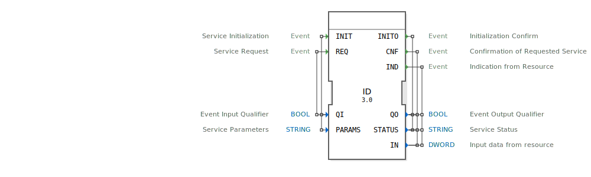

# ID

## 🎧 Podcast

* [4diac IDE: Dein "Hello World" der Automatisierung – Das Blinking Tutorial Lokal](https://podcasters.spotify.com/pod/show/eclipse-4diac-de/episodes/4diac-IDE-Dein-Hello-World-der-Automatisierung--Das-Blinking-Tutorial-Lokal-e36971r)
* [4diac IDE: Dein Open-Source-Werkzeugkasten für verteilte Industrieautomatisierung nach IEC 61499](https://podcasters.spotify.com/pod/show/eclipse-4diac-de/episodes/4diac-IDE-Dein-Open-Source-Werkzeugkasten-fr-verteilte-Industrieautomatisierung-nach-IEC-61499-e36821e)
* [4diac IDE: Wie der IEC 61499 Standard die Industrieautomatisierung revolutioniert](https://podcasters.spotify.com/pod/show/eclipse-4diac-de/episodes/4diac-IDE-Wie-der-IEC-61499-Standard-die-Industrieautomatisierung-revolutioniert-e36756a)
* [From Pyramid to Plug-and-Play: The Rise of Self-Configurable Industrial Automation](https://podcasters.spotify.com/pod/show/eclipse-4diac-en/episodes/From-Pyramid-to-Plug-and-Play-The-Rise-of-Self-Configurable-Industrial-Automation-e368lvk)
* [Building Tomorrow's Factories: Bridging OT and IT with IEC 61499](https://podcasters.spotify.com/pod/show/iec-61499-grundkurs-de/episodes/Building-Tomorrows-Factories-Bridging-OT-and-IT-with-IEC-61499-e376pia)

## 📺 Video

* [Ideale Dioden](https://www.youtube.com/watch?v=cPYHaOczu6s)

## Einleitung
Der ID-Funktionsblock ist ein Eingabeservice-Interface-Baustein für Doppelwort-Eingabedaten (DWORD). Er dient als Schnittstelle zwischen der Steuerungslogik und externen Eingabegeräten oder Ressourcen und ermöglicht die Abfrage von 32-Bit-Eingabedaten.

## Schnittstellenstruktur

### **Ereignis-Eingänge**
- **INIT**: Service-Initialisierung - Initialisiert den Funktionsblock und konfiguriert die Parameter
- **REQ**: Service-Anfrage - Löst eine Abfrage der Eingabedaten aus

### **Ereignis-Ausgänge**
- **INITO**: Initialisierungsbestätigung - Bestätigt die erfolgreiche Initialisierung
- **CNF**: Bestätigung der angeforderten Service - Bestätigt eine erfolgreiche Service-Anfrage
- **IND**: Indikation von der Ressource - Signalisiert eingehende Daten von der Ressource

### **Daten-Eingänge**
- **QI**: Event-Input-Qualifier (BOOL) - Aktiviert/deaktiviert den Service
- **PARAMS**: Service-Parameter (STRING) - Konfigurationsparameter für den Service

### **Daten-Ausgänge**
- **QO**: Event-Output-Qualifier (BOOL) - Status des Service-Ausgangs
- **STATUS**: Service-Status (STRING) - Statusinformationen über den Service
- **IN**: Eingabedaten von der Ressource (DWORD) - Die gelesenen 32-Bit-Eingabedaten

### **Adapter**
Keine Adapter-Schnittstellen vorhanden.

## Funktionsweise
Der ID-Baustein arbeitet als Service-Interface für Doppelwort-Eingaben. Bei Initialisierung (INIT) werden die Service-Parameter konfiguriert. Anschließend können über REQ-Ereignisse gezielt Eingabedaten von der angeschlossenen Ressource abgefragt werden. Der Baustein liefert die gelesenen Daten über die Ausgänge IN zusammen mit Statusinformationen zurück.

## Technische Besonderheiten
- Verarbeitet 32-Bit-Daten (DWORD)
- Unterstützt sowohl angeforderte (REQ/CNF) als auch spontane (IND) Datenübertragungen
- Flexible Parameterkonfiguration über STRING-Parameter
- Qualifier-basierte Steuerung (QI/QO) für Service-Aktivierung

## Zustandsübersicht
Der Baustein durchläuft folgende Hauptzustände:
1. **Nicht initialisiert**: Vor der INIT-Verarbeitung
2. **Initialisiert**: Nach erfolgreicher INIT-Verarbeitung, bereit für Datenabfragen
3. **Datenabfrage**: Während der Verarbeitung von REQ-Ereignissen
4. **Datenempfang**: Bei spontan eingehenden Daten (IND)

## Anwendungsszenarien
- Abfrage von 32-Bit-Sensordaten
- Einlesen von digitalen Eingangssignalen in Gruppen
- Kommunikation mit Peripheriegeräten, die Doppelwort-Daten liefern
- Integration von externen Messsystemen in 4diac-Steuerungen

## ⚖️ Vergleich mit ähnlichen Bausteinen
Im Vergleich zu einfacheren Eingabebausteinen bietet ID:
- Erweiterte Statusrückmeldungen
- Konfigurierbare Service-Parameter
- Unterstützung für beide Betriebsmodi (anforderungsbasiert und spontan)
- 32-Bit-Datenbreite statt einfacher BOOL- oder BYTE-Werte

## 🛠️ Zugehörige Übungen

* [Uebung_011](../../../training1/Ventilsteuerung/4diacIDE-workspace/test_B/Uebungen_doc/Uebung_011.md)
* [Uebung_011a2](../../../training1/Ventilsteuerung/4diacIDE-workspace/test_B/Uebungen_doc/Uebung_011a2.md)
* [Uebung_012](../../../training1/Ventilsteuerung/4diacIDE-workspace/test_B/Uebungen_doc/Uebung_012.md)
* [Uebung_012a_sub](../../../training1/Ventilsteuerung/4diacIDE-workspace/test_B/Uebungen_doc/Uebung_012a_sub.md)
* [Uebung_012b](../../../training1/Ventilsteuerung/4diacIDE-workspace/test_B/Uebungen_doc/Uebung_012b.md)
* [Uebung_012c](../../../training1/Ventilsteuerung/4diacIDE-workspace/test_B/Uebungen_doc/Uebung_012c.md)
* [Uebung_020c2_sub](../../../training1/Ventilsteuerung/4diacIDE-workspace/test_B/Uebungen_doc/Uebung_020c2_sub.md)
* [Uebung_028](../../../training1/Ventilsteuerung/4diacIDE-workspace/test_B/Uebungen_doc/Uebung_028.md)
* [Uebung_034](../../../training1/Ventilsteuerung/4diacIDE-workspace/test_B/Uebungen_doc/Uebung_034.md)
* [Uebung_034a1_Q1](../../../training1/Ventilsteuerung/4diacIDE-workspace/test_B/Uebungen_doc/Uebung_034a1_Q1.md)
* [Uebung_034a1_Q2](../../../training1/Ventilsteuerung/4diacIDE-workspace/test_B/Uebungen_doc/Uebung_034a1_Q2.md)
* [Uebung_034a1_Q4](../../../training1/Ventilsteuerung/4diacIDE-workspace/test_B/Uebungen_doc/Uebung_034a1_Q4.md)
* [Uebung_060](../../../training1/Ventilsteuerung/4diacIDE-workspace/test_B/Uebungen_doc/Uebung_060.md)
* [Uebung_103](../../../training1/Ventilsteuerung/4diacIDE-workspace/test_B/Uebungen_doc/Uebung_103.md)
* [Uebung_150](../../../training1/Ventilsteuerung/4diacIDE-workspace/test_B/Uebungen_doc/Uebung_150.md)
* [Uebung_150_AX](../../../training1/Ventilsteuerung/4diacIDE-workspace/test_AX/Uebungen_doc/Uebung_150_AX.md)
* [Uebung_151](../../../training1/Ventilsteuerung/4diacIDE-workspace/test_B/Uebungen_doc/Uebung_151.md)
* [Uebung_151_AX](../../../training1/Ventilsteuerung/4diacIDE-workspace/test_AX/Uebungen_doc/Uebung_151_AX.md)
* [Uebung_152](../../../training1/Ventilsteuerung/4diacIDE-workspace/test_B/Uebungen_doc/Uebung_152.md)
* [Uebung_153](../../../training1/Ventilsteuerung/4diacIDE-workspace/test_B/Uebungen_doc/Uebung_153.md)

## Fazit
Der ID-Funktionsblock stellt eine leistungsfähige und flexible Schnittstelle für Doppelwort-Eingabedaten bereit. Durch seine umfangreiche Statusrückmeldung und konfigurierbaren Parameter eignet er sich besonders für anspruchsvolle Anwendungen, bei denen zuverlässige und informative Eingabedatenverarbeitung erforderlich ist.