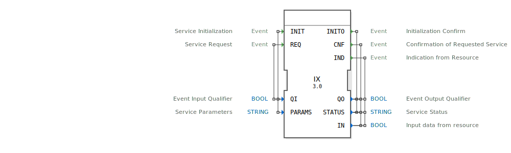

# IX

## 🎧 Podcast

* [Infineon MOTIX BTM9020/9021EP: Datenblatt-Analyse für Automotive – Robuster Motortreiber mit intelligenter Diagnose (HW vs. SPI)](https://podcasters.spotify.com/pod/show/ms-muc-lama/episodes/Infineon-MOTIX-BTM90209021EP-Datenblatt-Analyse-fr-Automotive--Robuster-Motortreiber-mit-intelligenter-Diagnose-HW-vs--SPI-e39av51)
* [integrierten Vollbrücken-ICs MOTIX™ BTM9020EP](https://podcasters.spotify.com/pod/show/ms-muc-lama/episodes/integrierten-Vollbrcken-ICs-MOTIX-BTM9020EP-e368kse)

## Einleitung
Der IX-Funktionsblock ist ein Service-Interface-Funktionsblock für boolesche Eingabedaten. Er dient als Schnittstelle zur Kommunikation mit Eingabegeräten und ermöglicht die Abfrage und Verarbeitung von digitalen Eingangssignalen in 4diac-Systemen.

## Schnittstellenstruktur

### **Ereignis-Eingänge**
- **INIT**: Service-Initialisierung - Initialisiert den Funktionsblock und konfiguriert die Hardware-Parameter
- **REQ**: Service-Anfrage - Fordert eine Abfrage des aktuellen Eingangswerts an

### **Ereignis-Ausgänge**
- **INITO**: Initialisierungsbestätigung - Bestätigt die erfolgreiche Initialisierung
- **CNF**: Bestätigung der angeforderten Service - Bestätigt eine erfolgreiche Abfrage
- **IND**: Indikation von der Ressource - Signalisiert eine Zustandsänderung des Eingangssignals

### **Daten-Eingänge**
- **QI**: Event-Input-Qualifier (BOOL) - Steuert die Aktivierung der Service-Funktionalität
- **PARAMS**: Service-Parameter (STRING) - Enthält Konfigurationsparameter für die Hardware-Schnittstelle

### **Daten-Ausgänge**
- **QO**: Event-Output-Qualifier (BOOL) - Zeigt den Status der Service-Ausführung an
- **STATUS**: Service-Status (STRING) - Liefert Statusinformationen über die Service-Ausführung
- **IN**: Eingabedaten von der Ressource (BOOL) - Enthält den aktuellen Wert des digitalen Eingangs

### **Adapter**
Keine Adapter-Schnittstellen vorhanden.

## Funktionsweise
Der IX-Funktionsblock dient als Vermittler zwischen der Steuerungslogik und physischen Eingabegeräten. Bei der Initialisierung (INIT) werden die Hardware-Parameter konfiguriert. Anschließend kann über REQ-Ereignisse der aktuelle Zustand des Eingangs abgefragt werden. Der Block kann sowohl poll-basierte Abfragen (REQ/CNF) als auch ereignisbasierte Benachrichtigungen (IND) bei Zustandsänderungen verarbeiten.

## Technische Besonderheiten
- Unterstützt sowohl anforderungsbasierte als auch ereignisgesteuerte Betriebsmodi
- Boolescher Datentyp für einfache digitale Eingänge
- Flexible Parameterkonfiguration über STRING-Parameter
- Umfassende Statusrückmeldung für Fehlerdiagnose

## Zustandsübersicht
Der Funktionsblock durchläuft folgende Hauptzustände:
1. **Nicht initialisiert**: Block ist inaktiv
2. **Initialisiert**: Block ist betriebsbereit nach erfolgreicher INIT-Verarbeitung
3. **Abfrage aktiv**: Verarbeitung einer REQ-Anfrage
4. **Indikationsbereit**: Bereit für ereignisgesteuerte Benachrichtigungen

## Anwendungsszenarien
- Abfrage von digitalen Sensoren (Endschalter, Näherungsschalter)
- Überwachung von Taster-Eingängen
- Lesen von Schalterstellungen
- Digitale Signalverarbeitung in Automatisierungssystemen

## ⚖️ Vergleich mit ähnlichen Bausteinen
Im Vergleich zu anderen Eingabe-Bausteinen bietet IX eine erweiterte Service-Schnittstelle mit sowohl poll-basierten als auch ereignisgesteuerten Betriebsmodi. Während einfachere Eingabeblöcke oft nur direkte Werte liefern, bietet IX zusätzliche Statusinformationen und Fehlerbehandlung.

## 🛠️ Zugehörige Übungen

* [Uebung_001](../../../Uebungen/test_B/Uebungen_doc/Uebung_001.md)
* [Uebung_001c](../../../Uebungen/test_B/Uebungen_doc/Uebung_001c.md)
* [Uebung_002](../../../Uebungen/test_B/Uebungen_doc/Uebung_002.md)
* [Uebung_002a](../../../Uebungen/test_B/Uebungen_doc/Uebung_002a.md)
* [Uebung_002a2](../../../Uebungen/test_B/Uebungen_doc/Uebung_002a2.md)
* [Uebung_002a3](../../../Uebungen/test_B/Uebungen_doc/Uebung_002a3.md)
* [Uebung_002a4](../../../Uebungen/test_B/Uebungen_doc/Uebung_002a4.md)
* [Uebung_002a5b](../../../Uebungen/test_B/Uebungen_doc/Uebung_002a5b.md)
* [Uebung_002b2](../../../Uebungen/test_B/Uebungen_doc/Uebung_002b2.md)
* [Uebung_002b3](../../../Uebungen/test_B/Uebungen_doc/Uebung_002b3.md)
* [Uebung_003](../../../Uebungen/test_B/Uebungen_doc/Uebung_003.md)
* [Uebung_003a0](../../../Uebungen/test_B/Uebungen_doc/Uebung_003a0.md)
* [Uebung_003a_sub](../../../Uebungen/test_B/Uebungen_doc/Uebung_003a_sub.md)
* [Uebung_003b2_sub](../../../Uebungen/test_B/Uebungen_doc/Uebung_003b2_sub.md)
* [Uebung_003b_sub](../../../Uebungen/test_B/Uebungen_doc/Uebung_003b_sub.md)
* [Uebung_003c_sub](../../../Uebungen/test_B/Uebungen_doc/Uebung_003c_sub.md)
* [Uebung_003d](../../../Uebungen/test_B/Uebungen_doc/Uebung_003d.md)
* [Uebung_005](../../../Uebungen/test_B/Uebungen_doc/Uebung_005.md)
* [Uebung_006e1](../../../Uebungen/test_B/Uebungen_doc/Uebung_006e1.md)
* [Uebung_006e2](../../../Uebungen/test_B/Uebungen_doc/Uebung_006e2.md)
* [Uebung_010](../../../Uebungen/test_B/Uebungen_doc/Uebung_010.md)
* [Uebung_010a](../../../Uebungen/test_B/Uebungen_doc/Uebung_010a.md)
* [Uebung_010a2](../../../Uebungen/test_B/Uebungen_doc/Uebung_010a2.md)
* [Uebung_010a3](../../../Uebungen/test_B/Uebungen_doc/Uebung_010a3.md)
* [Uebung_010a4](../../../Uebungen/test_B/Uebungen_doc/Uebung_010a4.md)
* [Uebung_010b1](../../../Uebungen/test_B/Uebungen_doc/Uebung_010b1.md)
* [Uebung_010b4_sub](../../../Uebungen/test_B/Uebungen_doc/Uebung_010b4_sub.md)
* [Uebung_010b5_sub](../../../Uebungen/test_B/Uebungen_doc/Uebung_010b5_sub.md)
* [Uebung_010c](../../../Uebungen/test_B/Uebungen_doc/Uebung_010c.md)
* [Uebung_010c2](../../../Uebungen/test_B/Uebungen_doc/Uebung_010c2.md)
* [Uebung_010c3_sub](../../../Uebungen/test_B/Uebungen_doc/Uebung_010c3_sub.md)
* [Uebung_010c4_sub](../../../Uebungen/test_B/Uebungen_doc/Uebung_010c4_sub.md)
* [Uebung_019c](../../../Uebungen/test_B/Uebungen_doc/Uebung_019c.md)
* [Uebung_020a](../../../Uebungen/test_B/Uebungen_doc/Uebung_020a.md)
* [Uebung_020b](../../../Uebungen/test_B/Uebungen_doc/Uebung_020b.md)
* [Uebung_020c](../../../Uebungen/test_B/Uebungen_doc/Uebung_020c.md)
* [Uebung_020c2](../../../Uebungen/test_B/Uebungen_doc/Uebung_020c2.md)
* [Uebung_020c3](../../../Uebungen/test_B/Uebungen_doc/Uebung_020c3.md)
* [Uebung_020d](../../../Uebungen/test_B/Uebungen_doc/Uebung_020d.md)
* [Uebung_020e](../../../Uebungen/test_B/Uebungen_doc/Uebung_020e.md)
* [Uebung_020e2](../../../Uebungen/test_B/Uebungen_doc/Uebung_020e2.md)
* [Uebung_020f](../../../Uebungen/test_B/Uebungen_doc/Uebung_020f.md)
* [Uebung_020f2](../../../Uebungen/test_B/Uebungen_doc/Uebung_020f2.md)
* [Uebung_020g](../../../Uebungen/test_B/Uebungen_doc/Uebung_020g.md)
* [Uebung_020i](../../../Uebungen/test_B/Uebungen_doc/Uebung_020i.md)
* [Uebung_028](../../../Uebungen/test_B/Uebungen_doc/Uebung_028.md)
* [Uebung_029](../../../Uebungen/test_B/Uebungen_doc/Uebung_029.md)
* [Uebung_030](../../../Uebungen/test_B/Uebungen_doc/Uebung_030.md)
* [Uebung_032](../../../Uebungen/test_B/Uebungen_doc/Uebung_032.md)
* [Uebung_033_sub](../../../Uebungen/test_B/Uebungen_doc/Uebung_033_sub.md)
* [Uebung_039_sub_Outputs](../../../Uebungen/test_B/Uebungen_doc/Uebung_039_sub_Outputs.md)
* [Uebung_039b](../../../Uebungen/test_B/Uebungen_doc/Uebung_039b.md)
* [Uebung_049](../../../Uebungen/test_B/Uebungen_doc/Uebung_049.md)
* [Uebung_051](../../../Uebungen/test_B/Uebungen_doc/Uebung_051.md)
* [Uebung_052](../../../Uebungen/test_B/Uebungen_doc/Uebung_052.md)
* [Uebung_053](../../../Uebungen/test_B/Uebungen_doc/Uebung_053.md)
* [Uebung_054](../../../Uebungen/test_B/Uebungen_doc/Uebung_054.md)
* [Uebung_055](../../../Uebungen/test_B/Uebungen_doc/Uebung_055.md)
* [Uebung_056](../../../Uebungen/test_B/Uebungen_doc/Uebung_056.md)
* [Uebung_085](../../../Uebungen/test_B/Uebungen_doc/Uebung_085.md)
* [Uebung_086](../../../Uebungen/test_B/Uebungen_doc/Uebung_086.md)
* [Uebung_087](../../../Uebungen/test_B/Uebungen_doc/Uebung_087.md)
* [Uebung_087a1](../../../Uebungen/test_B/Uebungen_doc/Uebung_087a1.md)
* [Uebung_087a2](../../../Uebungen/test_B/Uebungen_doc/Uebung_087a2.md)
* [Uebung_088](../../../Uebungen/test_B/Uebungen_doc/Uebung_088.md)
* [Uebung_089](../../../Uebungen/test_B/Uebungen_doc/Uebung_089.md)
* [Uebung_090a1](../../../Uebungen/test_B/Uebungen_doc/Uebung_090a1.md)
* [Uebung_090a1_AX](../../../Uebungen/test_AX/Uebungen_doc/Uebung_090a1_AX.md)
* [Uebung_090a2](../../../Uebungen/test_B/Uebungen_doc/Uebung_090a2.md)
* [Uebung_090a2_AX](../../../Uebungen/test_AX/Uebungen_doc/Uebung_090a2_AX.md)
* [Uebung_094](../../../Uebungen/test_B/Uebungen_doc/Uebung_094.md)
* [Uebung_094a](../../../Uebungen/test_B/Uebungen_doc/Uebung_094a.md)
* [Uebung_095](../../../Uebungen/test_B/Uebungen_doc/Uebung_095.md)
* [Uebung_160](../../../Uebungen/test_B/Uebungen_doc/Uebung_160.md)
* [Uebung_160b2](../../../Uebungen/test_B/Uebungen_doc/Uebung_160b2.md)
* [Uebung_177](../../../Uebungen/test_B/Uebungen_doc/Uebung_177.md)
* [Uebung_178](../../../Uebungen/test_B/Uebungen_doc/Uebung_178.md)

## Fazit
Der IX-Funktionsblock stellt eine robuste und flexible Lösung für die Integration boolescher Eingabedaten in 4diac-Systeme dar. Seine umfassende Fehlerbehandlung und flexible Betriebsmodi machen ihn besonders geeignet für zuverlässige Automatisierungsanwendungen mit digitalen Eingangssignalen.