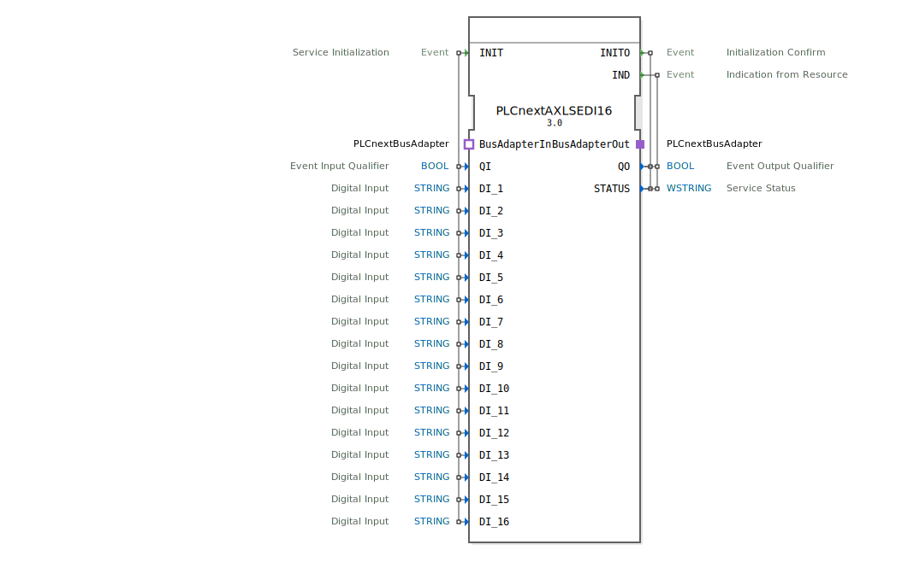

# PLCnextAXLSEDI16

```{index} single: PLCnextAXLSEDI16
```


* * * * * * * * * *
## Einleitung
Der PLCnextAXLSEDI16 ist ein Service Interface Function Block für die Anbindung an PLCnext-Systeme. Dieser Funktionsblock dient als Schnittstelle für digitale Eingänge und ermöglicht die Kommunikation mit der PLCnext-Bus-Architektur. Er unterstützt 16 digitale Eingangskanäle und bietet standardisierte Initialisierungs- und Statusrückmeldungen.



## Schnittstellenstruktur

### **Ereignis-Eingänge**
- **INIT**: Service Initialization - Initialisiert den Funktionsblock mit den konfigurierten Parametern

### **Ereignis-Ausgänge**
- **INITO**: Initialization Confirm - Bestätigt die erfolgreiche Initialisierung
- **IND**: Indication from Resource - Signalisiert Statusänderungen oder Ereignisse von der Ressource

### **Daten-Eingänge**
- **QI** (BOOL): Event Input Qualifier - Steuert die Initialisierung
- **DI_1 bis DI_16** (STRING): Digital Input - 16 digitale Eingangskanäle für die Konfiguration

### **Daten-Ausgänge**
- **QO** (BOOL): Event Output Qualifier - Status der Ereignisausgabe
- **STATUS** (WSTRING): Service Status - Detaillierte Statusinformationen

### **Adapter**
- **BusAdapterOut** (Plug): Ausgehender Bus-Adapter für PLCnext-Kommunikation
- **BusAdapterIn** (Socket): Eingehender Bus-Adapter für PLCnext-Kommunikation

## Funktionsweise
Der Funktionsblock initialisiert sich über das INIT-Ereignis und konfiguriert die 16 digitalen Eingangskanäle basierend auf den DI_Parameters. Nach erfolgreicher Initialisierung bestätigt er dies über INITO. Während des Betriebs überwacht er kontinuierlich die Eingänge und signalisiert Änderungen über das IND-Ereignis. Die Kommunikation mit dem PLCnext-Bus erfolgt über die integrierten Adapter-Schnittstellen.

## Technische Besonderheiten
- Unterstützt 16 unabhängige digitale Eingangskanäle
- String-basierte Konfiguration der Eingänge
- Unicode-fähige Statusrückmeldungen (WSTRING)
- Integrierte PLCnext-Bus-Adapter-Kommunikation
- Standardkonforme IEC 61499-2-Implementierung

## Zustandsübersicht
1. **Nicht initialisiert**: Funktionsblock wartet auf INIT-Ereignis
2. **Initialisierung**: Verarbeitung der Konfigurationsparameter
3. **Betriebsbereit**: Überwachung der digitalen Eingänge aktiv
4. **Fehlerzustand**: Bei Problemen mit Statusrückmeldung

## Anwendungsszenarien
- Anbindung digitaler Sensoren an PLCnext-Systeme
- Industrielle Automatisierungssteuerungen
- Überwachungssysteme mit multiplen Eingangssignalen
- PLCnext-basierte Steuerungsarchitekturen

## Vergleich mit ähnlichen Bausteinen
Im Vergleich zu einfachen digitalen Eingangsbausteinen bietet PLCnextAXLSEDI16 eine erweiterte Konfigurierbarkeit durch String-Parameter und eine integrierte Bus-Kommunikation für PLCnext-Systeme. Die 16 Kanäle ermöglichen eine höhere Eingangsdichte als Standardbausteine.

## Fazit
Der PLCnextAXLSEDI16 ist ein leistungsstarker Funktionsblock für die Integration digitaler Eingänge in PLCnext-basierte Automatisierungssysteme. Seine flexible Konfiguration und robuste Bus-Kommunikation machen ihn ideal für industrielle Anwendungen mit multiplen digitalen Signalen.