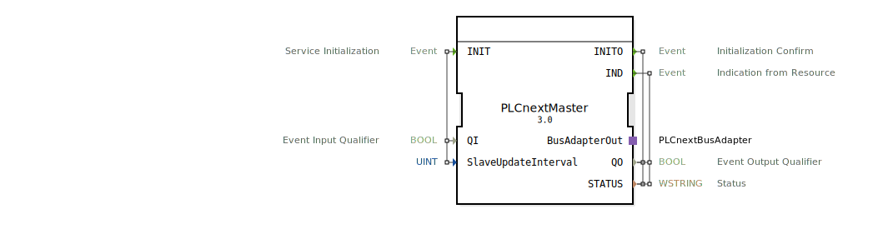

# PLCnextMaster

```{index} single: PLCnextMaster
```

* * * * * * * * * *

## Einleitung
Der PLCnextMaster ist ein Service Interface Function Block, der als Master-Komponente für die Kommunikation mit PLCnext-Systemen dient. Dieser Baustein ermöglicht die Initialisierung und Steuerung der Bus-Kommunikation in PLCnext-basierten Automatisierungslösungen.



## Schnittstellenstruktur

### **Ereignis-Eingänge**
- **INIT**: Service Initialisierung
  - Verknüpft mit: QI, SlaveUpdateInterval

### **Ereignis-Ausgänge**
- **INITO**: Initialisierungsbestätigung
  - Verknüpft mit: QO, STATUS
- **IND**: Indikation von der Resource
  - Verknüpft mit: QO, STATUS

### **Daten-Eingänge**
- **QI** (BOOL): Event Input Qualifier - Steuert die Aktivierung des Service
- **SlaveUpdateInterval** (UINT): Aktualisierungsintervall für Slaves mit Initialwert 25

### **Daten-Ausgänge**
- **QO** (BOOL): Event Output Qualifier - Bestätigt den Status der Operation
- **STATUS** (WSTRING): Statusinformationen als Unicode-String

### **Adapter**
- **BusAdapterOut**: PLCnextBusAdapter für die Bus-Kommunikation
  - Typ: eclipse4diac::io::plcnext::PLCnextBusAdapter

## Funktionsweise
Der PLCnextMaster initialisiert und verwaltet die Kommunikation mit PLCnext-Systemen. Bei Aktivierung des INIT-Events mit QI=TRUE wird der Service gestartet. Das SlaveUpdateInterval definiert das Aktualisierungsintervall für angeschlossene Slave-Komponenten. Nach erfolgreicher Initialisierung bestätigt INITO den Betriebszustand, während IND-Events asynchrone Statusänderungen anzeigen.

## Technische Besonderheiten
- Unterstützt Unicode-Statusmeldungen (WSTRING)
- Konfigurierbares Slave-Update-Intervall
- Adapter-basierte Bus-Kommunikation
- Initialwert für SlaveUpdateInterval auf 25 gesetzt

## Zustandsübersicht
1. **Inaktiv**: Vor INIT-Aktivierung
2. **Initialisierung**: Während INIT-Verarbeitung
3. **Aktiv**: Nach erfolgreicher INITO-Bestätigung
4. **Bereit**: Für IND-Events bei aktiver Kommunikation

## Anwendungsszenarien
- PLCnext-basierte Automatisierungssysteme
- Industrie 4.0 Anwendungen
- Vernetzte Steuerungssysteme
- IoT-Edge-Computing-Lösungen

## Vergleich mit ähnlichen Bausteinen
Im Vergleich zu generischen Bus-Master-Bausteinen bietet der PLCnextMaster spezifische Optimierungen für PLCnext-Hardware und unterstützt die spezifische Bus-Architektur von PLCnext-Systemen.

## Fazit
Der PLCnextMaster stellt einen spezialisierten Funktionsbaustein für die Integration von PLCnext-Systemen in 4diac-basierte Automatisierungslösungen dar. Durch seine konfigurierbaren Parameter und Adapter-Schnittstelle ermöglicht er eine flexible und zuverlässige Kommunikation in industriellen Steuerungsumgebungen.