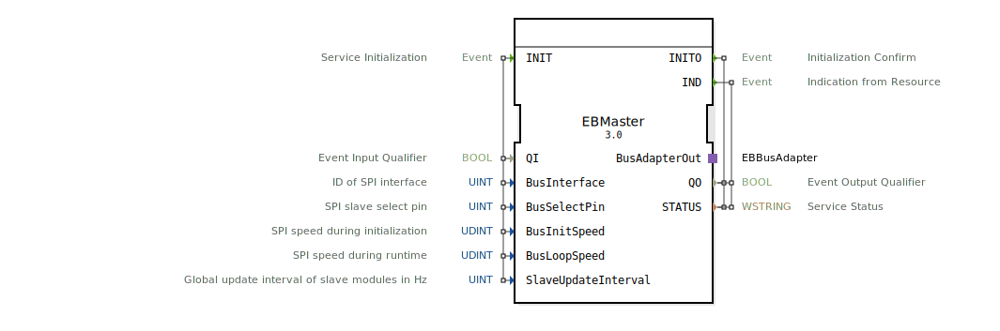

# EBMaster

```{index} single: EBMaster
```


* * * * * * * * * *

## Einleitung
Der EBMaster Funktionsblock ist ein Service Interface Function Block für die Kommunikation mit EtherBrick-Modulen über SPI (Serial Peripheral Interface). Er dient als Master-Komponente zur Steuerung und Konfiguration der SPI-Bus-Kommunikation mit angeschlossenen Slave-Modulen.



## Schnittstellenstruktur

### **Ereignis-Eingänge**
- **INIT**: Service Initialisierung - Initialisiert den SPI-Bus und konfiguriert die Kommunikationsparameter

### **Ereignis-Ausgänge**
- **INITO**: Initialisierungsbestätigung - Bestätigt den erfolgreichen Abschluss der Initialisierung
- **IND**: Indikation von der Ressource - Signalisiert Statusänderungen oder Ereignisse von den angeschlossenen Modulen

### **Daten-Eingänge**
- **QI** (BOOL): Event Input Qualifier - Aktiviert/Deaktiviert den Funktionsblock
- **BusInterface** (UINT): ID des SPI-Interface (Initialwert: 1)
- **BusSelectPin** (UINT): SPI Slave Select Pin (Initialwert: 49)
- **BusInitSpeed** (UDINT): SPI-Geschwindigkeit während der Initialisierung in Hz (Initialwert: 300000)
- **BusLoopSpeed** (UDINT): SPI-Geschwindigkeit während des Betriebs in Hz (Initialwert: 700000)
- **SlaveUpdateInterval** (UINT): Globale Update-Intervall der Slave-Module in Hz (Initialwert: 25)

### **Daten-Ausgänge**
- **QO** (BOOL): Event Output Qualifier - Status der Ereignisausgabe
- **STATUS** (WSTRING): Service Status - Detaillierte Statusinformationen

### **Adapter**
- **BusAdapterOut**: Adapter für die Kommunikation mit dem EtherBrick-Bus-System

## Funktionsweise
Der EBMaster verwaltet die SPI-Kommunikation als Master-Komponente. Bei der Initialisierung (INIT-Event) konfiguriert er das SPI-Interface mit den angegebenen Parametern. Während des Betriebs steuert er die Datenübertragung zu den angeschlossenen Slave-Modulen mit dem konfigurierten Update-Intervall. Der Block ermöglicht unterschiedliche Geschwindigkeiten für Initialisierungs- und Betriebsphase.

## Technische Besonderheiten
- Unterstützung verschiedener SPI-Geschwindigkeiten für Initialisierung und Betrieb
- Konfigurierbare Slave-Select-Pins
- Einstellbares globales Update-Intervall für Slave-Module
- WSTRING-basierte Statusrückmeldungen für detaillierte Fehlerdiagnose

## Zustandsübersicht
Der Funktionsblock durchläuft folgende Zustände:
1. **Nicht initialisiert**: Wartet auf INIT-Event
2. **Initialisierung**: Konfiguriert SPI-Parameter bei INIT-Event
3. **Betriebsbereit**: Sendet INITO bei erfolgreicher Initialisierung
4. **Aktiv**: Kommuniziert mit Slaves gemäß konfiguriertem Intervall
5. **Fehler**: Sendet IND-Event mit STATUS-Information bei Problemen

## Anwendungsszenarien
- Steuerung von EtherBrick-I/O-Modulen in Automatisierungssystemen
- SPI-basierte Kommunikation in Embedded-Systemen
- Industrielle Steuerungen mit modularen I/O-Erweiterungen
- Echtzeit-Datenerfassung mit konfigurierbaren Update-Raten

## Vergleich mit ähnlichen Bausteinen
Im Vergleich zu generischen SPI-Master-Blocks bietet EBMaster spezifische Optimierungen für EtherBrick-Module, einschließlich vorkonfigurierter Parameterwerte und spezialisierter Bus-Adapter-Schnittstellen.

## Fazit
Der EBMaster Funktionsblock bietet eine robuste und konfigurierbare Lösung für die SPI-Master-Kommunikation mit EtherBrick-Modulen. Durch die Trennung von Initialisierungs- und Betriebsgeschwindigkeit sowie das konfigurierbare Update-Intervall ermöglicht er eine optimale Anpassung an verschiedene Anwendungsanforderungen.