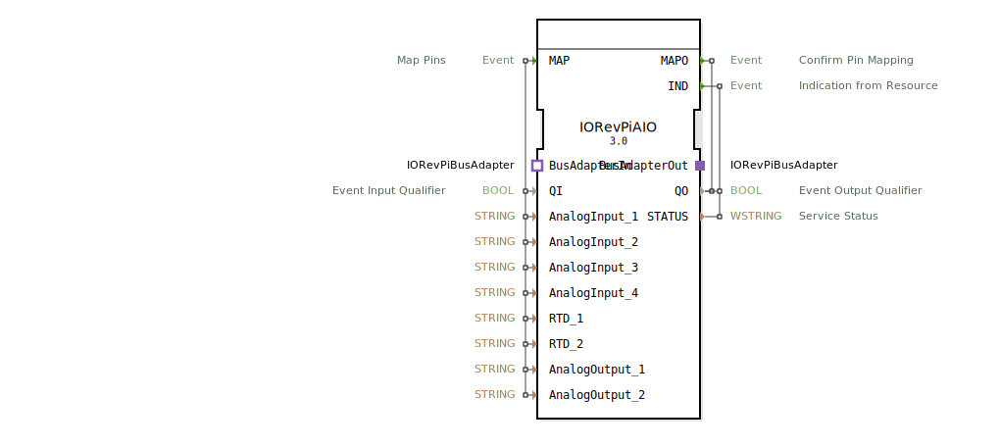

# 🔌 IORevPiAIO

```{index} single: IORevPiAIO
```


* * * * * * * * * *

## Einleitung
Der IORevPiAIO Funktionsblock stellt eine Schnittstelle für das Analog I/O-Modul des Revolution Pi von KUNBUS GmbH dar. Dieser Baustein ermöglicht die Ansteuerung und Auslesung von analogen Eingängen und Ausgängen sowie RTD-Sensoren (Resistance Temperature Detector) über das Revolution Pi System.



## Schnittstellenstruktur

### **Ereignis-Eingänge**
- **MAP**: Startet die Pin-Zuordnung für alle konfigurierten analogen Ein- und Ausgänge

### **Ereignis-Ausgänge**
- **MAPO**: Bestätigt die erfolgreiche Pin-Zuordnung
- **IND**: Zeigt Statusinformationen vom Ressourcen-Manager an

### **Daten-Eingänge**
- **QI** (BOOL): Event Input Qualifier - Aktiviert/Deaktiviert den Funktionsblock
- **AnalogInput_1** (STRING): Konfiguration für analogen Eingang 1
- **AnalogInput_2** (STRING): Konfiguration für analogen Eingang 2
- **AnalogInput_3** (STRING): Konfiguration für analogen Eingang 3
- **AnalogInput_4** (STRING): Konfiguration für analogen Eingang 4
- **RTD_1** (STRING): Konfiguration für RTD-Sensor 1
- **RTD_2** (STRING): Konfiguration für RTD-Sensor 2
- **AnalogOutput_1** (STRING): Konfiguration für analogen Ausgang 1
- **AnalogOutput_2** (STRING): Konfiguration für analogen Ausgang 2

### **Daten-Ausgänge**
- **QO** (BOOL): Event Output Qualifier - Status der Operation
- **STATUS** (WSTRING): Detaillierte Statusinformationen des Dienstes

### **Adapter**
- **BusAdapterIn** (Socket): Eingangsadapter für Revolution Pi Bus-Kommunikation
- **BusAdapterOut** (Plug): Ausgangsadapter für Revolution Pi Bus-Kommunikation

## Funktionsweise
Der IORevPiAIO Funktionsblock verwaltet die Kommunikation mit dem Revolution Pi Analog I/O-Modul. Beim Empfang des MAP-Ereignisses werden alle konfigurierten analogen Ein- und Ausgänge sowie RTD-Sensoren gemäß den String-Parametern initialisiert und zugeordnet. Der Block verwendet spezielle Bus-Adapter für die Kommunikation mit der Revolution Pi Hardware.

## Technische Besonderheiten
- Unterstützt bis zu 4 analoge Eingänge
- Unterstützt bis zu 2 analoge Ausgänge
- Integrierte RTD-Sensorunterstützung (2 Kanäle)
- String-basierte Konfiguration der Pin-Zuordnung
- Bus-Adapter-Architektur für hardwarenahe Kommunikation

## Zustandsübersicht
Der Funktionsblock verfügt über folgende Betriebszustände:
- **Inaktiv**: QI = FALSE, keine Operationen
- **Bereit**: QI = TRUE, wartet auf MAP-Ereignis
- **Mapping**: Verarbeitet Pin-Zuordnung nach MAP-Ereignis
- **Aktiv**: Erfolgreich konfiguriert, bereit für Datenoperationen

## Anwendungsszenarien
- Industrielle Prozessautomation mit analogen Sensoren
- Temperaturmessung mit RTD-Sensoren
- Analoges Signalverarbeitung in Steuerungssystemen
- Revolution Pi-basierte Automatisierungslösungen

## ⚖️ Vergleich mit ähnlichen Bausteinen
Im Vergleich zu generischen Analog-I/O-Blöcken bietet IORevPiAIO spezifische Integration für die Revolution Pi Hardware und unterstützt zusätzlich RTD-Temperatursensoren. Die Bus-Adapter-Architektur ermöglicht eine effiziente Kommunikation mit dem Revolution Pi System.

## Fazit
Der IORevPiAIO Funktionsblock bietet eine zuverlässige und spezialisierte Schnittstelle für Analog-I/O-Operationen auf Revolution Pi Systemen. Durch die integrierte Unterstützung für RTD-Sensoren und die flexible Konfiguration über String-Parameter eignet er sich besonders für industrielle Automatisierungsanwendungen mit analogen Mess- und Steueraufgaben.