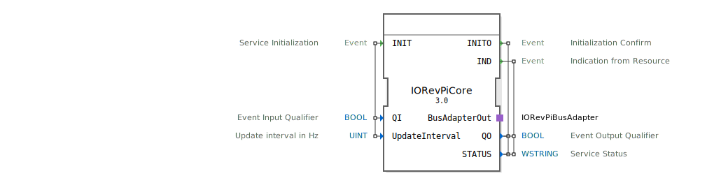

# 🔌 IORevPiCore

```{index} single: IORevPiCore
```


* * * * * * * * * *

## Einleitung
Der IORevPiCore Funktionsblock dient als Kernmodul für die Revolution Pi Hardware von KUNBUS GmbH. Er ermöglicht die grundlegende Kommunikation und Konfiguration der Revolution Pi I/O-Module innerhalb einer 4diac-basierten Steuerungsanwendung.



## Schnittstellenstruktur

### **Ereignis-Eingänge**
- **INIT**: Initialisierungsereignis zur Aktivierung des Funktionsblocks

### **Ereignis-Ausgänge**
- **INITO**: Bestätigung der erfolgreichen Initialisierung
- **IND**: Indikationsereignis bei Statusänderungen vom Ressourcen

### **Daten-Eingänge**
- **QI** (BOOL): Ereigniseingangsqualifizierer
- **UpdateInterval** (UINT): Aktualisierungsintervall in Hz (Standardwert: 25)

### **Daten-Ausgänge**
- **QO** (BOOL): Ereignisausgangsqualifizierer
- **STATUS** (WSTRING): Servicestatus als Unicode-String

### **Adapter**
- **BusAdapterOut**: Ausgangsadapter für die Revolution Pi Bus-Kommunikation (Typ: eclipse4diac::io::revpi::IORevPiBusAdapter)

## Funktionsweise
Der IORevPiCore Block initialisiert die Kommunikation mit der Revolution Pi Hardware beim Empfang des INIT-Ereignisses. Nach erfolgreicher Initialisierung wird INITO mit dem entsprechenden Status ausgegeben. Der Block überwacht kontinuierlich den Hardwarezustand und gibt bei Änderungen IND-Ereignisse aus. Das UpdateInterval bestimmt die Abtastrate für die Hardwareüberwachung.

## Technische Besonderheiten
- Standard-Updateintervall von 25 Hz
- Unicode-String-Ausgabe für Statusinformationen
- Integration über spezifischen Bus-Adapter für Revolution Pi Hardware
- Automatische Hardware-Erkennung und -Initialisierung

## Zustandsübersicht
1. **Inaktiv**: Block wartet auf INIT-Ereignis
2. **Initialisierung**: Verarbeitung der Konfigurationsparameter
3. **Aktiv**: Überwachung der Revolution Pi Hardware und Ausgabe von IND-Ereignissen bei Statusänderungen

## Anwendungsszenarien
- Steuerung von Revolution Pi I/O-Modulen in industriellen Automatisierungslösungen
- Integration von Revolution Pi Hardware in 4diac-basierte Steuerungssysteme
- Überwachung und Diagnose von Revolution Pi Komponenten

## ⚖️ Vergleich mit ähnlichen Bausteinen
Im Vergleich zu generischen I/O-Blöcken bietet IORevPiCore spezifische Optimierungen für die Revolution Pi Hardware-Plattform, einschließlich spezialisierter Bus-Kommunikation und hardwarenaher Konfigurationsparameter.

## Fazit
Der IORevPiCore Funktionsblock stellt eine zuverlässige und einfach zu konfigurierende Schnittstelle für die Integration von Revolution Pi Hardware in 4diac-basierte Automatisierungslösungen dar. Durch die standardisierte Schnittstelle und flexible Konfigurationsmöglichkeiten ermöglicht er eine effiziente Anbindung industrieller I/O-Komponenten.