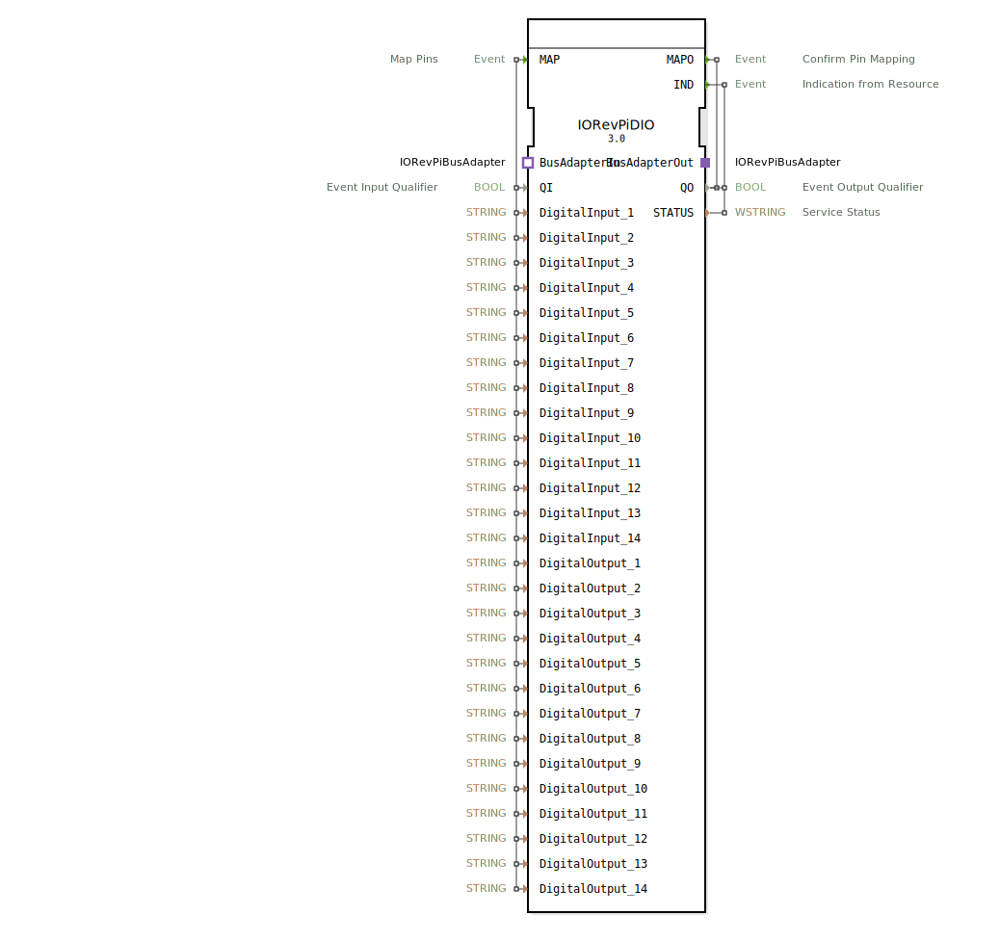

# 🔌 IORevPiDIO

```{index} single: IORevPiDIO
```


* * * * * * * * * *

## Einleitung
Der IORevPiDIO Funktionsblock ist ein digitales Ein-/Ausgabemodul für Revolution Pi Systeme von KUNBUS GmbH. Er ermöglicht die Ansteuerung und Überwachung digitaler Eingänge und Ausgänge über das Revolution Pi System und dient als Schnittstelle zwischen 4diac-IDE und der Revolution Pi Hardware.



## Schnittstellenstruktur

### **Ereignis-Eingänge**
- **MAP**: Ereignis zum Mappen der Pins mit allen DigitalInput- und DigitalOutput-Datenvariablen sowie QI

### **Ereignis-Ausgänge**
- **MAPO**: Bestätigungsereignis für erfolgreiches Pin-Mapping mit QO
- **IND**: Indikationsereignis vom Resource mit QO und STATUS

### **Daten-Eingänge**
- **QI** (BOOL): Event Input Qualifier
- **DigitalInput_1** bis **DigitalInput_14** (STRING): Konfiguration der digitalen Eingänge 1-14
- **DigitalOutput_1** bis **DigitalOutput_14** (STRING): Konfiguration der digitalen Ausgänge 1-14

### **Daten-Ausgänge**
- **QO** (BOOL): Event Output Qualifier
- **STATUS** (WSTRING): Service Status

### **Adapter**
- **BusAdapterOut** (Plug): Ausgehender Bus-Adapter vom Typ IORevPiBusAdapter
- **BusAdapterIn** (Socket): Eingehender Bus-Adapter vom Typ IORevPiBusAdapter

## Funktionsweise
Der Funktionsblock ermöglicht die Konfiguration und Steuerung von bis zu 14 digitalen Eingängen und 14 digitalen Ausgängen eines Revolution Pi Systems. Durch das MAP-Ereignis werden die Pin-Konfigurationen übergeben und mit MAPO bestätigt. Der IND-Ausgang signalisiert Statusänderungen und Fehlerzustände. Die Kommunikation mit der Hardware erfolgt über die IORevPiBusAdapter-Schnittstelle.

## Technische Besonderheiten
- Unterstützt bis zu 14 digitale Eingänge und 14 digitale Ausgänge
- Verwendet STRING-Typ für Pin-Konfiguration
- Integriert Bus-Adapter für Revolution Pi Kommunikation
- Bietet umfassende Statusrückmeldung über WSTRING

## Zustandsübergänge
1. **Initialisierung**: Warten auf MAP-Ereignis mit Konfigurationsdaten
2. **Konfiguration**: Verarbeitung der Pin-Zuordnungen und Bestätigung via MAPO
3. **Betrieb**: Überwachung der digitalen Ein-/Ausgänge und Signalgebung via IND
4. **Fehlerbehandlung**: Statusmeldung bei Kommunikationsproblemen mit der Hardware

## Anwendungsszenarien
- Industrielle Automatisierung mit Revolution Pi
- Digitale Signalverarbeitung in Steuerungssystemen
- Anbindung von Sensoren und Aktoren an 4diac-basierte Steuerungen
- Prototyping und Entwicklung von IoT-Lösungen

## ⚖️ Vergleich mit ähnlichen Bausteinen
Im Vergleich zu anderen I/O-Bausteinen bietet IORevPiDIO spezifische Unterstützung für Revolution Pi Hardware mit einer hohen Anzahl an konfigurierbaren Ein-/Ausgängen. Die Integration des Bus-Adapters ermöglicht eine direkte Kommunikation mit der Revolution Pi Plattform.

## Fazit
Der IORevPiDIO Funktionsblock stellt eine leistungsstarke Schnittstelle für digitale Ein-/Ausgänge in Revolution Pi Systemen dar und ermöglicht eine einfache Integration in 4diac-basierte Automatisierungslösungen. Die umfangreiche Konfigurationsmöglichkeit und zuverlässige Statusrückmeldung machen ihn zu einer robusten Lösung für industrielle Anwendungen.