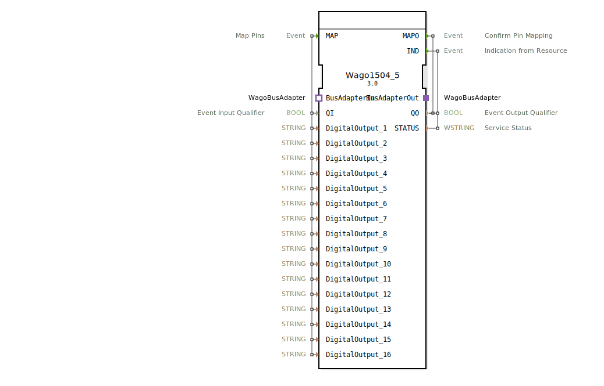

# Wago1504_5

```{index} single: Wago1504_5
```


* * * * * * * * * *

## Einleitung
Der Wago1504_5 ist ein Service Interface Function Block für die Ansteuerung digitaler Ausgänge eines Wago 750-1504/005-000 Moduls. Dieser Funktionsblock ermöglicht die Konfiguration und Steuerung von 16 digitalen Ausgängen über eine Busadapter-Schnittstelle.



## Schnittstellenstruktur

### **Ereignis-Eingänge**
- **MAP**: Map Pins - Initialisiert die Pin-Zuordnung der digitalen Ausgänge

### **Ereignis-Ausgänge**
- **MAPO**: Confirm Pin Mapping - Bestätigt die erfolgreiche Pin-Zuordnung
- **IND**: Indication from Resource - Meldung vom Ressourcen-Adapter

### **Daten-Eingänge**
- **QI**: Event Input Qualifier (BOOL) - Qualifiziert die Ereigniseingänge
- **DigitalOutput_1** bis **DigitalOutput_16** (STRING) - Konfigurationsstrings für die jeweiligen digitalen Ausgänge

### **Daten-Ausgänge**
- **QO**: Event Output Qualifier (BOOL) - Qualifiziert die Ereignisausgänge
- **STATUS**: Service Status (WSTRING) - Statusinformationen des Service

### **Adapter**
- **BusAdapterOut** (Plug): Ausgehender WagoBusAdapter
- **BusAdapterIn** (Socket): Eingehender WagoBusAdapter

## Funktionsweise
Der Wago1504_5 Funktionsblock dient als Schnittstelle zwischen der 4diac-Steuerung und dem Wago 750-1504/005-000 E/A-Modul. Beim Empfang des MAP-Ereignisses werden die 16 digitalen Ausgänge gemäß der übergebenen String-Konfiguration zugeordnet. Die erfolgreiche Zuordnung wird durch das MAPO-Ereignis bestätigt. Der IND-Ausgang dient zur Rückmeldung von Statusinformationen aus dem Ressourcen-Adapter.

## Technische Besonderheiten
- Unterstützt 16 unabhängige digitale Ausgänge
- Verwendet String-basierte Konfiguration für die Pin-Zuordnung
- Implementiert Busadapter-Kommunikation für die Anbindung an Wago-Hardware
- Bietet Statusrückmeldungen über WSTRING-Datentyp

## Zustandsübersicht
Der Funktionsblock wechselt zwischen folgenden Zuständen:
1. **Inaktiv**: Warten auf MAP-Ereignis
2. **Mapping**: Verarbeitung der Pin-Zuordnung
3. **Bestätigung**: Senden von MAPO bei erfolgreicher Zuordnung
4. **Bereit**: Betriebsbereit für IND-Meldungen

## Anwendungsszenarien
- Ansteuerung von Relais und Aktoren in Automatisierungsanlagen
- Digitale Signalausgabe in Prozesssteuerungen
- Integration von Wago 750-1504/005-000 Modulen in 4diac-basierte Steuerungen
- Industrielle Automatisierung mit verteilten E/A-Systemen

## ⚖️ Vergleich mit ähnlichen Bausteinen
Im Vergleich zu generischen digitalen Ausgangs-Blöcken bietet Wago1504_5:
- Spezifische Anpassung für Wago-Hardware
- Erweiterte Konfigurationsmöglichkeiten über String-Parameter
- Integrierte Busadapter-Kommunikation
- Statusrückmeldungen mit detaillierten Informationen

## Fazit
Der Wago1504_5 Funktionsblock stellt eine zuverlässige und spezialisierte Schnittstelle für die Ansteuerung von Wago 750-1504/005-000 Digitalausgangsmodulen dar. Durch die strukturierte Ereignissteuerung und umfassende Statusrückmeldungen eignet er sich besonders für robuste industrielle Automatisierungslösungen.