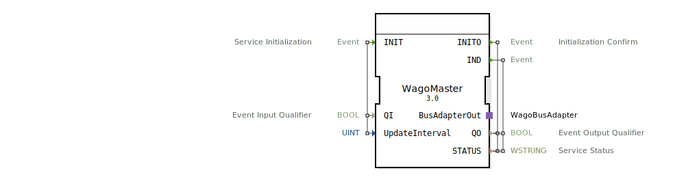

# WagoMaster

```{index} single: WagoMaster
```


* * * * * * * * * *

## Einleitung
Der WagoMaster ist ein Service Interface Function Block zur Steuerung und Überwachung von Wago-Bussystemen. Dieser Baustein dient als Master-Komponente für die Kommunikation mit Wago-IO-Systemen und ermöglicht die Initialisierung und Verwaltung der Busverbindung.



## Schnittstellenstruktur

### **Ereignis-Eingänge**
- **INIT**: Service Initialisierung
  - Verknüpft mit: QI, UpdateInterval

### **Ereignis-Ausgänge**
- **INITO**: Initialisierungsbestätigung
  - Verknüpft mit: QO, STATUS
- **IND**: Indikationsereignis
  - Verknüpft mit: STATUS, QO

### **Daten-Eingänge**
- **QI** (BOOL): Event Input Qualifier - Steuert die Aktivierung des Service
- **UpdateInterval** (UINT): Definiert das Aktualisierungsintervall für die Buskommunikation

### **Daten-Ausgänge**
- **QO** (BOOL): Event Output Qualifier - Zeigt den Status der Service-Ausführung an
- **STATUS** (WSTRING): Service Status - Enthält Statusinformationen und Fehlermeldungen

### **Adapter**
- **BusAdapterOut**: WagoBusAdapter - Stellt die Verbindung zum Wago-Bussystem her

## Funktionsweise
Der WagoMaster initialisiert und verwaltet die Kommunikation mit Wago-Bussystemen. Bei Aktivierung durch das INIT-Ereignis wird der Service gestartet und über das definierte UpdateInterval die Buskommunikation periodisch durchgeführt. Der Baustein meldet den Initialisierungserfolg über INITO und liefert kontinuierlich Statusinformationen über IND-Ereignisse.

## Technische Besonderheiten
- Unterstützt WSTRING für detaillierte Statusmeldungen
- Konfigurierbares Update-Intervall für flexible Anpassung an verschiedene Anwendungsanforderungen
- Integrierte Qualifier-Variablen (QI/QO) für zuverlässige Service-Steuerung
- Spezialisierter WagoBusAdapter für optimierte Buskommunikation

## Zustandsübersicht
Der Baustein durchläuft folgende Zustände:
1. **Inaktiv**: Vor der Initialisierung
2. **Initialisierung**: Bei INIT-Ereignis mit QI=TRUE
3. **Aktiv**: Nach erfolgreicher Initialisierung (QO=TRUE)
4. **Fehler**: Bei Kommunikationsproblemen (STATUS mit Fehlermeldung)

## Anwendungsszenarien
- Steuerung von Wago-750-Serie IO-Modulen
- Integration in Automatisierungssysteme mit Wago-Controller
- Überwachung und Diagnose von Wago-Busnetzwerken
- Industrie 4.0-Anwendungen mit verteilten Wago-IO-Systemen

## Vergleich mit ähnlichen Bausteinen
Im Vergleich zu generischen Bus-Master-Bausteinen bietet der WagoMaster spezifische Optimierungen für Wago-Bussysteme und eine integrierte Statusdiagnose über WSTRING. Die spezialisierte Adapter-Schnittstelle ermöglicht eine effizientere Kommunikation als universelle Bus-Adapter.

## Fazit
Der WagoMaster stellt einen zuverlässigen und spezialisierten Baustein für die Integration von Wago-Bussystemen in 4diac-basierte Steuerungssysteme dar. Durch seine konfigurierbaren Parameter und detaillierte Statusrückmeldung eignet er sich besonders für anspruchsvolle Industrieautomationsanwendungen.