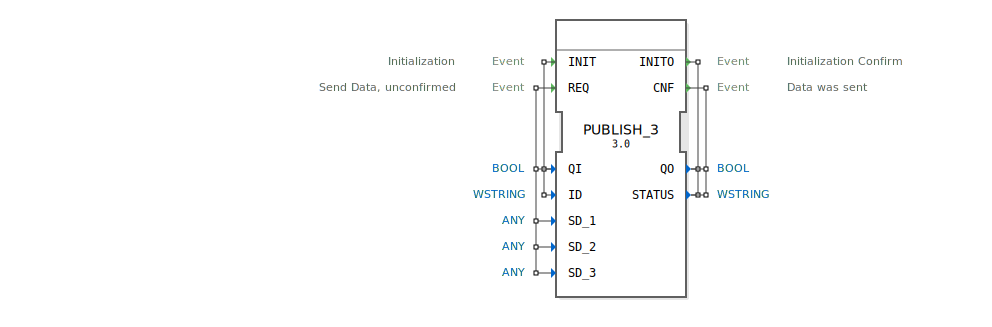

# PUBLISH_3

```{index} single: PUBLISH_3
```


* * * * * * * * * *

## Einleitung
Der PUBLISH_3-Funktionsblock dient zum Verteilen von Daten an einen oder mehrere SUBSCRIBE_3-Blöcke. Er ermöglicht die unbestätigte Übertragung von bis zu drei verschiedenen Datenwerten an Abonnenten in einem verteilten System.



## Schnittstellenstruktur

### **Ereignis-Eingänge**
- **INIT**: Initialisierungsereignis mit den zugehörigen Daten QI und ID
- **REQ**: Sendeanforderung für Daten (unbestätigt) mit den zugehörigen Daten QI, SD_1, SD_2 und SD_3

### **Ereignis-Ausgänge**
- **INITO**: Bestätigung der Initialisierung mit den zugehörigen Daten QO und STATUS
- **CNF**: Bestätigung, dass Daten gesendet wurden, mit den zugehörigen Daten QO und STATUS

### **Daten-Eingänge**
- **QI** (BOOL): Qualifizierer für Initialisierung und Sendeoperationen
- **ID** (WSTRING): Identifikator für den Publisher
- **SD_1** (ANY): Erster zu sendender Datenwert (beliebiger Datentyp)
- **SD_2** (ANY): Zweiter zu sendender Datenwert (beliebiger Datentyp)
- **SD_3** (ANY): Dritter zu sendender Datenwert (beliebiger Datentyp)

### **Daten-Ausgänge**
- **QO** (BOOL): Qualifizierer für Ausgangsereignisse
- **STATUS** (WSTRING): Statusinformationen über die ausgeführte Operation

### **Adapter**
Keine Adapter-Schnittstellen vorhanden.

## Funktionsweise
Der PUBLISH_3-Block wird zunächst über das INIT-Ereignis initialisiert, wobei der ID-Parameter den eindeutigen Identifikator für diesen Publisher festlegt. Nach erfolgreicher Initialisierung bestätigt der Block mit INITO. Daten können anschließend über das REQ-Ereignis gesendet werden, wobei bis zu drei verschiedene Datenwerte (SD_1, SD_2, SD_3) gleichzeitig übertragen werden können. Die Übertragung erfolgt unbestätigt, jedoch gibt der Block nach dem Senden ein CNF-Ereignis aus.

## Technische Besonderheiten
- Unterstützt den ANY-Datentyp für alle drei Datenkanäle, was maximale Flexibilität bei den zu übertragenden Datentypen bietet
- Verwendet WSTRING für ID und STATUS, ermöglicht somit internationale Zeichensätze
- Unbestätigte Kommunikation für reduzierte Latenz
- Kann Daten an mehrere Subscriber gleichzeitig verteilen

## Zustandsübersicht
1. **Nicht initialisiert**: Block ist betriebsbereit, aber nicht für den Datenaustausch konfiguriert
2. **Initialisiert**: Block ist konfiguriert und bereit zum Senden von Daten
3. **Sendend**: Block verarbeitet eine Sendeanforderung
4. **Bereit**: Block hat Daten erfolgreich gesendet und ist bereit für weitere Anforderungen

## Anwendungsszenarien
- Verteilung von Sensordaten an mehrere Verarbeitungsknoten
- Broadcast von Steuerinformationen in verteilten Systemen
- Datenverteilung in Produktionsanlagen mit mehreren Verbrauchern
- Messwertverteilung in Überwachungssystemen

## Vergleich mit ähnlichen Bausteinen
Im Vergleich zu einfacheren PUBLISH-Blöcken bietet PUBLISH_3 die Möglichkeit, bis zu drei verschiedene Datenwerte gleichzeitig zu übertragen, was die Effizienz in Systemen mit mehreren zusammenhängenden Datenpunkten erhöht. Die Verwendung von ANY-Datentypen bietet mehr Flexibilität als typspezifische Implementierungen.

## Fazit
Der PUBLISH_3-Funktionsblock ist eine leistungsstarke Lösung für die Verteilung von Daten in verteilten Automatisierungssystemen. Seine Fähigkeit, bis zu drei verschiedene Datenwerte gleichzeitig zu übertragen, kombiniert mit der Flexibilität der ANY-Datentypen, macht ihn besonders geeignet für komplexe Anwendungen, bei denen mehrere zusammenhängende Informationen effizient verteilt werden müssen.