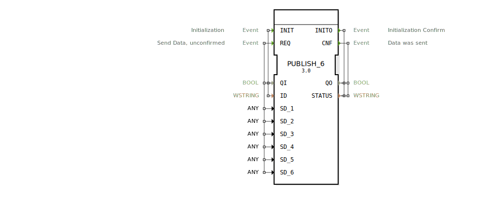

# PUBLISH_6

```{index} single: PUBLISH_6
```


* * * * * * * * * *

## Einleitung
Der PUBLISH_6 Funktionsblock dient zum Veröffentlichen von Daten an einen oder mehrere SUBSCRIBE_6 Blöcke. Er ermöglicht die Übertragung von bis zu sechs verschiedenen Datenwerten über ein Publish-Subscribe-Kommunikationsmuster und bietet sowohl bestätigte als auch unbestätigte Sendeoperationen.



## Schnittstellenstruktur

### **Ereignis-Eingänge**
- **INIT**: Initialisierungsereignis mit zugehörigen Daten QI und ID
- **REQ**: Sendeanforderung für Daten (unbestätigt) mit zugehörigen Daten QI und SD_1 bis SD_6

### **Ereignis-Ausgänge**
- **INITO**: Initialisierungsbestätigung mit zugehörigen Daten QO und STATUS
- **CNF**: Bestätigung, dass Daten gesendet wurden, mit zugehörigen Daten QO und STATUS

### **Daten-Eingänge**
- **QI** (BOOL): Qualitätsindikator für Initialisierung und Sendeoperationen
- **ID** (WSTRING): Identifikator für den Kommunikationskanal
- **SD_1** bis **SD_6** (ANY): Sechs verschiedene zu sendende Datenwerte beliebigen Typs

### **Daten-Ausgänge**
- **QO** (BOOL): Qualitätsindikator für Ausgangsoperationen
- **STATUS** (WSTRING): Statusinformation über die ausgeführte Operation

### **Adapter**
Keine Adapter-Schnittstellen vorhanden.

## Funktionsweise
Der PUBLISH_6 Block initialisiert sich über das INIT-Ereignis und bestätigt die Initialisierung mit INITO. Daten können über das REQ-Ereignis gesendet werden, wobei bis zu sechs verschiedene Datenwerte (SD_1 bis SD_6) gleichzeitig übertragen werden können. Nach erfolgreichem Senden der Daten wird ein CNF-Ereignis ausgegeben. Der Block unterstützt das Publish-Subscribe-Pattern, bei dem mehrere Subscriber die gesendeten Daten empfangen können.

## Technische Besonderheiten
- Unterstützung für bis zu sechs verschiedene Datenwerte beliebigen Typs (ANY)
- Verwendung von WSTRING für Statusmeldungen und Kanal-Identifikation
- Unbestätigte Sendeoperationen (REQ) mit nachfolgender Bestätigung (CNF)
- Generische Implementierung für flexible Wiederverwendung

## Zustandsübersicht
1. **Nicht initialisiert**: Block wartet auf INIT-Ereignis
2. **Initialisiert**: Block bereit zum Empfang von REQ-Ereignissen
3. **Sendeoperation**: Verarbeitung der Sendeanforderung und Datenübertragung
4. **Bestätigung**: Ausgabe von CNF nach erfolgreichem Senden

## Anwendungsszenarien
- Verteilung von Sensordaten an mehrere Verarbeitungsknoten
- Broadcast-Kommunikation in verteilten Steuerungssystemen
- Datenverteilung in Produktionsanlagen mit mehreren Verbrauchern
- Flexibles Messaging in IoT-Anwendungen

## Vergleich mit ähnlichen Bausteinen
Im Vergleich zu einfacheren Publish-Blöcken bietet PUBLISH_6 die Möglichkeit, bis zu sechs verschiedene Datenwerte gleichzeitig zu übertragen, was die Effizienz bei der Übertragung zusammengehöriger Daten erhöht. Die Verwendung des ANY-Datentyps ermöglicht maximale Flexibilität bei den zu übertragenden Datenformaten.

## Fazit
Der PUBLISH_6 Funktionsblock ist ein leistungsfähiges Werkzeug für Publish-Subscribe-Kommunikation in verteilten Automatisierungssystemen. Seine Fähigkeit, mehrere Datenwerte gleichzeitig zu übertragen, macht ihn besonders effizient für Anwendungen, bei denen zusammenhängende Datensätze verteilt werden müssen. Die flexible Typunterstützung und robuste Fehlerbehandlung durch Statusmeldungen machen ihn zu einer zuverlässigen Lösung für industrielle Kommunikationsanforderungen.