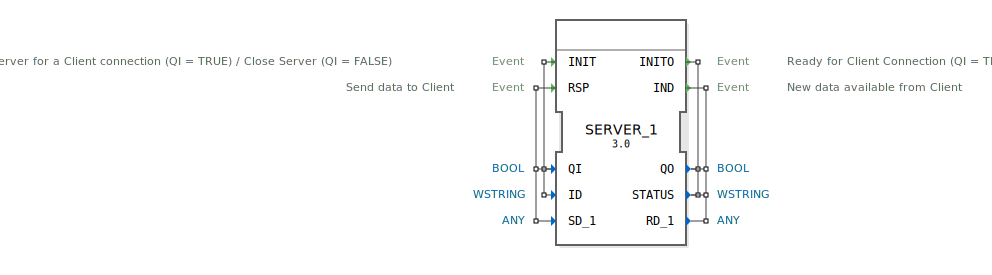

# SERVER_1

```{index} single: SERVER_1
```


* * * * * * * * * *

## Einleitung
Der SERVER_1 Funktionsblock dient zur Kommunikation mit einem CLIENT_1 Block und ermöglicht die Einrichtung einer Server-Client-Verbindung. Der Block kann Daten von Clients empfangen und an diese senden, wobei er eine flexible Kommunikationsschnittstelle für verschiedene Anwendungsfälle bereitstellt.



## Schnittstellenstruktur

### **Ereignis-Eingänge**
- **INIT** (Typ: EInit) - Aktiviert den Server für eine Client-Verbindung (QI = TRUE) oder schließt den Server (QI = FALSE)
- **RSP** (Typ: Event) - Sendet Daten an den Client

### **Ereignis-Ausgänge**
- **INITO** (Typ: EInit) - Signalisiert Bereitschaft für Client-Verbindung (QI = TRUE) oder geschlossenen Zustand (QI = FALSE)
- **IND** (Typ: Event) - Zeigt neue verfügbare Daten vom Client an

### **Daten-Eingänge**
- **QI** (BOOL) - Qualifizierer für INIT-Operation
- **ID** (WSTRING) - Identifikator für die Server-Instanz
- **SD_1** (ANY) - Sendedaten an den Client

### **Daten-Ausgänge**
- **QO** (BOOL) - Qualifizierer für Statusausgabe
- **STATUS** (WSTRING) - Statusinformationen
- **RD_1** (ANY) - Empfangene Daten vom Client

## Funktionsweise
Der SERVER_1 Block verwaltet Server-Client-Verbindungen über zwei Hauptoperationen:

1. **Initialisierung/Deaktivierung**: Durch das INIT-Ereignis mit entsprechendem QI-Wert wird der Server aktiviert oder deaktiviert. Bei erfolgreicher Operation wird INITO mit Statusinformationen ausgelöst.

2. **Datenkommunikation**:
   - Empfang: Eingehende Daten vom Client lösen das IND-Ereignis aus und stehen über RD_1 zur Verfügung
   - Sendung: Das RSP-Ereignis ermöglicht das Senden von Daten über SD_1 an den verbundenen Client

## Technische Besonderheiten
- Verwendung des ANY-Datentyps für SD_1 und RD_1 ermöglicht flexible Datenformate
- WSTRING-Typ für ID und STATUS unterstützt Unicode-Strings
- Generische Implementierung durch 'GEN_SERVER' Klassenattribut
- Package-Zugehörigkeit: iec61499::net

## Zustandsübersicht
Der Block kann folgende Zustände annehmen:
- **Nicht initialisiert**: Server nicht betriebsbereit
- **Initialisiert**: Server bereit für Client-Verbindungen
- **Datenempfang**: Verarbeitung eingehender Daten
- **Datensendung**: Versand von Daten an Client

## Anwendungsszenarien
- Industrielle Automatisierungssysteme
- Vernetzte Steuerungssysteme
- IoT-Kommunikationsanwendungen
- Distributed Control Systems (DCS)
- Maschine-zu-Maschine-Kommunikation

## Vergleich mit ähnlichen Bausteinen
Im Vergleich zu anderen Kommunikationsblöcken bietet SERVER_1:
- Spezifische Server-Funktionalität für CLIENT_1-Blöcke
- Flexible Datenübertragung durch ANY-Typ
- Explizite Initialisierungs- und Deaktivierungssteuerung
- Statusrückmeldungen für verbesserte Fehlererkennung

## Fazit
Der SERVER_1 Funktionsblock stellt eine robuste und flexible Lösung für Server-Client-Kommunikation in verteilten Automatisierungssystemen dar. Seine klare Schnittstellendefinition und flexible Datentypunterstützung machen ihn besonders geeignet für verschiedenste industrielle Kommunikationsanforderungen.