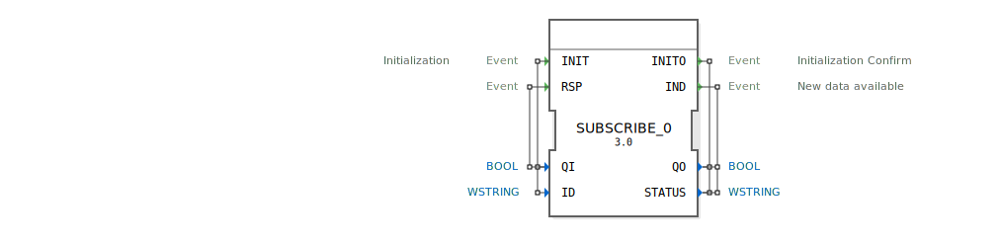

# SUBSCRIBE_0

```{index} single: SUBSCRIBE_0
```


* * * * * * * * * *

## Einleitung
Der SUBSCRIBE_0 Funktionsblock dient zum Abonnieren von Daten eines PUBLISH_0 Blocks. Er ermöglicht die Kommunikation zwischen verschiedenen Komponenten in einem verteilten Automatisierungssystem, indem er Daten von einem Publisher empfängt und bei neuen Daten Ereignisse auslöst.



## Schnittstellenstruktur

### **Ereignis-Eingänge**
- **INIT** (Typ: EInit) - Initialisierungsereignis
  - Verknüpft mit: QI, ID
- **RSP** (Typ: Event) - Response-Ereignis
  - Verknüpft mit: QI

### **Ereignis-Ausgänge**
- **INITO** (Typ: EInit) - Initialisierungsbestätigung
  - Verknüpft mit: QO, STATUS
- **IND** (Typ: Event) - Anzeige bei neuen verfügbaren Daten
  - Verknüpft mit: QO, STATUS

### **Daten-Eingänge**
- **QI** (Typ: BOOL) - Qualifizierer für Initialisierung
- **ID** (Typ: WSTRING) - Identifikator für die Abonnement-Verbindung

### **Daten-Ausgänge**
- **QO** (Typ: BOOL) - Qualifizierer für Ausgangszustand
- **STATUS** (Typ: WSTRING) - Statusinformationen

### **Adapter**
Keine Adapter-Schnittstellen vorhanden.

## Funktionsweise
Der SUBSCRIBE_0 Block initialisiert sich über das INIT-Ereignis und stellt dabei eine Verbindung zu einem PUBLISH_0 Block her, der durch den ID-Parameter identifiziert wird. Nach erfolgreicher Initialisierung bestätigt der Block dies über das INITO-Ereignis. Bei empfangenen neuen Daten vom Publisher wird das IND-Ereignis ausgelöst, wodurch die Anwendung über verfügbare Daten informiert wird.

## Technische Besonderheiten
- Verwendet WSTRING-Datentypen für ID und STATUS für internationale Zeichenunterstützung
- Implementiert ein Qualifizierungsmodell mit QI und QO für Zustandsmanagement
- Bietet Statusrückmeldungen über den STATUS-Ausgang

## Zustandsübersicht
1. **Nicht initialisiert**: Ausgangszustand vor INIT
2. **Initialisierungsphase**: Während INIT-Verarbeitung
3. **Bereit**: Erfolgreich initialisiert und wartet auf Daten
4. **Datenempfang**: Verarbeitet eingehende Daten und löst IND aus

## Anwendungsszenarien
- Verteile Automatisierungssysteme mit Datenverteilung
- IoT-Anwendungen mit Publisher-Subscriber-Muster
- Überwachungssysteme, die Statusdaten von verschiedenen Quellen sammeln
- Steuerungssysteme mit losgekoppelter Kommunikation zwischen Komponenten

## Vergleich mit ähnlichen Bausteinen
Im Vergleich zu anderen Kommunikationsbausteinen fokussiert sich SUBSCRIBE_0 spezifisch auf das Publisher-Subscriber-Muster und bietet eine einfache Schnittstelle für das Abonnieren von Datenströmen. Im Gegensatz zu Client-Server-Bausteinen arbeitet er asynchron und push-basiert.

## Fazit
Der SUBSCRIBE_0 Funktionsblock bietet eine robuste Lösung für das Abonnieren von Daten in verteilten Automatisierungssystemen. Seine klare Schnittstelle und das etablierte Publisher-Subscriber-Muster machen ihn zu einer zuverlässigen Wahl für lose gekoppelte Kommunikationsszenarien.