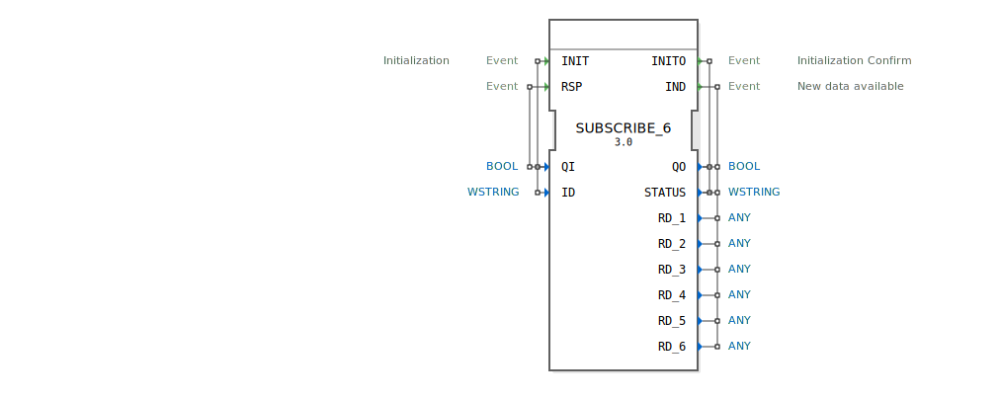

# SUBSCRIBE_6

```{index} single: SUBSCRIBE_6
```


* * * * * * * * * *

## Einleitung
Der SUBSCRIBE_6 Funktionsblock dient zum Abonnieren von Daten eines PUBLISH_6 Blocks. Er ermöglicht den Empfang von bis zu sechs verschiedenen Datenwerten über eine Netzwerkverbindung und stellt diese für die weitere Verarbeitung in einem IEC 61499-System zur Verfügung.



## Schnittstellenstruktur

### **Ereignis-Eingänge**
- **INIT**: Initialisierungsereignis mit zugehörigen Daten QI und ID
- **RSP**: Response-Ereignis mit zugehörigem Daten QI

### **Ereignis-Ausgänge**
- **INITO**: Initialisierungsbestätigung mit zugehörigen Daten QO und STATUS
- **IND**: Indikationsereignis bei neu verfügbaren Daten mit zugehörigen Daten QO, STATUS und RD_1 bis RD_6

### **Daten-Eingänge**
- **QI** (BOOL): Qualifier Input - Steuert die Aktivierung des Blocks
- **ID** (WSTRING): Identifikationsstring zur Zuordnung zum entsprechenden PUBLISH_6 Block

### **Daten-Ausgänge**
- **QO** (BOOL): Qualifier Output - Status der Blockoperation
- **STATUS** (WSTRING): Statusinformationen als Unicode-String
- **RD_1** bis **RD_6** (ANY): Empfangene Datenwerte (bis zu 6 verschiedene Datentypen)

## Funktionsweise
Der SUBSCRIBE_6 Block initialisiert sich über das INIT-Ereignis und stellt eine Verbindung zu einem PUBLISH_6 Block mit der angegebenen ID her. Bei erfolgreicher Initialisierung bestätigt er dies mit INITO. Sobald neue Daten vom PUBLISH_6 Block verfügbar sind, löst der SUBSCRIBE_6 Block das IND-Ereignis aus und stellt die empfangenen Daten über die RD_1 bis RD_6 Ausgänge zur Verfügung.

## Technische Besonderheiten
- Unterstützt bis zu sechs verschiedene Datenwerte gleichzeitig
- Verwendet WSTRING für Statusmeldungen und Identifikation
- Flexible Datentypen durch ANY-Typ bei den empfangenen Daten
- Netzwerkbasierte Kommunikation zwischen verteilten Systemen

## Zustandsübersicht
Der Block durchläuft folgende Hauptzustände:
1. **Nicht initialisiert**: Block ist inaktiv
2. **Initialisierung**: Verarbeitung des INIT-Ereignisses
3. **Verbunden**: Erfolgreiche Verbindung zum Publisher
4. **Datenempfang**: Empfängt und verarbeitet eingehende Daten

## Anwendungsszenarien
- Verteilte Steuerungssysteme mit Datenverteilung
- Überwachungssysteme mit zentraler Datenerfassung
- Industrie 4.0 Anwendungen mit Maschinendaten
- SCADA-Systeme mit dezentralen Datenquellen

## ⚖️ Vergleich mit ähnlichen Bausteinen
Im Vergleich zu einfacheren Subscribe-Blocks bietet SUBSCRIBE_6 die Möglichkeit, bis zu sechs verschiedene Datenwerte parallel zu empfangen, was eine höhere Datendurchsatzkapazität ermöglicht. Die Verwendung von WSTRING für Statusmeldungen ermöglicht detailliertere Fehlerinformationen.

## Fazit
Der SUBSCRIBE_6 Funktionsblock ist eine leistungsstarke Lösung für verteilte Systeme, die den gleichzeitigen Empfang mehrerer Datenströme erfordern. Seine flexible Architektur und die Unterstützung verschiedener Datentypen machen ihn ideal für komplexe industrielle Automatisierungsanwendungen.