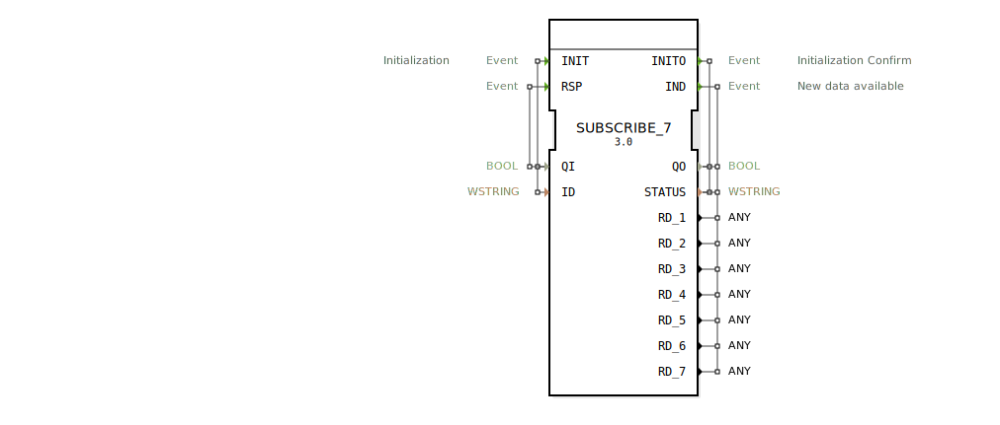

# SUBSCRIBE_7

```{index} single: SUBSCRIBE_7
```


* * * * * * * * * *

## Einleitung
Der SUBSCRIBE_7 Funktionsblock dient als Abonnent für Daten eines PUBLISH_7 Blocks. Er ermöglicht den Empfang von bis zu sieben verschiedenen Datenpunkten über eine Kommunikationsverbindung. Der Block ist Teil der IEC 61499 Netzwerkkommunikationsfunktionalität und wird für verteilte Automatisierungssysteme eingesetzt.



## Schnittstellenstruktur

### **Ereignis-Eingänge**
- **INIT**: Initialisierungsereignis mit zugehörigen Daten QI und ID
- **RSP**: Response-Ereignis mit zugehörigem Daten QI

### **Ereignis-Ausgänge**
- **INITO**: Initialisierungsbestätigung mit zugehörigen Daten QO und STATUS
- **IND**: Indikationsereignis bei neuen verfügbaren Daten mit zugehörigen Daten QO, STATUS und RD_1 bis RD_7

### **Daten-Eingänge**
- **QI** (BOOL): Qualifizierer für Initialisierung
- **ID** (WSTRING): Identifikator für die Verbindung

### **Daten-Ausgänge**
- **QO** (BOOL): Qualifizierer für Ausgangszustand
- **STATUS** (WSTRING): Statusinformation der Verbindung
- **RD_1** bis **RD_7** (ANY): Empfangene Datenpunkte 1 bis 7

### **Adapter**
Keine Adapter-Schnittstellen vorhanden.

## Funktionsweise
Der SUBSCRIBE_7 Block initialisiert sich über das INIT-Ereignis und stellt eine Verbindung zu einem entsprechenden PUBLISH_7 Block her. Nach erfolgreicher Initialisierung bestätigt er dies über INITO. Bei empfangenen Daten vom Publisher wird das IND-Ereignis ausgelöst und die empfangenen Daten über RD_1 bis RD_7 ausgegeben. Der RSP-Eingang ermöglicht die Behandlung von Antwortnachrichten.

## Technische Besonderheiten
- Unterstützt bis zu sieben verschiedene Datenpunkte gleichzeitig
- Verwendet WSTRING für Status- und Identifikationsinformationen
- ANY-Datentyp für die empfangenen Daten ermöglicht flexible Datentypen
- Generische Implementierung durch GEN_SUBSCRIBE Basisklasse

## Zustandsübersicht
1. **Nicht initialisiert**: Block wartet auf INIT-Ereignis
2. **Initialisierung**: Verarbeitung der INIT-Anfrage
3. **Bereit**: Erfolgreich verbunden, wartet auf Daten
4. **Datenempfang**: Verarbeitung eingehender Daten mit IND-Auslösung

## Anwendungsszenarien
- Verteiltes Automatisierungssystem mit Datenverteilung
- Maschinenvernetzung in Industrie 4.0 Umgebungen
- Datenaustausch zwischen verschiedenen Steuerungskomponenten
- Überwachungssysteme mit zentraler Datensammlung

## Vergleich mit ähnlichen Bausteinen
Im Vergleich zu einfacheren SUBSCRIBE-Blöcken bietet SUBSCRIBE_7 die Möglichkeit, bis zu sieben Datenpunkte parallel zu empfangen. Gegenüber individuellen Kommunikationslösungen bietet er standardisierte IEC 61499 Schnittstellen und vereinfachte Konfiguration.

## Fazit
Der SUBSCRIBE_7 Block ist ein leistungsfähiger Kommunikationsbaustein für verteilte Automatisierungssysteme, der durch seine Flexibilität bei der Datenübertragung und standardisierte Schnittstellen eine zuverlässige Grundlage für industrielle Kommunikationsanwendungen bietet.