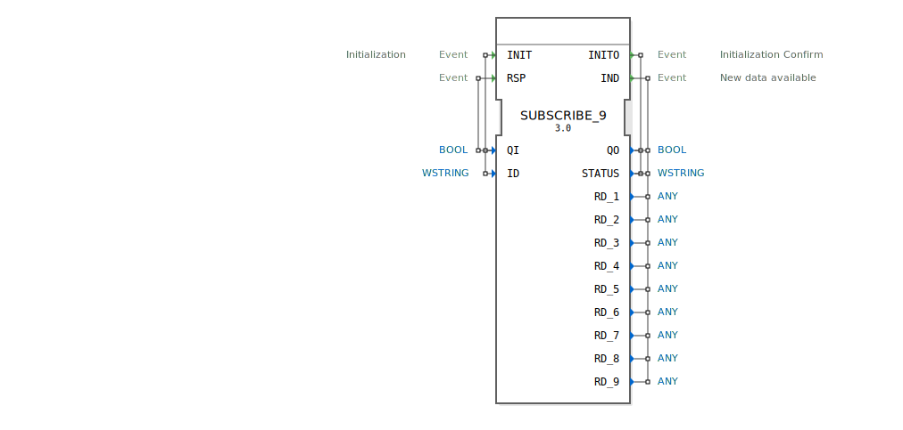

# SUBSCRIBE_9

```{index} single: SUBSCRIBE_9
```


* * * * * * * * * *

## Einleitung
Der SUBSCRIBE_9 Funktionsblock dient zum Abonnieren von Daten eines PUBLISH_9 Blocks. Er ermöglicht den Empfang von bis zu 9 verschiedenen Datenpunkten über eine Netzwerkverbindung und stellt diese für die weitere Verarbeitung im Steuerungssystem bereit.



## Schnittstellenstruktur

### **Ereignis-Eingänge**
- **INIT**: Initialisierungsereignis mit den zugehörigen Daten QI und ID
- **RSP**: Response-Ereignis mit zugehörigem Daten QI

### **Ereignis-Ausgänge**
- **INITO**: Initialisierungsbestätigung mit QO und STATUS
- **IND**: Indikationsereignis bei neuen verfügbaren Daten mit QO, STATUS und allen 9 RD_x Datenausgängen

### **Daten-Eingänge**
- **QI** (BOOL): Qualifizierer für Initialisierung (TRUE = aktivieren, FALSE = deaktivieren)
- **ID** (WSTRING): Identifikationsstring für die Verbindung zum Publisher

### **Daten-Ausgänge**
- **QO** (BOOL): Qualifizierer-Ausgang für Betriebszustand
- **STATUS** (WSTRING): Statusinformationen als Unicode-String
- **RD_1** bis **RD_9** (ANY): Empfangene Datenpunkte 1-9 mit beliebigem Datentyp

### **Adapter**
Keine Adapter-Schnittstellen vorhanden.

## Funktionsweise
Der SUBSCRIBE_9 Block initialisiert bei Empfang des INIT-Ereignisses eine Verbindung zu einem PUBLISH_9 Block basierend auf der angegebenen ID. Nach erfolgreicher Initialisierung bestätigt er dies mit dem INITO-Ereignis. Bei empfangenen Daten vom Publisher wird das IND-Ereignis ausgelöst und die Daten werden über die RD_1 bis RD_9 Ausgänge verfügbar gemacht.

## Technische Besonderheiten
- Unterstützt bis zu 9 verschiedene Datenpunkte parallel
- Verwendet WSTRING für Status- und Identifikationsinformationen
- ANY-Datentypen für die empfangenen Daten ermöglichen flexible Datentypen
- Generische Implementierung als GEN_SUBSCRIBE

## Zustandsübersicht
1. **Nicht initialisiert**: Block wartet auf INIT-Ereignis
2. **Initialisiert**: Verbindung zum Publisher hergestellt, bereit zum Empfang
3. **Datenempfang**: Verarbeitet eingehende Daten und triggert IND-Ereignis

## Anwendungsszenarien
- Verteilte Steuerungssysteme mit Datenverteilung
- Maschinenvernetzung in Industrie 4.0 Umgebungen
- Überwachungssysteme mit zentraler Datensammlung
- Anlagen mit mehreren dezentralen Sensorknoten

## ⚖️ Vergleich mit ähnlichen Bausteinen
Im Vergleich zu einfacheren SUBSCRIBE-Blöcken bietet SUBSCRIBE_9 die Möglichkeit, bis zu 9 verschiedene Datenpunkte gleichzeitig zu empfangen, was die Effizienz in komplexeren Netzwerkstrukturen erhöht.

## Fazit
Der SUBSCRIBE_9 Funktionsblock ist eine leistungsstarke Lösung für den Empfang multipler Datenströme in verteilten Automatisierungssystemen und eignet sich besonders für Anwendungen mit hohem Datenaufkommen.