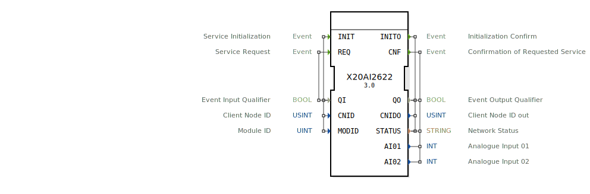

# X20AI2622

```{index} single: X20AI2622
```

* * * * * * * * * *

## Einleitung
Der X20AI2622 Funktionsblock stellt eine Schnittstelle für analoge Eingänge im openPOWERLINK Feldbus dar. Er entspricht dem B&R X20AI2622 Modul.



## Schnittstellenstruktur

### **Ereignis-Eingänge**
- **INIT**: Initialisierung des Dienstes.
- **REQ**: Anforderung zur Aktualisierung der Eingangsdaten.

### **Ereignis-Ausgänge**
- **INITO**: Bestätigung der Initialisierung.
- **CNF**: Bestätigung der Anfrage mit neuen Daten.

### **Daten-Eingänge**
- **QI** (BOOL): Qualifizierer für INIT und REQ.
- **CNID** (USINT): Client Node ID (Adresse des Knotens im POWERLINK Netzwerk).
- **MODID** (UINT): Modul-ID (Position des Moduls im Knoten).

### **Daten-Ausgänge**
- **QO** (BOOL): Qualifizierer für Ausgänge.
- **CNIDO** (USINT): Bestätigte Client Node ID.
- **STATUS** (STRING): Netzwerk-Status.
- **AI01** (INT): Analoger Eingang 01.
- **AI02** (INT): Analoger Eingang 02.

## Funktionsweise
Nach der Initialisierung mit `CNID` und `MODID` liefert der Baustein bei jedem `REQ` die aktuellen Analogwerte des physischen Moduls an den Ausgängen `AIxx`.

## Metadaten
| Attribut | Wert |
| :--- | :--- |
| Copyright | (c) 2014 AIT |
| Lizenz | EPL-2.0 |
| Version | 3.0 (2025-04-14, Patrick Aigner) |
| 4diac-Paket | powerlink |