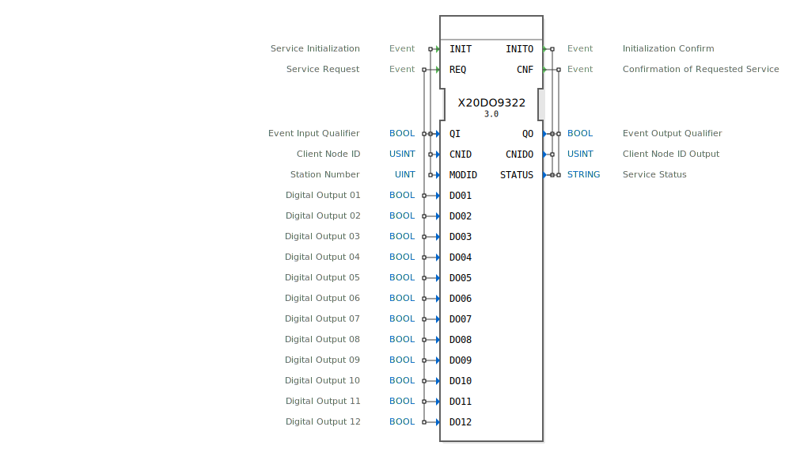

# X20DO9322

```{index} single: X20DO9322
```

* * * * * * * * * *

## Einleitung
Der X20DO9322 Funktionsblock dient zur Ansteuerung von digitalen Ausgängen über den openPOWERLINK Feldbus. Er entspricht dem B&R X20DO9322 Digital-Ausgangsmodul (12 Kanäle).



## Schnittstellenstruktur

### **Ereignis-Eingänge**
- **INIT**: Initialisierung.
- **REQ**: Ausgänge schreiben.

### **Ereignis-Ausgänge**
- **INITO**: Initialisierung bestätigt.
- **CNF**: Schreibvorgang bestätigt.

### **Daten-Eingänge**
- **QI** (BOOL): Qualifizierer.
- **CNID** (USINT): Client Node ID.
- **MODID** (UINT): Modul-ID.
- **DO01** - **DO12** (BOOL): Digitale Ausgänge 01 bis 12.

### **Daten-Ausgänge**
- **QO** (BOOL): Qualifizierer.
- **CNIDO** (USINT): Bestätigte Node ID.
- **STATUS** (STRING): Status.

## Funktionsweise
Setzt die 12 digitalen Ausgänge am Modul.

## Metadaten
| Attribut | Wert |
| :--- | :--- |
| Copyright | (c) 2011 AIT |
| Lizenz | EPL-2.0 |
| Version | 3.0 (2025-04-14, Patrick Aigner) |
| 4diac-Paket | powerlink |