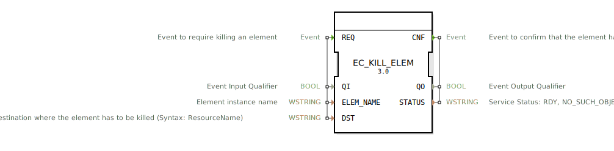

# EC_KILL_ELEM

```{index} single: EC_KILL_ELEM
```


* * * * * * * * * *

## Einleitung
Der EC_KILL_ELEM Funktionsblock dient zum Beenden von Instanzen gemäß der Zustandsmaschine von IEC 61499 Funktionsblöcken. Er ermöglicht das gezielte Beenden von Funktionsblock-Instanzen, Verbindungen (Ereignis/Daten), Ressourcen oder Geräten innerhalb eines 4diac-Systems.



## Schnittstellenstruktur

### **Ereignis-Eingänge**
- **REQ**: Ereignis zum Anfordern des Beendens eines Elements

### **Ereignis-Ausgänge**
- **CNF**: Ereignis zur Bestätigung, dass das Element beendet wurde

### **Daten-Eingänge**
- **QI** (BOOL): Ereignis-Eingangs-Qualifier
- **ELEM_NAME** (WSTRING): Name der Elementinstanz
- **DST** (WSTRING): Zielort, an dem das Element beendet werden muss (Syntax: ResourceName)

### **Daten-Ausgänge**
- **QO** (BOOL): Ereignis-Ausgangs-Qualifier
- **STATUS** (WSTRING): Service-Status (RDY, NO_SUCH_OBJECT, INVALID_STATE)

### **Adapter**
Keine Adapter-Schnittstellen vorhanden.

## Funktionsweise
Der Funktionsblock reagiert auf das REQ-Ereignis und versucht, das spezifizierte Element (Funktionsblock, Verbindung, Ressource oder Gerät) an der angegebenen Zielressource zu beenden. Nach der Ausführung wird das CNF-Ereignis mit dem entsprechenden Status ausgegeben.

## Technische Besonderheiten
- Unterstützt das Beenden verschiedener Elementtypen (FB, Verbindungen, Ressourcen, Geräte)
- Verwendet WSTRING-Datentypen für Elementnamen und Ziele
- Bietet detaillierte Statusrückmeldungen über den Beendigungsvorgang
- Implementiert gemäß IEC 61499 Execution Control Services

## Zustandsübersicht
Der Funktionsblock verfügt über mehrere Service-Sequenzen:
- **normal_establishment**: Erfolgreiche Initialisierung
- **unsuccessful_establishment**: Fehlgeschlagene Initialisierung
- **request_confirm**: Erfolgreiche Beendigungsanfrage
- **request_inhibited**: Unterdrückte Beendigungsanfrage
- **request_error**: Fehlerhafte Beendigungsanfrage
- **application_initiated_termination**: Anwendungsinitiierte Beendigung
- **resource_initiated_termination**: Ressourceninitiierte Beendigung

## Anwendungsszenarien
- Dynamische Rekonfiguration von Automatisierungssystemen
- Gezieltes Beenden fehlerhafter Komponenten
- Ressourcenmanagement in verteilten Systemen
- Systemwartung und -updates
- Fehlerbehandlung und Systemwiederherstellung

## ⚖️ Vergleich mit ähnlichen Bausteinen
Im Vergleich zu anderen Execution-Control-Blöcken bietet EC_KILL_ELEM spezifische Funktionen zum Beenden von Elementinstanzen, während ähnliche Blöcke oft Erstellungs- oder Managementfunktionen bereitstellen. Die Fähigkeit, verschiedene Elementtypen (FB, Verbindungen, Ressourcen, Geräte) zu behandeln, macht ihn besonders vielseitig.

## Fazit
EC_KILL_ELEM ist ein essentieller Baustein für Rekonfigurationsaufgaben in IEC 61499-basierten Systemen. Seine Fähigkeit, gezielt Elemente zu beenden, ermöglicht dynamische Systemanpassungen und robuste Fehlerbehandlungsstrategien in industriellen Automatisierungslösungen.