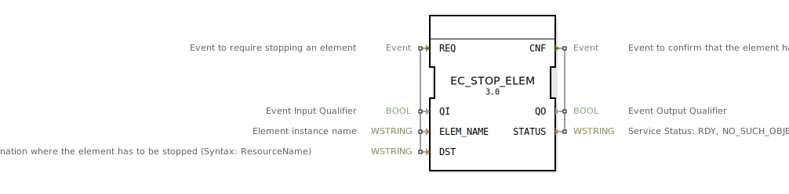

# EC_STOP_ELEM

```{index} single: EC_STOP_ELEM
```


* * * * * * * * * *

## Einleitung
Der EC_STOP_ELEM Funktionsblock dient zum Stoppen von Instanzen gemäß dem Zustandsautomaten von IEC 61499 Funktionsblöcken. Er kann Funktionsblock-Instanzen, Verbindungen (Ereignis/Daten), Ressourcen oder Geräte anhalten. Dieser Baustein gehört zur Kategorie der Rekonfigurationsdienste und implementiert einen Ausführungssteuerungsdienst gemäß IEC 61499-1.



## Schnittstellenstruktur

### **Ereignis-Eingänge**
- **REQ**: Ereignis zum Anfordern des Stoppens eines Elements

### **Ereignis-Ausgänge**
- **CNF**: Ereignis zur Bestätigung, dass das Element gestoppt wurde

### **Daten-Eingänge**
- **QI** (BOOL): Ereignis-Eingangsqualifizierer
- **ELEM_NAME** (WSTRING): Element-Instanzname
- **DST** (WSTRING): Ziel, an dem das Element gestoppt werden muss (Syntax: ResourceName)

### **Daten-Ausgänge**
- **QO** (BOOL): Ereignis-Ausgangsqualifizierer
- **STATUS** (WSTRING): Dienststatus: RDY, NO_SUCH_OBJECT, INVALID_STATE

### **Adapter**
Keine Adapter-Schnittstellen vorhanden.

## Funktionsweise
Der EC_STOP_ELEM Funktionsblock verarbeitet Stopp-Anforderungen für verschiedene Elemente innerhalb eines IEC 61499-Systems. Bei Eingang eines REQ-Ereignisses mit aktiviertem QI-Eingang wird der Stopp-Vorgang für das spezifizierte Element initiiert. Nach Abschluss des Stopp-Vorgangs wird ein CNF-Ereignis mit dem entsprechenden Status ausgegeben.

## Technische Besonderheiten
- Unterstützt das Stoppen verschiedener Elementtypen: FBs, Verbindungen, Ressourcen und Geräte
- Verwendet WSTRING-Datentypen für Elementnamen und Ziele
- Bietet detaillierte Statusrückmeldungen über mögliche Fehlerzustände
- Implementiert gemäß IEC 61499-1 Standard für Ausführungssteuerungsdienste

## Zustandsübersicht
Der Funktionsblock verfügt über mehrere Service-Sequenzen:
- **normal_establishment**: Erfolgreiche Initialisierung
- **unsuccessful_establishment**: Fehlgeschlagene Initialisierung
- **request_confirm**: Erfolgreiche Stopp-Anforderung
- **request_inhibited**: Unterdrückte Stopp-Anforderung
- **request_error**: Fehlerhafte Stopp-Anforderung
- **application_initiated_termination**: Anwendungsinitiierte Beendigung
- **resource_initiated_termination**: Ressourceninitiierte Beendigung

## Anwendungsszenarien
- Dynamisches Rekonfigurieren von Steuerungssystemen
- Geplantes Herunterfahren von Systemkomponenten
- Fehlerbehandlung durch gezieltes Stoppen fehlerhafter Komponenten
- Wartungsarbeiten an laufenden Systemen

## ⚖️ Vergleich mit ähnlichen Bausteinen
Im Vergleich zu anderen Rekonfigurationsbausteinen bietet EC_STOP_ELEM eine spezialisierte Funktion zum gezielten Stoppen einzelner Systemkomponenten. Während allgemeine Rekonfigurationsbausteine oft komplexere Operationen unterstützen, konzentriert sich dieser Baustein auf die spezifische Aufgabe des kontrollierten Anhaltens.

## Fazit
EC_STOP_ELEM ist ein essentieller Baustein für dynamische Steuerungssysteme, die Rekonfiguration zur Laufzeit erfordern. Seine klare Schnittstelle und zuverlässige Statusrückmeldung machen ihn zu einem wertvollen Werkzeug für die Entwicklung wartbarer und flexibler Automatisierungslösungen gemäß IEC 61499.