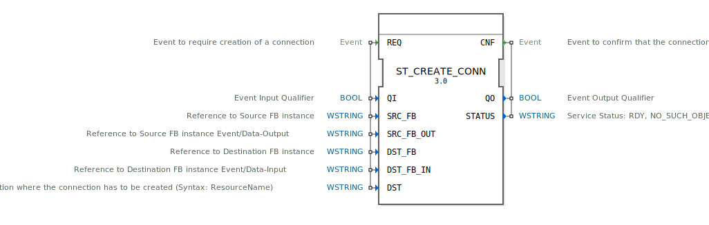

# ST_CREATE_CONN

```{index} single: ST_CREATE_CONN
```


* * * * * * * * * *

## Einleitung
Der ST_CREATE_CONN Funktionsblock dient zur Erstellung von Ereignis- oder Datenverbindungen zwischen zwei Funktionsblock-Instanzen zur Laufzeit. Dieser Baustein ermöglicht die dynamische Rekonfiguration von Verbindungen in einem 4diac-System und ist als struktureller Service klassifiziert.



## Schnittstellenstruktur

### **Ereignis-Eingänge**
- **REQ**: Ereignis zur Anforderung der Erstellung einer Verbindung

### **Ereignis-Ausgänge**
- **CNF**: Ereignis zur Bestätigung, dass die Verbindung erstellt wurde

### **Daten-Eingänge**
- **QI** (BOOL): Ereignis-Eingangsqualifizierer
- **SRC_FB** (WSTRING): Referenz zur Quell-FB-Instanz
- **SRC_FB_OUT** (WSTRING): Referenz zum Ereignis-/Daten-Ausgang der Quell-FB-Instanz
- **DST_FB** (WSTRING): Referenz zur Ziel-FB-Instanz
- **DST_FB_IN** (WSTRING): Referenz zum Ereignis-/Daten-Eingang der Ziel-FB-Instanz
- **DST** (WSTRING): Zielort, an dem die Verbindung erstellt werden muss (Syntax: ResourceName)

### **Daten-Ausgänge**
- **QO** (BOOL): Ereignis-Ausgangsqualifizierer
- **STATUS** (WSTRING): Service-Status (RDY, NO_SUCH_OBJECT, INVALID_STATE)

### **Adapter**
Keine Adapter-Schnittstellen vorhanden.

## Funktionsweise
Der Funktionsblock erstellt auf Anforderung (REQ-Ereignis) eine Verbindung zwischen einer Quell- und einer Ziel-Funktionsblock-Instanz. Die Verbindung kann sowohl für Ereignisse als auch für Datenströme verwendet werden. Nach erfolgreicher Verarbeitung wird eine Bestätigung (CNF-Ereignis) mit dem entsprechenden Status ausgegeben.

## Technische Besonderheiten
- Unterstützt dynamische Rekonfiguration zur Laufzeit
- Verwendet Wide-String-Datentypen für alle Referenzen
- Bietet detaillierte Statusrückmeldungen
- Implementiert als struktureller Service gemäß IEC 61499-1

## Zustandsübersicht
Der Baustein unterstützt mehrere Service-Sequenzen:
- Normale Verbindungserstellung
- Erfolglose Verbindungserstellung
- Anforderungs-Bestätigungs-Zyklus
- Anforderungs-Verhinderung
- Fehlerbehandlung
- Anwendungs- und Ressourcen-initiierte Beendigung

## Anwendungsszenarien
- Dynamische Systemrekonfiguration
- Laufzeit-Anpassung von Steuerungslogik
- Flexible Verbindungsverwaltung in verteilten Systemen
- Adaptive Automatisierungssysteme

## Vergleich mit ähnlichen Bausteinen
Im Gegensatz zu statisch konfigurierten Verbindungen ermöglicht ST_CREATE_CONN die dynamische Erstellung von Verbindungen zur Laufzeit. Andere Rekonfigurationsbausteine fokussieren sich typischerweise auf das Erstellen oder Löschen von FB-Instanzen, während dieser Baustein speziell für Verbindungsmanagement optimiert ist.

## Fazit
ST_CREATE_CONN ist ein essentieller Baustein für Systeme, die dynamische Rekonfiguration erfordern. Seine Fähigkeit, Verbindungen zwischen Funktionsblöcken zur Laufzeit zu erstellen, macht ihn besonders wertvoll für adaptive und flexible Automatisierungslösungen.