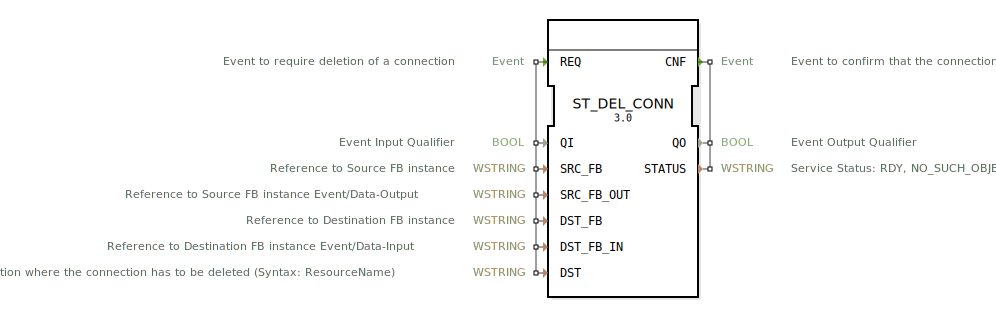

# ST_DEL_CONN

```{index} single: ST_DEL_CONN
```


* * * * * * * * * *

## Einleitung
Der Funktionsblock ST_DEL_CONN dient zum Löschen von Ereignis- oder Datenverbindungen zwischen zwei Funktionsblock-Instanzen innerhalb eines 4diac-Systems. Er ermöglicht die dynamische Rekonfiguration von Verbindungen zur Laufzeit und gehört zur Kategorie der Strukturellen Dienste gemäß IEC 61499-1.



## Schnittstellenstruktur

### **Ereignis-Eingänge**
- **REQ**: Ereignis zum Anfordern des Löschens einer Verbindung

### **Ereignis-Ausgänge**
- **CNF**: Ereignis zur Bestätigung, dass die Verbindung gelöscht wurde

### **Daten-Eingänge**
- **QI** (BOOL): Ereignis-Eingangs-Qualifier
- **SRC_FB** (WSTRING): Referenz zur Quell-FB-Instanz
- **SRC_FB_OUT** (WSTRING): Referenz zum Ereignis-/Daten-Ausgang der Quell-FB-Instanz
- **DST_FB** (WSTRING): Referenz zur Ziel-FB-Instanz
- **DST_FB_IN** (WSTRING): Referenz zum Ereignis-/Daten-Eingang der Ziel-FB-Instanz
- **DST** (WSTRING): Ziel, wo die Verbindung gelöscht werden muss (Syntax: ResourceName)

### **Daten-Ausgänge**
- **QO** (BOOL): Ereignis-Ausgangs-Qualifier
- **STATUS** (WSTRING): Dienststatus: RDY, NO_SUCH_OBJECT

### **Adapter**
Keine Adapter-Schnittstellen vorhanden.

## Funktionsweise
Beim Auslösen des REQ-Ereignisses wird die spezifizierte Verbindung zwischen den angegebenen Funktionsblock-Instanzen gelöscht. Der Block erwartet vollständige Referenzen sowohl für die Quell- als auch die Ziel-FB-Instanzen inklusive deren Ein- und Ausgänge. Nach erfolgreicher Verarbeitung wird das CNF-Ereignis mit dem entsprechenden Status ausgegeben.

## Technische Besonderheiten
- Unterstützt das Löschen sowohl von Ereignis- als auch Datenverbindungen
- Arbeitet mit Wide-String-Datentypen für alle Referenzparameter
- Bietet Statusrückmeldung über erfolgreiche oder fehlgeschlagene Operationen
- Implementiert gemäß IEC 61499-1 Standard für strukturelle Dienste

## Zustandsübersicht
Der Funktionsblock unterstützt verschiedene Service-Sequenzen:
- Normale Initialisierung (INIT+ → INITO+)
- Fehlgeschlagene Initialisierung (INIT+ → INITO-)
- Erfolgreiche Anfrage (REQ+ → CNF+)
- Unterdrückte Anfrage (REQ- → CNF-)
- Fehlerhafte Anfrage (REQ+ → CNF-)
- Anwendungs- und ressourcenseitige Beendigung

## Anwendungsszenarien
- Dynamische Rekonfiguration von Steuerungssystemen
- Entfernen von Verbindungen zur Laufzeit
- Fehlerbehandlung bei Verbindungsproblemen
- Adaptive Systeme, die sich an veränderte Anforderungen anpassen müssen

## ⚖️ Vergleich mit ähnlichen Bausteinen
Im Vergleich zu anderen Rekonfigurations-Bausteinen spezialisiert sich ST_DEL_CONN ausschließlich auf das Löschen von Verbindungen, während andere Bausteine möglicherweise das Erstellen oder Modifizieren von Verbindungen unterstützen.

## Fazit
ST_DEL_CONN ist ein essentieller Baustein für Systeme, die dynamische Rekonfiguration erfordern. Seine klare Schnittstellendefinition und zuverlässige Statusrückmeldung machen ihn zu einem zuverlässigen Werkzeug für die Verwaltung von Verbindungen in IEC 61499-basierten Steuerungssystemen.